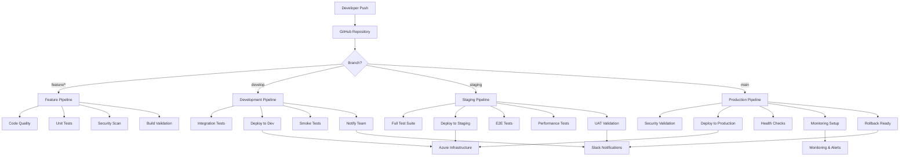

# CI/CD Pipeline Architecture
## Headless WordPress + Next.js Enterprise Solution

### Document Information
- **Document Version**: 1.0
- **Last Updated**: 2025-08-11
- **Owner**: DevOps Team
- **Review Cycle**: Monthly

---

## Executive Summary

This document defines the comprehensive CI/CD pipeline architecture for our headless WordPress + Next.js enterprise solution. The pipeline implements GitOps principles with multi-environment deployment, automated testing, security scanning, and comprehensive monitoring.

**Key Pipeline Features:**
- **Multi-Environment**: Development, Staging, and Production deployments
- **Security-First**: Integrated security scanning and compliance checks
- **Quality Gates**: Automated testing and quality assurance
- **Azure Native**: Full Azure DevOps and GitHub Actions integration
- **Monitoring**: Comprehensive observability and alerting

---

## Pipeline Overview

### Architecture Diagram



### Pipeline Environments

#### Development Environment
- **Trigger**: Push to `develop` branch
- **Purpose**: Continuous integration and early feedback
- **Deployment**: Azure Container Instances (Development tier)
- **Testing**: Unit tests, integration tests, smoke tests
- **Approval**: Automatic deployment

#### Staging Environment
- **Trigger**: Push to `staging` branch or manual promotion
- **Purpose**: Pre-production validation and UAT
- **Deployment**: Azure Container Instances (Production-like)
- **Testing**: Full test suite, performance tests, E2E tests
- **Approval**: Automatic with manual gate for production promotion

#### Production Environment
- **Trigger**: Push to `main` branch or release tag
- **Purpose**: Live production deployment
- **Deployment**: Azure Container Instances (High Availability)
- **Testing**: Health checks, monitoring validation
- **Approval**: Manual approval required

---

## GitHub Actions Workflows

### Main CI/CD Workflow

```yaml
# .github/workflows/ci-cd-main.yml
name: CI/CD Pipeline

on:
  push:
    branches: [main, develop, staging]
  pull_request:
    branches: [main, develop]
  release:
    types: [published]

env:
  NODE_VERSION: '18'
  PHP_VERSION: '8.2'
  REGISTRY: ghcr.io
  IMAGE_NAME: ${{ github.repository }}

jobs:
  # Code Quality and Security
  code-quality:
    name: Code Quality & Security
    runs-on: ubuntu-latest
    steps:
      - name: Checkout code
        uses: actions/checkout@v4
        with:
          fetch-depth: 0
      
      - name: Setup Node.js
        uses: actions/setup-node@v4
        with:
          node-version: ${{ env.NODE_VERSION }}
          cache: 'npm'
          cache-dependency-path: frontend/package-lock.json
      
      - name: Install dependencies
        run: |
          cd frontend
          npm ci
      
      - name: Lint and format check
        run: |
          cd frontend
          npm run lint
          npm run format:check
      
      - name: TypeScript check
        run: |
          cd frontend
          npm run type-check
      
      - name: Security audit
        run: |
          cd frontend
          npm audit --audit-level high
      
      - name: CodeQL Analysis
        uses: github/codeql-action/init@v2
        with:
          languages: javascript, typescript
      
      - name: Perform CodeQL Analysis
        uses: github/codeql-action/analyze@v2
      
      - name: SonarCloud Scan
        uses: SonarSource/sonarcloud-github-action@master
        env:
          GITHUB_TOKEN: ${{ secrets.GITHUB_TOKEN }}
          SONAR_TOKEN: ${{ secrets.SONAR_TOKEN }}

  # Unit Testing
  unit-tests:
    name: Unit Tests
    runs-on: ubuntu-latest
    needs: code-quality
    steps:
      - name: Checkout code
        uses: actions/checkout@v4
      
      - name: Setup Node.js
        uses: actions/setup-node@v4
        with:
          node-version: ${{ env.NODE_VERSION }}
          cache: 'npm'
          cache-dependency-path: frontend/package-lock.json
      
      - name: Install dependencies
        run: |
          cd frontend
          npm ci
      
      - name: Run unit tests
        run: |
          cd frontend
          npm run test:unit -- --coverage --watchAll=false
      
      - name: Upload coverage to Codecov
        uses: codecov/codecov-action@v3
        with:
          file: frontend/coverage/lcov.info
          flags: frontend
          name: frontend-coverage
      
      - name: Upload test results
        uses: actions/upload-artifact@v3
        if: always()
        with:
          name: unit-test-results
          path: frontend/coverage/

  # Build Images
  build:
    name: Build Docker Images
    runs-on: ubuntu-latest
    needs: [code-quality, unit-tests]
    outputs:
      frontend-image: ${{ steps.meta.outputs.tags }}
      frontend-digest: ${{ steps.build-frontend.outputs.digest }}
      backend-image: ${{ steps.meta-backend.outputs.tags }}
      backend-digest: ${{ steps.build-backend.outputs.digest }}
    steps:
      - name: Checkout code
        uses: actions/checkout@v4
      
      - name: Set up Docker Buildx
        uses: docker/setup-buildx-action@v3
      
      - name: Log in to Container Registry
        uses: docker/login-action@v3
        with:
          registry: ${{ env.REGISTRY }}
          username: ${{ github.actor }}
          password: ${{ secrets.GITHUB_TOKEN }}
      
      - name: Extract metadata (Frontend)
        id: meta
        uses: docker/metadata-action@v5
        with:
          images: ${{ env.REGISTRY }}/${{ env.IMAGE_NAME }}/frontend
          tags: |
            type=ref,event=branch
            type=ref,event=pr
            type=sha,prefix={{branch}}-
            type=raw,value=latest,enable={{is_default_branch}}
      
      - name: Build and push Frontend image
        id: build-frontend
        uses: docker/build-push-action@v5
        with:
          context: frontend
          file: frontend/Dockerfile
          push: true
          tags: ${{ steps.meta.outputs.tags }}
          labels: ${{ steps.meta.outputs.labels }}
          cache-from: type=gha
          cache-to: type=gha,mode=max
      
      - name: Extract metadata (Backend)
        id: meta-backend
        uses: docker/metadata-action@v5
        with:
          images: ${{ env.REGISTRY }}/${{ env.IMAGE_NAME }}/backend
          tags: |
            type=ref,event=branch
            type=ref,event=pr
            type=sha,prefix={{branch}}-
            type=raw,value=latest,enable={{is_default_branch}}
      
      - name: Build and push Backend image
        id: build-backend
        uses: docker/build-push-action@v5
        with:
          context: infrastructure/docker/wordpress
          push: true
          tags: ${{ steps.meta-backend.outputs.tags }}
          labels: ${{ steps.meta-backend.outputs.labels }}
          cache-from: type=gha
          cache-to: type=gha,mode=max

  # Integration Tests
  integration-tests:
    name: Integration Tests
    runs-on: ubuntu-latest
    needs: build
    if: github.ref == 'refs/heads/develop' || github.ref == 'refs/heads/staging' || github.ref == 'refs/heads/main'
    services:
      mysql:
        image: mysql:8.0
        env:
          MYSQL_ROOT_PASSWORD: test_password
          MYSQL_DATABASE: wordpress_test
        options: --health-cmd="mysqladmin ping" --health-interval=10s --health-timeout=5s --health-retries=3
        ports:
          - 3306:3306
      
      redis:
        image: redis:7-alpine
        options: --health-cmd="redis-cli ping" --health-interval=10s --health-timeout=5s --health-retries=3
        ports:
          - 6379:6379
    
    steps:
      - name: Checkout code
        uses: actions/checkout@v4
      
      - name: Setup Node.js
        uses: actions/setup-node@v4
        with:
          node-version: ${{ env.NODE_VERSION }}
          cache: 'npm'
          cache-dependency-path: frontend/package-lock.json
      
      - name: Install dependencies
        run: |
          cd frontend
          npm ci
      
      - name: Wait for services
        run: |
          sleep 30
      
      - name: Run integration tests
        env:
          WORDPRESS_DB_HOST: localhost
          WORDPRESS_DB_NAME: wordpress_test
          WORDPRESS_DB_USER: root
          WORDPRESS_DB_PASSWORD: test_password
          REDIS_HOST: localhost
          REDIS_PORT: 6379
        run: |
          cd frontend
          npm run test:integration
      
      - name: Upload integration test results
        uses: actions/upload-artifact@v3
        if: always()
        with:
          name: integration-test-results
          path: frontend/test-results/

  # Deploy to Development
  deploy-dev:
    name: Deploy to Development
    runs-on: ubuntu-latest
    needs: [build, integration-tests]
    if: github.ref == 'refs/heads/develop'
    environment: development
    steps:
      - name: Checkout code
        uses: actions/checkout@v4
      
      - name: Azure Login
        uses: azure/login@v1
        with:
          creds: ${{ secrets.AZURE_CREDENTIALS_DEV }}
      
      - name: Deploy Infrastructure
        run: |
          cd infrastructure/terraform/environments/dev
          terraform init
          terraform apply -auto-approve \
            -var="frontend_image=${{ needs.build.outputs.frontend-image }}" \
            -var="backend_image=${{ needs.build.outputs.backend-image }}"
      
      - name: Run smoke tests
        run: |
          cd tests
          npm install
          npm run test:smoke -- --env=development
      
      - name: Notify team
        uses: 8398a7/action-slack@v3
        with:
          status: ${{ job.status }}
          channel: '#development'
          webhook_url: ${{ secrets.SLACK_WEBHOOK }}
        if: always()

  # Deploy to Staging
  deploy-staging:
    name: Deploy to Staging
    runs-on: ubuntu-latest
    needs: [build, integration-tests]
    if: github.ref == 'refs/heads/staging'
    environment: staging
    steps:
      - name: Checkout code
        uses: actions/checkout@v4
      
      - name: Azure Login
        uses: azure/login@v1
        with:
          creds: ${{ secrets.AZURE_CREDENTIALS_STAGING }}
      
      - name: Deploy Infrastructure
        run: |
          cd infrastructure/terraform/environments/staging
          terraform init
          terraform apply -auto-approve \
            -var="frontend_image=${{ needs.build.outputs.frontend-image }}" \
            -var="backend_image=${{ needs.build.outputs.backend-image }}"
      
      - name: Run E2E tests
        run: |
          cd tests
          npm install
          npm run test:e2e -- --env=staging
      
      - name: Run performance tests
        run: |
          cd tests
          npm run test:performance -- --env=staging
      
      - name: Upload test results
        uses: actions/upload-artifact@v3
        if: always()
        with:
          name: staging-test-results
          path: tests/results/

  # Deploy to Production
  deploy-prod:
    name: Deploy to Production
    runs-on: ubuntu-latest
    needs: [build, integration-tests]
    if: github.ref == 'refs/heads/main'
    environment: 
      name: production
      url: https://your-production-domain.com
    steps:
      - name: Checkout code
        uses: actions/checkout@v4
      
      - name: Azure Login
        uses: azure/login@v1
        with:
          creds: ${{ secrets.AZURE_CREDENTIALS_PROD }}
      
      - name: Security scan images
        run: |
          docker run --rm -v /var/run/docker.sock:/var/run/docker.sock \
            aquasec/trivy image --exit-code 1 --no-progress \
            ${{ needs.build.outputs.frontend-image }}
          
          docker run --rm -v /var/run/docker.sock:/var/run/docker.sock \
            aquasec/trivy image --exit-code 1 --no-progress \
            ${{ needs.build.outputs.backend-image }}
      
      - name: Deploy Infrastructure
        run: |
          cd infrastructure/terraform/environments/prod
          terraform init
          terraform apply -auto-approve \
            -var="frontend_image=${{ needs.build.outputs.frontend-image }}" \
            -var="backend_image=${{ needs.build.outputs.backend-image }}"
      
      - name: Health checks
        run: |
          cd tests
          npm install
          npm run test:health -- --env=production
      
      - name: Setup monitoring
        run: |
          cd infrastructure/monitoring
          ./setup-alerts.sh production
      
      - name: Notify deployment
        uses: 8398a7/action-slack@v3
        with:
          status: success
          channel: '#deployments'
          text: '🚀 Production deployment successful!'
          webhook_url: ${{ secrets.SLACK_WEBHOOK }}
```

### Security Workflow

```yaml
# .github/workflows/security.yml
name: Security Scanning

on:
  schedule:
    - cron: '0 2 * * *'  # Daily at 2 AM
  push:
    branches: [main, develop]
  pull_request:
    branches: [main, develop]

jobs:
  dependency-check:
    name: Dependency Security Check
    runs-on: ubuntu-latest
    steps:
      - name: Checkout code
        uses: actions/checkout@v4
      
      - name: Setup Node.js
        uses: actions/setup-node@v4
        with:
          node-version: '18'
      
      - name: Install dependencies
        run: |
          cd frontend
          npm ci
      
      - name: Run npm audit
        run: |
          cd frontend
          npm audit --audit-level high
      
      - name: Run Snyk security scan
        uses: snyk/actions/node@master
        env:
          SNYK_TOKEN: ${{ secrets.SNYK_TOKEN }}
        with:
          args: --severity-threshold=medium
          command: test
      
      - name: Upload Snyk results
        uses: github/codeql-action/upload-sarif@v2
        if: always()
        with:
          sarif_file: snyk.sarif

  secret-scan:
    name: Secret Scanning
    runs-on: ubuntu-latest
    steps:
      - name: Checkout code
        uses: actions/checkout@v4
        with:
          fetch-depth: 0
      
      - name: Run GitLeaks
        uses: gitleaks/gitleaks-action@v2
        env:
          GITHUB_TOKEN: ${{ secrets.GITHUB_TOKEN }}
          GITLEAKS_LICENSE: ${{ secrets.GITLEAKS_LICENSE }}

  sast-scan:
    name: Static Application Security Testing
    runs-on: ubuntu-latest
    steps:
      - name: Checkout code
        uses: actions/checkout@v4
      
      - name: Initialize CodeQL
        uses: github/codeql-action/init@v2
        with:
          languages: javascript, typescript
          queries: security-and-quality
      
      - name: Autobuild
        uses: github/codeql-action/autobuild@v2
      
      - name: Perform CodeQL Analysis
        uses: github/codeql-action/analyze@v2

  docker-security:
    name: Docker Image Security
    runs-on: ubuntu-latest
    if: github.event_name == 'push'
    steps:
      - name: Checkout code
        uses: actions/checkout@v4
      
      - name: Build test images
        run: |
          docker build -t test-frontend frontend/
          docker build -t test-backend infrastructure/docker/wordpress/
      
      - name: Scan frontend image
        uses: aquasecurity/trivy-action@master
        with:
          image-ref: test-frontend
          format: sarif
          output: frontend-trivy-results.sarif
      
      - name: Scan backend image
        uses: aquasecurity/trivy-action@master
        with:
          image-ref: test-backend
          format: sarif
          output: backend-trivy-results.sarif
      
      - name: Upload Trivy scan results
        uses: github/codeql-action/upload-sarif@v2
        if: always()
        with:
          sarif_file: frontend-trivy-results.sarif
      
      - name: Upload Trivy scan results (backend)
        uses: github/codeql-action/upload-sarif@v2
        if: always()
        with:
          sarif_file: backend-trivy-results.sarif
```

### Performance Testing Workflow

```yaml
# .github/workflows/performance.yml
name: Performance Testing

on:
  schedule:
    - cron: '0 4 * * 1'  # Weekly on Monday at 4 AM
  workflow_dispatch:
    inputs:
      environment:
        description: 'Environment to test'
        required: true
        default: 'staging'
        type: choice
        options:
          - staging
          - production

jobs:
  lighthouse:
    name: Lighthouse Performance Audit
    runs-on: ubuntu-latest
    steps:
      - name: Checkout code
        uses: actions/checkout@v4
      
      - name: Setup Node.js
        uses: actions/setup-node@v4
        with:
          node-version: '18'
      
      - name: Install Lighthouse CI
        run: npm install -g @lhci/cli
      
      - name: Run Lighthouse CI
        env:
          LHCI_GITHUB_APP_TOKEN: ${{ secrets.LHCI_GITHUB_APP_TOKEN }}
        run: |
          lhci autorun --config=lighthouse.config.js
      
      - name: Upload Lighthouse results
        uses: actions/upload-artifact@v3
        with:
          name: lighthouse-results
          path: .lighthouseci/

  load-testing:
    name: Load Testing
    runs-on: ubuntu-latest
    steps:
      - name: Checkout code
        uses: actions/checkout@v4
      
      - name: Setup K6
        run: |
          curl https://github.com/grafana/k6/releases/download/v0.47.0/k6-v0.47.0-linux-amd64.tar.gz -L | tar xvz --strip-components 1
      
      - name: Run load tests
        env:
          TARGET_URL: ${{ github.event.inputs.environment == 'production' && secrets.PROD_URL || secrets.STAGING_URL }}
        run: |
          ./k6 run tests/performance/load-test.js
      
      - name: Upload load test results
        uses: actions/upload-artifact@v3
        with:
          name: load-test-results
          path: test-results/
```

---

## Azure DevOps Integration

### Azure Pipeline Configuration

```yaml
# azure-pipelines.yml
trigger:
  branches:
    include:
      - main
      - develop
      - staging
  paths:
    exclude:
      - docs/*
      - README.md

pool:
  vmImage: 'ubuntu-latest'

variables:
  - group: 'shared-variables'
  - name: 'nodeVersion'
    value: '18.x'
  - name: 'phpVersion'
    value: '8.2'

stages:
  - stage: Build
    displayName: 'Build and Test'
    jobs:
      - job: BuildFrontend
        displayName: 'Build Frontend'
        steps:
          - task: NodeTool@0
            inputs:
              versionSpec: $(nodeVersion)
            displayName: 'Install Node.js'
          
          - script: |
              cd frontend
              npm ci
              npm run build
              npm run test:unit
            displayName: 'Build and test frontend'
          
          - task: PublishTestResults@2
            condition: succeededOrFailed()
            inputs:
              testRunner: JUnit
              testResultsFiles: 'frontend/test-results/junit.xml'
              testRunTitle: 'Frontend Unit Tests'
          
          - task: PublishCodeCoverageResults@1
            inputs:
              codeCoverageTool: Cobertura
              summaryFileLocation: 'frontend/coverage/cobertura-coverage.xml'
              reportDirectory: 'frontend/coverage'
      
      - job: BuildBackend
        displayName: 'Build Backend'
        steps:
          - task: Docker@2
            displayName: 'Build WordPress Docker image'
            inputs:
              command: build
              dockerfile: infrastructure/docker/wordpress/Dockerfile
              buildContext: infrastructure/docker/wordpress
              repository: $(Build.Repository.Name)/backend
              tags: |
                $(Build.BuildId)
                latest

  - stage: DeployDev
    displayName: 'Deploy to Development'
    condition: and(succeeded(), eq(variables['Build.SourceBranch'], 'refs/heads/develop'))
    dependsOn: Build
    jobs:
      - deployment: DeployToDev
        displayName: 'Deploy to Development'
        environment: 'development'
        strategy:
          runOnce:
            deploy:
              steps:
                - task: AzureCLI@2
                  displayName: 'Deploy to Azure'
                  inputs:
                    azureSubscription: 'azure-service-connection'
                    scriptType: 'bash'
                    scriptLocation: 'inlineScript'
                    inlineScript: |
                      cd infrastructure/terraform/environments/dev
                      terraform init
                      terraform apply -auto-approve

  - stage: DeployStaging
    displayName: 'Deploy to Staging'
    condition: and(succeeded(), eq(variables['Build.SourceBranch'], 'refs/heads/staging'))
    dependsOn: Build
    jobs:
      - deployment: DeployToStaging
        displayName: 'Deploy to Staging'
        environment: 'staging'
        strategy:
          runOnce:
            deploy:
              steps:
                - task: AzureCLI@2
                  displayName: 'Deploy to Azure'
                  inputs:
                    azureSubscription: 'azure-service-connection'
                    scriptType: 'bash'
                    scriptLocation: 'inlineScript'
                    inlineScript: |
                      cd infrastructure/terraform/environments/staging
                      terraform init
                      terraform apply -auto-approve
                
                - task: Bash@3
                  displayName: 'Run E2E Tests'
                  inputs:
                    targetType: 'inline'
                    script: |
                      cd tests
                      npm install
                      npm run test:e2e -- --env=staging

  - stage: DeployProduction
    displayName: 'Deploy to Production'
    condition: and(succeeded(), eq(variables['Build.SourceBranch'], 'refs/heads/main'))
    dependsOn: Build
    jobs:
      - deployment: DeployToProduction
        displayName: 'Deploy to Production'
        environment: 'production'
        strategy:
          runOnce:
            deploy:
              steps:
                - task: ManualValidation@0
                  displayName: 'Manual approval for production'
                  inputs:
                    instructions: 'Please validate the deployment and approve to continue'
                    onTimeout: 'reject'
                
                - task: AzureCLI@2
                  displayName: 'Deploy to Azure'
                  inputs:
                    azureSubscription: 'azure-service-connection'
                    scriptType: 'bash'
                    scriptLocation: 'inlineScript'
                    inlineScript: |
                      cd infrastructure/terraform/environments/prod
                      terraform init
                      terraform apply -auto-approve
                
                - task: Bash@3
                  displayName: 'Health Checks'
                  inputs:
                    targetType: 'inline'
                    script: |
                      cd tests
                      npm install
                      npm run test:health -- --env=production
```

---

## Infrastructure as Code Pipeline

### Terraform Workflow

```yaml
# .github/workflows/terraform.yml
name: Terraform Infrastructure

on:
  push:
    paths:
      - 'infrastructure/terraform/**'
    branches: [main, develop, staging]
  pull_request:
    paths:
      - 'infrastructure/terraform/**'
    branches: [main, develop, staging]

env:
  TF_VERSION: '1.6.0'
  TF_LOG: INFO
  ARM_CLIENT_ID: ${{ secrets.ARM_CLIENT_ID }}
  ARM_CLIENT_SECRET: ${{ secrets.ARM_CLIENT_SECRET }}
  ARM_SUBSCRIPTION_ID: ${{ secrets.ARM_SUBSCRIPTION_ID }}
  ARM_TENANT_ID: ${{ secrets.ARM_TENANT_ID }}

jobs:
  terraform-plan:
    name: Terraform Plan
    runs-on: ubuntu-latest
    strategy:
      matrix:
        environment: [dev, staging, prod]
        exclude:
          - environment: prod
            if: github.ref != 'refs/heads/main'
          - environment: staging
            if: github.ref == 'refs/heads/develop'
    steps:
      - name: Checkout code
        uses: actions/checkout@v4
      
      - name: Setup Terraform
        uses: hashicorp/setup-terraform@v2
        with:
          terraform_version: ${{ env.TF_VERSION }}
      
      - name: Terraform Format Check
        run: terraform fmt -check -recursive infrastructure/terraform/
      
      - name: Terraform Init
        run: |
          cd infrastructure/terraform/environments/${{ matrix.environment }}
          terraform init
      
      - name: Terraform Validate
        run: |
          cd infrastructure/terraform/environments/${{ matrix.environment }}
          terraform validate
      
      - name: Terraform Plan
        run: |
          cd infrastructure/terraform/environments/${{ matrix.environment }}
          terraform plan -out=tfplan
      
      - name: Upload Terraform Plan
        uses: actions/upload-artifact@v3
        with:
          name: terraform-plan-${{ matrix.environment }}
          path: infrastructure/terraform/environments/${{ matrix.environment }}/tfplan

  terraform-apply:
    name: Terraform Apply
    runs-on: ubuntu-latest
    needs: terraform-plan
    if: github.ref == 'refs/heads/main' || github.ref == 'refs/heads/develop' || github.ref == 'refs/heads/staging'
    strategy:
      matrix:
        environment: [dev, staging, prod]
        exclude:
          - environment: prod
            if: github.ref != 'refs/heads/main'
          - environment: staging
            if: github.ref == 'refs/heads/develop'
    environment: ${{ matrix.environment }}
    steps:
      - name: Checkout code
        uses: actions/checkout@v4
      
      - name: Setup Terraform
        uses: hashicorp/setup-terraform@v2
        with:
          terraform_version: ${{ env.TF_VERSION }}
      
      - name: Download Terraform Plan
        uses: actions/download-artifact@v3
        with:
          name: terraform-plan-${{ matrix.environment }}
          path: infrastructure/terraform/environments/${{ matrix.environment }}/
      
      - name: Terraform Init
        run: |
          cd infrastructure/terraform/environments/${{ matrix.environment }}
          terraform init
      
      - name: Terraform Apply
        run: |
          cd infrastructure/terraform/environments/${{ matrix.environment }}
          terraform apply tfplan
      
      - name: Terraform Output
        run: |
          cd infrastructure/terraform/environments/${{ matrix.environment }}
          terraform output -json > ../../../outputs/${{ matrix.environment }}-outputs.json
      
      - name: Upload Terraform Outputs
        uses: actions/upload-artifact@v3
        with:
          name: terraform-outputs-${{ matrix.environment }}
          path: infrastructure/outputs/${{ matrix.environment }}-outputs.json
```

---

## Quality Gates and Testing

### Test Strategy

#### Unit Testing
```yaml
Scope: Individual functions and components
Tools:
  - Jest (JavaScript/TypeScript)
  - React Testing Library (React components)
  - PHPUnit (WordPress/PHP)
Coverage Target: 80% minimum
Execution: Every commit, pull request
Gating: Must pass to proceed to integration
```

#### Integration Testing
```yaml
Scope: API endpoints, database interactions, service communication
Tools:
  - Supertest (API testing)
  - Docker Compose (service orchestration)
  - Custom scripts (WordPress/GraphQL integration)
Environment: Containerized test environment
Execution: develop, staging, main branches
Gating: Must pass for deployment
```

#### End-to-End Testing
```yaml
Scope: Complete user workflows, cross-browser compatibility
Tools:
  - Playwright (primary)
  - Cypress (fallback)
Environments: staging, production
Execution: Before production deployment
Gating: Must pass for production release
```

#### Performance Testing
```yaml
Scope: Load testing, performance benchmarks, Core Web Vitals
Tools:
  - Lighthouse CI (performance auditing)
  - K6 (load testing)
  - WebPageTest (real-world performance)
Thresholds:
  - Lighthouse Performance: > 90
  - LCP: < 2.5s
  - FID: < 100ms
  - CLS: < 0.1
Execution: Weekly, before major releases
```

### Quality Metrics

```yaml
Code Quality:
  - Code Coverage: > 80%
  - Complexity Score: < 10 (cyclomatic)
  - Duplication: < 5%
  - Technical Debt: < 30 minutes

Security:
  - Vulnerability Scan: 0 critical, 0 high
  - Dependency Audit: Pass
  - Secret Detection: Pass
  - SAST Scan: Pass

Performance:
  - Build Time: < 5 minutes
  - Test Execution: < 10 minutes
  - Deployment Time: < 15 minutes
  - Recovery Time: < 5 minutes

Reliability:
  - Success Rate: > 95%
  - Flaky Test Rate: < 2%
  - Rollback Rate: < 5%
  - MTTR: < 30 minutes
```

---

## Monitoring and Observability

### Application Monitoring

#### Azure Application Insights Setup
```yaml
# monitoring/application-insights.yml
Deployment:
  Resource: Application Insights
  Configuration:
    - Instrumentation Key: Secure key vault reference
    - Sampling Rate: 100% (development), 10% (production)
    - Data Retention: 90 days
    - Custom Metrics: Enabled
    - Live Metrics: Enabled

Metrics:
  Performance:
    - Request Duration (P50, P95, P99)
    - Request Rate
    - Dependency Duration
    - Custom Business Metrics
  
  Availability:
    - Uptime Percentage
    - Failed Request Rate
    - Service Health
  
  Errors:
    - Exception Rate
    - HTTP Error Codes
    - Custom Error Tracking
  
  Usage:
    - Active Users
    - Page Views
    - Feature Usage
```

#### Custom Dashboards
```yaml
Dashboards:
  Operational Dashboard:
    - System Health Overview
    - Real-time Metrics
    - Error Rates
    - Performance Trends
  
  Business Dashboard:
    - User Engagement
    - Content Performance
    - Conversion Metrics
    - Revenue Impact
  
  Developer Dashboard:
    - Build Performance
    - Deployment Frequency
    - Code Quality Trends
    - Technical Debt
```

### Infrastructure Monitoring

```yaml
Azure Monitor Integration:
  Metrics:
    - CPU Utilization
    - Memory Usage
    - Network I/O
    - Storage Usage
    - Database Performance
  
  Logs:
    - Application Logs
    - System Logs
    - Security Logs
    - Audit Logs
  
  Alerts:
    - Threshold-based Alerts
    - Anomaly Detection
    - Smart Alerts
    - Action Groups
```

### Alerting Configuration

```yaml
# monitoring/alerts.yml
Alert Rules:
  Critical Alerts:
    - High Error Rate: > 5% for 5 minutes
    - Service Unavailability: < 95% uptime
    - Database Connection Failure
    - Security Breach Detection
  
  Warning Alerts:
    - High Response Time: P95 > 2s for 10 minutes
    - High CPU Usage: > 80% for 15 minutes
    - Low Disk Space: < 15% remaining
    - Failed Deployment
  
  Information Alerts:
    - Successful Deployment
    - Scheduled Maintenance
    - Performance Improvements

Notification Channels:
  - Slack: #alerts channel
  - Email: oncall-team@company.com
  - SMS: Critical alerts only
  - PagerDuty: Production incidents
```

---

## Deployment Strategies

### Blue-Green Deployment

```yaml
# Blue-Green deployment configuration
Strategy: Blue-Green
Benefits:
  - Zero-downtime deployments
  - Instant rollback capability
  - Production testing validation
  - Risk mitigation

Implementation:
  1. Deploy to Green environment
  2. Run health checks and smoke tests
  3. Switch traffic from Blue to Green
  4. Monitor for issues
  5. Decommission Blue environment after validation

Azure Resources:
  - Application Gateway for traffic switching
  - Container Instances for both environments
  - Shared database with migration strategy
  - Monitoring across both environments
```

### Canary Deployment

```yaml
# Canary deployment for gradual rollout
Strategy: Canary
Benefits:
  - Gradual traffic shift
  - Early issue detection
  - Reduced blast radius
  - A/B testing capability

Implementation:
  Traffic Split:
    - Phase 1: 5% traffic to new version
    - Phase 2: 25% traffic after validation
    - Phase 3: 50% traffic after continued success
    - Phase 4: 100% traffic full rollout
  
  Success Criteria:
    - Error rate < 1%
    - Response time within SLA
    - No critical issues
    - Business metrics stable

Rollback Triggers:
    - Error rate > 5%
    - Response time > 3s P95
    - Critical business metric degradation
    - Manual intervention
```

### Database Migration Strategy

```yaml
Database Deployment:
  Strategy: Backward Compatible Migrations
  Process:
    1. Schema Migration (additive changes)
    2. Application Deployment
    3. Data Migration (if required)
    4. Cleanup (remove deprecated columns)
  
  Safety Measures:
    - Database backups before migration
    - Migration rollback scripts
    - Schema validation
    - Data integrity checks
  
  Zero-Downtime Patterns:
    - Expand-Contract pattern
    - Shadow columns
    - Feature flags for data access
    - Gradual data migration
```

---

## Disaster Recovery and Rollback

### Rollback Procedures

#### Automated Rollback
```yaml
Triggers:
  - Health check failures
  - Error rate thresholds exceeded
  - Performance degradation
  - Security incidents

Process:
  1. Detect issue via monitoring
  2. Trigger automated rollback
  3. Switch traffic to previous version
  4. Verify system stability
  5. Notify team of rollback
  6. Investigate root cause

Implementation:
  - Blue-Green: Instant traffic switch
  - Canary: Halt rollout, revert traffic
  - Database: Apply rollback migrations
  - Infrastructure: Terraform state revert
```

#### Manual Rollback
```yaml
Scenarios:
  - Complex issues requiring investigation
  - Partial rollback requirements
  - Data consistency concerns
  - Business decision to revert

Process:
  1. Assess impact and scope
  2. Communicate with stakeholders
  3. Execute rollback plan
  4. Validate system functionality
  5. Document lessons learned

Commands:
  # Infrastructure rollback
  cd infrastructure/terraform/environments/prod
  terraform apply -var="app_version=v1.2.3"
  
  # Application rollback
  kubectl rollout undo deployment/frontend
  kubectl rollout undo deployment/backend
  
  # Database rollback
  wp-cli db import backup_20231201_143000.sql
```

### Disaster Recovery Plan

```yaml
Disaster Scenarios:
  - Complete Azure region failure
  - Database corruption
  - Security breach
  - Extended service outage

Recovery Procedures:
  RTO (Recovery Time Objective): 4 hours
  RPO (Recovery Point Objective): 1 hour
  
  Steps:
    1. Activate incident response team
    2. Assess scope and impact
    3. Initiate failover procedures
    4. Restore from backups
    5. Validate system integrity
    6. Communicate with users
    7. Conduct post-incident review

Backup Strategy:
  Database:
    - Automated daily backups
    - Point-in-time recovery
    - Cross-region replication
    - 30-day retention
  
  Application:
    - Git repository (distributed)
    - Container images (multi-region)
    - Configuration (Infrastructure as Code)
    - Secrets (Azure Key Vault)
  
  Infrastructure:
    - Terraform state files
    - Infrastructure documentation
    - Network configurations
    - Security policies
```

---

## Performance Optimization

### Build Optimization

```yaml
Docker Build Optimization:
  Multi-stage Builds:
    - Separate build and runtime stages
    - Minimal production images
    - Layer caching optimization
    - Security scanning integration
  
  Caching Strategies:
    - GitHub Actions cache
    - Docker BuildKit cache
    - NPM/Composer dependency cache
    - Terraform plan cache
  
  Parallelization:
    - Concurrent job execution
    - Matrix builds for environments
    - Parallel test execution
    - Simultaneous deployments
```

### Pipeline Performance

```yaml
Optimization Techniques:
  Resource Allocation:
    - Larger GitHub Actions runners
    - Azure DevOps parallel jobs
    - Optimized container resources
    - Database connection pooling
  
  Execution Optimization:
    - Skip unnecessary steps
    - Conditional job execution
    - Incremental builds
    - Smart test selection
  
  Monitoring:
    - Pipeline execution time
    - Resource utilization
    - Bottleneck identification
    - Cost optimization
```

---

## Security and Compliance

### Security Integration

```yaml
Security Scanning:
  Static Analysis:
    - CodeQL (GitHub Advanced Security)
    - SonarCloud (code quality & security)
    - Snyk (dependency vulnerabilities)
    - ESLint (JavaScript/TypeScript)
  
  Dynamic Analysis:
    - OWASP ZAP (security testing)
    - Burp Suite (penetration testing)
    - Security headers validation
    - SSL/TLS configuration check
  
  Container Security:
    - Trivy (image vulnerability scanning)
    - Docker Bench (security best practices)
    - Admission controllers (Kubernetes)
    - Runtime security monitoring
  
  Infrastructure Security:
    - Terraform security scanning
    - Azure Security Center
    - Network security group validation
    - Identity and access management
```

### Compliance Framework

```yaml
Compliance Requirements:
  GDPR:
    - Data protection validation
    - Privacy impact assessments
    - Audit trail maintenance
    - Right to erasure implementation
  
  SOC 2:
    - Security controls validation
    - Access logging and monitoring
    - Change management procedures
    - Incident response documentation
  
  ISO 27001:
    - Information security management
    - Risk assessment procedures
    - Security awareness training
    - Continuous improvement process

Automated Compliance:
  - Policy as Code
  - Automated evidence collection
  - Compliance dashboard
  - Audit report generation
```

---

## Cost Optimization

### Resource Management

```yaml
Cost Control Strategies:
  Development Environment:
    - Auto-shutdown policies
    - Shared development resources
    - Spot instances for testing
    - Resource right-sizing
  
  Production Environment:
    - Reserved instances
    - Auto-scaling policies
    - Performance-based scaling
    - Resource monitoring
  
  CI/CD Pipeline:
    - Efficient build caching
    - Parallel execution optimization
    - Resource cleanup automation
    - Cost monitoring and alerting

Monitoring:
  - Azure Cost Management
  - Resource utilization tracking
  - Spending alerts
  - Cost optimization recommendations
```

---

## Team Collaboration

### Communication Integration

```yaml
Notifications:
  Slack Integration:
    - Deployment notifications
    - Build status updates
    - Security alerts
    - Performance reports
  
  Email Notifications:
    - Critical system alerts
    - Weekly summary reports
    - Security incident notifications
    - Compliance updates
  
  Dashboard Integration:
    - Real-time metrics
    - Historical trends
    - Performance comparisons
    - Business intelligence
```

### Documentation Automation

```yaml
Automated Documentation:
  API Documentation:
    - GraphQL schema documentation
    - OpenAPI specification
    - Postman collection updates
    - Interactive API explorer
  
  Infrastructure Documentation:
    - Terraform documentation
    - Network diagrams
    - Security policies
    - Runbook generation
  
  Release Notes:
    - Automated changelog generation
    - Feature documentation
    - Breaking change notifications
    - Migration guides
```

---

## Continuous Improvement

### Metrics and KPIs

```yaml
Deployment Metrics:
  - Deployment Frequency: Target daily
  - Lead Time: < 4 hours
  - Mean Time to Recovery: < 30 minutes
  - Change Failure Rate: < 5%

Quality Metrics:
  - Build Success Rate: > 95%
  - Test Coverage: > 80%
  - Security Vulnerability Time to Fix: < 24 hours
  - Performance Regression Rate: < 2%

Team Metrics:
  - Developer Productivity
  - Time to First Deployment
  - Pull Request Review Time
  - Incident Response Time
```

### Feedback Loops

```yaml
Continuous Feedback:
  Developer Experience:
    - Pipeline performance surveys
    - Tool effectiveness assessment
    - Process improvement suggestions
    - Training needs analysis
  
  System Performance:
    - Application performance monitoring
    - User experience metrics
    - Business impact analysis
    - Cost-benefit evaluation
  
  Process Optimization:
    - Regular retrospectives
    - Metric-driven improvements
    - Automation opportunities
    - Tool consolidation
```

---

## Implementation Roadmap

### Phase 1: Foundation (Week 1-2)
```yaml
Goals:
  - Basic CI/CD pipeline setup
  - Essential security scanning
  - Development environment automation

Deliverables:
  - GitHub Actions workflows
  - Basic testing pipeline
  - Security scanning integration
  - Development deployment automation

Success Criteria:
  - Successful automated builds
  - Security scans passing
  - Development deployments working
```

### Phase 2: Enhancement (Week 3-4)
```yaml
Goals:
  - Multi-environment deployment
  - Comprehensive testing
  - Performance monitoring

Deliverables:
  - Staging environment pipeline
  - E2E testing integration
  - Performance testing setup
  - Monitoring dashboards

Success Criteria:
  - All environments automated
  - Test coverage > 80%
  - Performance benchmarks established
```

### Phase 3: Production (Week 5-6)
```yaml
Goals:
  - Production deployment pipeline
  - Advanced monitoring
  - Disaster recovery procedures

Deliverables:
  - Production deployment automation
  - Comprehensive monitoring
  - Rollback procedures
  - Documentation completion

Success Criteria:
  - Production deployments successful
  - Monitoring fully operational
  - Team trained on procedures
```

### Phase 4: Optimization (Week 7-8)
```yaml
Goals:
  - Performance optimization
  - Advanced features
  - Process refinement

Deliverables:
  - Pipeline performance tuning
  - Advanced deployment strategies
  - Cost optimization
  - Continuous improvement process

Success Criteria:
  - Improved pipeline performance
  - Reduced deployment time
  - Cost optimization achieved
```

---

## Conclusion

This CI/CD pipeline architecture provides a comprehensive, enterprise-grade solution for our headless WordPress + Next.js project. The implementation ensures:

- **Reliability**: Robust testing and quality gates
- **Security**: Integrated security scanning and compliance
- **Performance**: Optimized build and deployment processes
- **Scalability**: Multi-environment support with proper resource management
- **Observability**: Comprehensive monitoring and alerting
- **Maintainability**: Clear documentation and automated processes

The phased implementation approach allows for gradual adoption while maintaining system stability and team productivity. Regular review and optimization ensure the pipeline evolves with project needs and industry best practices.
