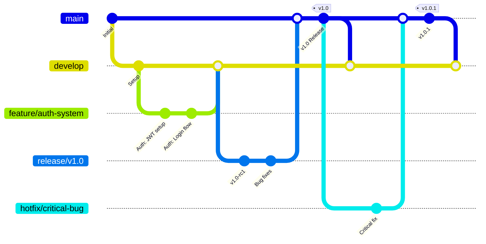

# GitHub Repository Architecture
## Headless WordPress + Next.js Enterprise Solution

### Document Information
- **Document Version**: 1.0
- **Last Updated**: 2025-08-11
- **Owner**: DevOps Team
- **Review Cycle**: Quarterly

---

## Executive Summary

This document defines the GitHub repository architecture, branching strategy, security configuration, and collaboration workflows for our headless WordPress + Next.js enterprise solution. The architecture prioritizes security, collaboration, and automated quality assurance while maintaining development velocity.

**Key Architectural Decisions:**
- **Branching Strategy**: GitFlow with environment-specific branches
- **Security**: Branch protection, required reviews, automated security scanning
- **Automation**: Comprehensive CI/CD with quality gates
- **Collaboration**: Templates, labels, and workflows for efficient team collaboration

---

## Repository Structure Analysis

### Current State Assessment

```
Wordpess-Claude/
├── .github/                    # GitHub-specific configurations
│   ├── workflows/              # CI/CD pipeline definitions
│   ├── ISSUE_TEMPLATE/         # Issue templates
│   ├── PULL_REQUEST_TEMPLATE/  # PR templates
│   └── CODEOWNERS              # Code ownership definitions
├── docs/                       # Comprehensive documentation
├── frontend/                   # Next.js application
├── wordpress/                  # WordPress backend
├── infrastructure/             # Infrastructure as Code
├── tests/                      # Test suites
└── [configuration files]       # Root configuration
```

### Recommended Improvements

1. **Repository Settings Optimization**
2. **Branch Protection Configuration**
3. **Security and Compliance Setup**
4. **Collaboration Templates**
5. **Automated Workflows**
6. **Access Control and Permissions**

---

## Branching Strategy

### GitFlow Implementation



### Branch Definitions

#### Main Branches

**1. `main`** (Production)
- **Purpose**: Production-ready code
- **Protection**: Maximum protection with required reviews
- **Deployment**: Auto-deploy to production environment
- **Access**: Maintainers only
- **Merge Policy**: Only from `release/*` and `hotfix/*` branches

**2. `develop`** (Development Integration)
- **Purpose**: Integration branch for active development
- **Protection**: Required reviews and status checks
- **Deployment**: Auto-deploy to development environment
- **Access**: Developers with write access
- **Merge Policy**: From `feature/*` branches via PRs

**3. `staging`** (Staging Environment)
- **Purpose**: Pre-production testing and validation
- **Protection**: Required reviews and automated testing
- **Deployment**: Auto-deploy to staging environment
- **Access**: Developers and QA team
- **Merge Policy**: From `develop` branch when ready for staging

#### Supporting Branches

**Feature Branches**: `feature/<ticket-number>-<short-description>`
```
feature/PROJ-123-user-authentication
feature/PROJ-456-graphql-optimization
feature/PROJ-789-azure-deployment
```

**Release Branches**: `release/v<major>.<minor>`
```
release/v1.0
release/v1.1
release/v2.0
```

**Hotfix Branches**: `hotfix/v<major>.<minor>.<patch>-<description>`
```
hotfix/v1.0.1-security-patch
hotfix/v1.0.2-critical-bug-fix
```

### Branch Protection Rules

#### Main Branch Protection
```yaml
Branch: main
Protection Rules:
  - Restrict pushes that create files
  - Require pull request reviews before merging
  - Required reviewers: 2
  - Dismiss stale reviews: true
  - Require review from CODEOWNERS: true
  - Restrict review dismissals: true
  - Require status checks: true
  - Required status checks:
    - ci/build-frontend
    - ci/build-backend
    - ci/test-unit
    - ci/test-integration
    - ci/test-e2e
    - ci/security-scan
    - ci/code-quality
  - Require branches to be up to date: true
  - Include administrators: true
  - Allow force pushes: false
  - Allow deletions: false
```

#### Develop Branch Protection
```yaml
Branch: develop
Protection Rules:
  - Require pull request reviews before merging
  - Required reviewers: 1
  - Dismiss stale reviews: false
  - Require status checks: true
  - Required status checks:
    - ci/build-frontend
    - ci/build-backend
    - ci/test-unit
    - ci/lint-and-format
  - Require branches to be up to date: true
  - Allow force pushes: false
  - Allow deletions: false
```

#### Feature Branch Conventions
```yaml
Branch Pattern: feature/*
Naming Convention: feature/<ticket>-<description>
Lifecycle:
  1. Create from develop
  2. Regular commits with descriptive messages
  3. Rebase on develop before PR
  4. Submit PR to develop
  5. Code review and approval
  6. Merge to develop
  7. Delete feature branch
```

---

## Repository Security Configuration

### Security Policies

#### GitHub Security Features
```yaml
Security Settings:
  - Dependency scanning: Enabled
  - Secret scanning: Enabled
  - Code scanning: Enabled (CodeQL)
  - Security advisories: Enabled
  - Automated security updates: Enabled
  - Vulnerability reporting: Private
```

#### Secrets Management
```yaml
Repository Secrets:
  # Azure Deployment
  - AZURE_CREDENTIALS
  - AZURE_SUBSCRIPTION_ID
  - AZURE_TENANT_ID
  - AZURE_CLIENT_ID
  - AZURE_CLIENT_SECRET
  
  # Database Credentials
  - MYSQL_ROOT_PASSWORD
  - MYSQL_PASSWORD
  - REDIS_PASSWORD
  
  # Application Secrets
  - JWT_SECRET
  - WORDPRESS_AUTH_KEY
  - WORDPRESS_SECURE_AUTH_KEY
  - WORDPRESS_LOGGED_IN_KEY
  - WORDPRESS_NONCE_KEY
  
  # External Services
  - SENDGRID_API_KEY
  - CLOUDFLARE_API_TOKEN
  - SENTRY_DSN
  
  # CI/CD
  - DOCKER_USERNAME
  - DOCKER_PASSWORD
  - SLACK_WEBHOOK_URL
  - TEAMS_WEBHOOK_URL

Environment Secrets:
  production:
    - PROD_DATABASE_URL
    - PROD_REDIS_URL
    - PROD_STORAGE_ACCOUNT_KEY
  
  staging:
    - STAGING_DATABASE_URL
    - STAGING_REDIS_URL
    - STAGING_STORAGE_ACCOUNT_KEY
  
  development:
    - DEV_DATABASE_URL
    - DEV_REDIS_URL
```

### CODEOWNERS Configuration

```gitignore
# .github/CODEOWNERS
# Global ownership
* @technical-leads @senior-developers

# Architecture and Infrastructure
/docs/architecture/ @architects @technical-leads
/infrastructure/ @devops-team @technical-leads
/.github/workflows/ @devops-team @technical-leads

# Frontend Development
/frontend/ @frontend-team @technical-leads
/frontend/src/components/ @frontend-team
/frontend/src/lib/ @frontend-team @senior-developers

# Backend Development
/wordpress/ @backend-team @technical-leads
/wordpress/plugins/ @backend-team
/wordpress/themes/ @backend-team @frontend-team

# Database and Configuration
/infrastructure/docker/mysql/ @backend-team @devops-team
/infrastructure/docker/redis/ @backend-team @devops-team

# Documentation
/docs/ @technical-writers @technical-leads
/README.md @technical-writers @technical-leads
/CHANGELOG.md @technical-leads

# Security and Compliance
/.github/dependabot.yml @security-team @devops-team
/.github/workflows/security.yml @security-team @devops-team

# Testing
/tests/ @qa-team @developers
/frontend/src/**/*.test.* @frontend-team @qa-team
/wordpress/tests/ @backend-team @qa-team

# Configuration Files
/docker-compose.yml @devops-team @technical-leads
/Makefile @devops-team @senior-developers
package.json @frontend-team @senior-developers
composer.json @backend-team @senior-developers
```

---

## Issue and PR Templates

### Issue Templates

#### Bug Report Template
```yaml
# .github/ISSUE_TEMPLATE/bug_report.yml
name: Bug Report
description: Report a bug to help us improve
title: "[BUG] "
labels: ["bug", "triage"]
assignees: []
body:
  - type: markdown
    attributes:
      value: |
        Thanks for taking the time to report a bug! Please fill out the form below.
  
  - type: dropdown
    id: component
    attributes:
      label: Component
      description: Which component is affected?
      options:
        - Frontend (Next.js)
        - Backend (WordPress)
        - Database (MySQL)
        - Cache (Redis)
        - Infrastructure
        - Documentation
        - CI/CD
    validations:
      required: true
  
  - type: dropdown
    id: environment
    attributes:
      label: Environment
      description: Where did you encounter this bug?
      options:
        - Development
        - Staging
        - Production
        - Local Docker
    validations:
      required: true
  
  - type: textarea
    id: description
    attributes:
      label: Bug Description
      description: A clear and concise description of what the bug is.
      placeholder: Describe the bug...
    validations:
      required: true
  
  - type: textarea
    id: reproduction
    attributes:
      label: Steps to Reproduce
      description: Steps to reproduce the behavior
      placeholder: |
        1. Go to '...'
        2. Click on '...'
        3. Scroll down to '...'
        4. See error
    validations:
      required: true
  
  - type: textarea
    id: expected
    attributes:
      label: Expected Behavior
      description: What you expected to happen
      placeholder: Describe expected behavior...
    validations:
      required: true
  
  - type: textarea
    id: actual
    attributes:
      label: Actual Behavior
      description: What actually happened
      placeholder: Describe actual behavior...
    validations:
      required: true
  
  - type: textarea
    id: screenshots
    attributes:
      label: Screenshots
      description: If applicable, add screenshots to help explain your problem.
  
  - type: textarea
    id: system-info
    attributes:
      label: System Information
      description: Please provide relevant system information
      placeholder: |
        - OS: [e.g. macOS 13.0]
        - Browser: [e.g. Chrome 108.0]
        - Node.js version: [e.g. 18.12.0]
        - Docker version: [e.g. 20.10.21]
  
  - type: textarea
    id: additional
    attributes:
      label: Additional Context
      description: Add any other context about the problem here.
```

#### Feature Request Template
```yaml
# .github/ISSUE_TEMPLATE/feature_request.yml
name: Feature Request
description: Suggest a new feature or enhancement
title: "[FEATURE] "
labels: ["enhancement", "triage"]
body:
  - type: dropdown
    id: component
    attributes:
      label: Component
      description: Which component should this feature be added to?
      options:
        - Frontend (Next.js)
        - Backend (WordPress)
        - Database (MySQL)
        - Cache (Redis)
        - Infrastructure
        - Documentation
        - CI/CD
        - Developer Experience
    validations:
      required: true
  
  - type: dropdown
    id: priority
    attributes:
      label: Priority
      description: How important is this feature?
      options:
        - Low
        - Medium
        - High
        - Critical
    validations:
      required: true
  
  - type: textarea
    id: problem
    attributes:
      label: Problem Statement
      description: What problem does this feature solve?
      placeholder: Describe the problem this feature would solve...
    validations:
      required: true
  
  - type: textarea
    id: solution
    attributes:
      label: Proposed Solution
      description: Describe the solution you'd like
      placeholder: Describe your proposed solution...
    validations:
      required: true
  
  - type: textarea
    id: alternatives
    attributes:
      label: Alternatives Considered
      description: Describe alternatives you've considered
      placeholder: Describe alternative solutions...
  
  - type: textarea
    id: acceptance-criteria
    attributes:
      label: Acceptance Criteria
      description: What conditions must be met for this feature to be considered complete?
      placeholder: |
        - [ ] Condition 1
        - [ ] Condition 2
        - [ ] Condition 3
  
  - type: textarea
    id: technical-notes
    attributes:
      label: Technical Notes
      description: Any technical considerations or constraints
  
  - type: checkboxes
    id: impact
    attributes:
      label: Impact Assessment
      description: Select all that apply
      options:
        - label: Breaking change
        - label: Database migration required
        - label: Infrastructure changes required
        - label: Documentation update required
        - label: Third-party integration required
```

### Pull Request Template

```markdown
# .github/PULL_REQUEST_TEMPLATE.md
# Pull Request

## Description
<!-- Provide a brief description of the changes -->

## Related Issue(s)
<!-- Link to the related issue(s) -->
Closes #
Related to #

## Type of Change
<!-- Select the type of change -->
- [ ] Bug fix (non-breaking change which fixes an issue)
- [ ] New feature (non-breaking change which adds functionality)
- [ ] Breaking change (fix or feature that would cause existing functionality to not work as expected)
- [ ] Documentation update
- [ ] Performance improvement
- [ ] Code refactoring
- [ ] Infrastructure change
- [ ] Test improvement

## Component(s) Affected
<!-- Select all components that are affected by this change -->
- [ ] Frontend (Next.js)
- [ ] Backend (WordPress)
- [ ] Database (MySQL)
- [ ] Cache (Redis)
- [ ] Infrastructure
- [ ] CI/CD
- [ ] Documentation
- [ ] Tests

## Testing
<!-- Describe the tests that you ran to verify your changes -->

### Test Configuration
- [ ] Local development environment
- [ ] Docker environment
- [ ] Staging environment
- [ ] Manual testing performed
- [ ] Automated tests pass

### Test Cases
<!-- List specific test cases -->
- [ ] Test case 1
- [ ] Test case 2
- [ ] Test case 3

## Screenshots
<!-- If applicable, add screenshots to help explain your changes -->

## Performance Impact
<!-- Describe any performance implications -->
- [ ] No performance impact
- [ ] Performance improvement
- [ ] Potential performance impact (explain below)

## Security Considerations
<!-- Describe any security implications -->
- [ ] No security impact
- [ ] Security improvement
- [ ] Potential security impact (explain below)

## Documentation
<!-- Select all that apply -->
- [ ] Code is self-documenting
- [ ] Added/updated code comments
- [ ] Added/updated README
- [ ] Added/updated API documentation
- [ ] Added/updated architecture documentation
- [ ] No documentation needed

## Deployment Notes
<!-- Any special deployment considerations -->
- [ ] No special deployment requirements
- [ ] Database migration required
- [ ] Infrastructure changes required
- [ ] Environment variables need updating
- [ ] Third-party service configuration needed

## Checklist
<!-- Ensure all items are completed before submitting -->
- [ ] My code follows the style guidelines of this project
- [ ] I have performed a self-review of my own code
- [ ] I have commented my code, particularly in hard-to-understand areas
- [ ] I have made corresponding changes to the documentation
- [ ] My changes generate no new warnings
- [ ] I have added tests that prove my fix is effective or that my feature works
- [ ] New and existing unit tests pass locally with my changes
- [ ] Any dependent changes have been merged and published in downstream modules
- [ ] I have checked my code and corrected any misspellings

## Additional Notes
<!-- Any additional information that reviewers should know -->
```

---

## Labels and Project Management

### Label Strategy

#### Type Labels
```yaml
bug:
  color: "d73a4a"
  description: "Something isn't working"

enhancement:
  color: "a2eeef"
  description: "New feature or request"

documentation:
  color: "0075ca"
  description: "Improvements or additions to documentation"

security:
  color: "b60205"
  description: "Security-related issues or improvements"

performance:
  color: "fef2c0"
  description: "Performance improvements"

refactor:
  color: "fbca04"
  description: "Code refactoring"

test:
  color: "c5def5"
  description: "Testing improvements"
```

#### Priority Labels
```yaml
priority-critical:
  color: "b60205"
  description: "Critical priority - immediate attention required"

priority-high:
  color: "d93f0b"
  description: "High priority"

priority-medium:
  color: "fbca04"
  description: "Medium priority"

priority-low:
  color: "0e8a16"
  description: "Low priority"
```

#### Component Labels
```yaml
frontend:
  color: "61dafb"
  description: "Frontend (Next.js) related"

backend:
  color: "21759b"
  description: "Backend (WordPress) related"

database:
  color: "4479a1"
  description: "Database (MySQL) related"

cache:
  color: "d82c20"
  description: "Cache (Redis) related"

infrastructure:
  color: "0078d4"
  description: "Infrastructure related"

ci-cd:
  color: "28a745"
  description: "CI/CD pipeline related"
```

#### Status Labels
```yaml
triage:
  color: "ffffff"
  description: "Needs initial review and categorization"

in-progress:
  color: "fbca04"
  description: "Currently being worked on"

waiting-review:
  color: "fef2c0"
  description: "Waiting for code review"

waiting-feedback:
  color: "d4c5f9"
  description: "Waiting for feedback from reporter"

blocked:
  color: "b60205"
  description: "Blocked by external dependency"

ready-to-merge:
  color: "0e8a16"
  description: "Approved and ready to merge"

wont-fix:
  color: "6f42c1"
  description: "Will not be addressed"

duplicate:
  color: "cfd3d7"
  description: "Duplicate of another issue"

invalid:
  color: "e4e669"
  description: "Invalid issue or request"
```

### Project Boards

#### Development Board
```yaml
Name: "Development Workflow"
Columns:
  1. "Backlog"
     - New issues
     - Feature requests
     - Unplanned work
  
  2. "To Do"
     - Prioritized issues
     - Sprint planning
     - Ready for development
  
  3. "In Progress"
     - Active development
     - Assigned issues
     - Work in progress
  
  4. "In Review"
     - Pull requests
     - Code review
     - Testing phase
  
  5. "Testing"
     - QA validation
     - Staging deployment
     - User acceptance testing
  
  6. "Done"
     - Completed work
     - Deployed to production
     - Closed issues

Automation:
  - Move new issues to "Backlog"
  - Move PRs to "In Review"
  - Move approved PRs to "Testing"
  - Move merged PRs to "Done"
```

#### Release Planning Board
```yaml
Name: "Release Planning"
Columns:
  1. "Planned Features"
  2. "Current Sprint"
  3. "Next Sprint"
  4. "Ready for Release"
  5. "Released"

Filters:
  - Milestone-based organization
  - Priority-based sorting
  - Component-based grouping
```

---

## Access Control and Permissions

### Team Structure

#### Repository Roles
```yaml
Admin:
  Members: ["technical-leads", "project-managers"]
  Permissions:
    - Repository settings
    - Branch protection
    - Security settings
    - Team management
    - Secret management

Maintainer:
  Members: ["senior-developers", "architects"]
  Permissions:
    - Code review
    - Merge to protected branches
    - Issue management
    - Pull request management
    - Release management

Write:
  Members: ["developers", "qa-engineers"]
  Permissions:
    - Create branches
    - Submit pull requests
    - Comment on issues/PRs
    - Create issues
    - Fork repository

Triage:
  Members: ["junior-developers", "interns"]
  Permissions:
    - Comment on issues/PRs
    - Create issues
    - Fork repository
    - Assign labels (limited)

Read:
  Members: ["stakeholders", "contractors"]
  Permissions:
    - View repository
    - Clone repository
    - Download releases
    - View issues/PRs
```

#### Team Assignments
```yaml
Teams:
  technical-leads:
    Members: ["lead-architect", "senior-tech-lead"]
    Access: Admin
    Responsibilities:
      - Architecture decisions
      - Code review oversight
      - Release approval
      - Security oversight
  
  frontend-team:
    Members: ["frontend-lead", "frontend-dev-1", "frontend-dev-2"]
    Access: Write
    Responsibilities:
      - Next.js development
      - UI/UX implementation
      - Frontend testing
      - Performance optimization
  
  backend-team:
    Members: ["backend-lead", "backend-dev-1", "backend-dev-2"]
    Access: Write
    Responsibilities:
      - WordPress development
      - GraphQL API
      - Database management
      - Server-side logic
  
  devops-team:
    Members: ["devops-lead", "infrastructure-engineer"]
    Access: Maintainer
    Responsibilities:
      - CI/CD pipelines
      - Infrastructure management
      - Security compliance
      - Monitoring and alerts
  
  qa-team:
    Members: ["qa-lead", "qa-engineer-1", "qa-engineer-2"]
    Access: Write
    Responsibilities:
      - Test strategy
      - Quality assurance
      - Bug reporting
      - User acceptance testing
```

### External Collaborators

#### Contractor Access
```yaml
Contractors:
  Access Level: Triage
  Duration: Temporary (project-based)
  Permissions:
    - View code
    - Create issues
    - Comment on assigned work
  Restrictions:
    - No direct repository access
    - No sensitive information access
    - Time-limited access
  Review Process:
    - Monthly access review
    - Automatic removal on project completion
```

#### Third-party Integration
```yaml
GitHub Apps:
  - Dependabot: Dependency management
  - CodeQL: Security analysis
  - Azure DevOps: CI/CD integration
  - Slack: Notifications
  - Jira: Issue tracking
  - SonarCloud: Code quality

Webhooks:
  - Deployment notifications
  - Security alerts
  - Code quality reports
  - Build status updates
```

---

## Automation and Workflows

### Automated Workflows

#### PR Automation
```yaml
# .github/workflows/pr-automation.yml
name: PR Automation
on:
  pull_request:
    types: [opened, synchronize, reopened]

jobs:
  label-pr:
    runs-on: ubuntu-latest
    steps:
      - name: Auto-label PR
        uses: actions/labeler@v4
        with:
          repo-token: ${{ secrets.GITHUB_TOKEN }}
  
  size-label:
    runs-on: ubuntu-latest
    steps:
      - name: Add size label
        uses: pascalgn/size-label-action@v0.4.3
        env:
          GITHUB_TOKEN: ${{ secrets.GITHUB_TOKEN }}
  
  assign-reviewers:
    runs-on: ubuntu-latest
    steps:
      - name: Auto-assign reviewers
        uses: kentaro-m/auto-assign-action@v1.2.5
        with:
          repo-token: ${{ secrets.GITHUB_TOKEN }}
```

#### Issue Management
```yaml
# .github/workflows/issue-management.yml
name: Issue Management
on:
  issues:
    types: [opened, labeled, unlabeled]
  
jobs:
  triage-issue:
    runs-on: ubuntu-latest
    steps:
      - name: Auto-triage
        uses: actions/github-script@v6
        with:
          script: |
            // Auto-assign based on labels
            const issue = context.payload.issue;
            const labels = issue.labels.map(label => label.name);
            
            let assignees = [];
            if (labels.includes('frontend')) {
              assignees.push('frontend-lead');
            }
            if (labels.includes('backend')) {
              assignees.push('backend-lead');
            }
            if (labels.includes('infrastructure')) {
              assignees.push('devops-lead');
            }
            
            if (assignees.length > 0) {
              github.rest.issues.addAssignees({
                owner: context.repo.owner,
                repo: context.repo.repo,
                issue_number: issue.number,
                assignees: assignees
              });
            }
```

#### Stale Issue Management
```yaml
# .github/workflows/stale.yml
name: Mark stale issues and pull requests
on:
  schedule:
    - cron: '0 0 * * *'  # Daily at midnight

jobs:
  stale:
    runs-on: ubuntu-latest
    steps:
      - uses: actions/stale@v8
        with:
          repo-token: ${{ secrets.GITHUB_TOKEN }}
          stale-issue-message: |
            This issue has been automatically marked as stale because it has not had 
            recent activity. It will be closed if no further activity occurs. 
            Thank you for your contributions.
          stale-pr-message: |
            This pull request has been automatically marked as stale because it has not had 
            recent activity. It will be closed if no further activity occurs. 
            Thank you for your contributions.
          close-issue-message: |
            This issue has been automatically closed due to inactivity. 
            If you believe this issue is still relevant, please reopen it.
          close-pr-message: |
            This pull request has been automatically closed due to inactivity. 
            If you would like to continue working on this, please reopen it.
          days-before-stale: 30
          days-before-close: 7
          exempt-issue-labels: 'pinned,security,enhancement'
          exempt-pr-labels: 'pinned,work-in-progress'
```

### Release Automation

#### Semantic Versioning
```yaml
# .github/workflows/release.yml
name: Release
on:
  push:
    branches: [main]

jobs:
  release:
    runs-on: ubuntu-latest
    steps:
      - uses: actions/checkout@v4
        with:
          fetch-depth: 0
          token: ${{ secrets.PERSONAL_ACCESS_TOKEN }}
      
      - name: Setup Node.js
        uses: actions/setup-node@v4
        with:
          node-version: 18
      
      - name: Install dependencies
        run: npm ci
      
      - name: Semantic Release
        env:
          GITHUB_TOKEN: ${{ secrets.PERSONAL_ACCESS_TOKEN }}
          NPM_TOKEN: ${{ secrets.NPM_TOKEN }}
        run: npx semantic-release
```

---

## Monitoring and Analytics

### Repository Insights

#### Metrics Dashboard
```yaml
Key Metrics:
  Development Velocity:
    - Commits per day/week
    - Pull requests opened/merged
    - Issue resolution time
    - Code review turnaround time
  
  Code Quality:
    - Code coverage percentage
    - Security vulnerabilities
    - Code duplication
    - Technical debt ratio
  
  Collaboration:
    - Contributors count
    - Review participation
    - Discussion activity
    - Community engagement
  
  Operational:
    - Build success rate
    - Deployment frequency
    - Mean time to recovery
    - Change failure rate
```

#### Automated Reports
```yaml
Reports:
  Weekly Development Summary:
    - Generated every Monday
    - Sent to team leads
    - Includes velocity metrics
    - Highlights bottlenecks
  
  Monthly Security Report:
    - Security scan results
    - Dependency vulnerabilities
    - Compliance status
    - Remediation recommendations
  
  Quarterly Architecture Review:
    - Code complexity analysis
    - Technical debt assessment
    - Architecture compliance
    - Improvement recommendations
```

---

## Migration and Implementation Plan

### Implementation Phases

#### Phase 1: Repository Setup (Week 1)
```yaml
Tasks:
  - Configure repository settings
  - Set up branch protection rules
  - Create issue/PR templates
  - Configure CODEOWNERS
  - Set up initial labels
Deliverables:
  - Protected main/develop branches
  - Automated PR/issue workflows
  - Team access configured
Success Criteria:
  - All protection rules active
  - Templates working correctly
  - Team permissions verified
```

#### Phase 2: Security Configuration (Week 2)
```yaml
Tasks:
  - Enable security scanning
  - Configure secret management
  - Set up Dependabot
  - Configure security policies
  - Implement CODEOWNERS
Deliverables:
  - Security scanning active
  - Secrets properly managed
  - Automated security updates
Success Criteria:
  - Security scan passing
  - No exposed secrets
  - Dependabot functioning
```

#### Phase 3: Workflow Automation (Week 3)
```yaml
Tasks:
  - Implement CI/CD workflows
  - Set up automated labeling
  - Configure release automation
  - Create monitoring dashboards
  - Train team on new processes
Deliverables:
  - Automated CI/CD pipeline
  - Streamlined PR process
  - Release automation
Success Criteria:
  - Successful automated builds
  - Reduced manual overhead
  - Team adoption
```

### Migration Checklist

```yaml
Pre-Migration:
  - [ ] Document current workflow
  - [ ] Identify team roles and permissions
  - [ ] Plan branch migration strategy
  - [ ] Prepare team training materials
  - [ ] Set up backup procedures

Migration:
  - [ ] Create new branch structure
  - [ ] Migrate existing branches
  - [ ] Update CI/CD pipelines
  - [ ] Configure security settings
  - [ ] Test all workflows

Post-Migration:
  - [ ] Validate all protections
  - [ ] Test automation workflows
  - [ ] Train team members
  - [ ] Monitor adoption metrics
  - [ ] Collect feedback and iterate
```

---

## Best Practices and Guidelines

### Commit Message Convention

```
type(scope): subject

[optional body]

[optional footer(s)]
```

#### Types
- `feat`: New feature
- `fix`: Bug fix
- `docs`: Documentation changes
- `style`: Code style changes (formatting, etc.)
- `refactor`: Code refactoring
- `perf`: Performance improvements
- `test`: Adding or modifying tests
- `chore`: Maintenance tasks
- `ci`: CI/CD changes
- `build`: Build system changes

#### Examples
```
feat(frontend): add user authentication flow

Implement JWT-based authentication with login/logout functionality.
Includes form validation and error handling.

Closes #123

---

fix(backend): resolve GraphQL query timeout issue

Optimize database queries to prevent timeout on large datasets.
Add query complexity analysis to prevent expensive operations.

Fixes #456

---

docs(architecture): update deployment guide

Add Azure-specific deployment instructions and troubleshooting section.
```

### Code Review Guidelines

#### Review Criteria
```yaml
Functionality:
  - [ ] Code works as intended
  - [ ] Edge cases handled
  - [ ] Error handling implemented
  - [ ] Business requirements met

Code Quality:
  - [ ] Follows project conventions
  - [ ] Well-structured and readable
  - [ ] Appropriate comments
  - [ ] No code duplication
  - [ ] Performance considerations

Security:
  - [ ] No security vulnerabilities
  - [ ] Input validation present
  - [ ] Authentication/authorization correct
  - [ ] No sensitive data exposure

Testing:
  - [ ] Adequate test coverage
  - [ ] Tests are meaningful
  - [ ] All tests passing
  - [ ] Manual testing performed

Documentation:
  - [ ] README updated if needed
  - [ ] API documentation updated
  - [ ] Comments explain complex logic
  - [ ] Breaking changes documented
```

#### Review Process
1. **Self-Review**: Author reviews own code before submission
2. **Automated Checks**: CI/CD pipeline validates code quality
3. **Peer Review**: At least one team member reviews
4. **Technical Review**: Senior developer/architect for complex changes
5. **Final Approval**: Code owner or maintainer approval
6. **Merge**: Automated merge after all approvals

---

## Conclusion

This GitHub repository architecture provides a comprehensive foundation for enterprise-grade development collaboration. The implementation ensures:

- **Security**: Comprehensive security controls and scanning
- **Quality**: Automated quality gates and code review processes
- **Efficiency**: Streamlined workflows and automation
- **Compliance**: Proper access controls and audit trails
- **Scalability**: Structure that grows with the team

Regular review and optimization of these processes will ensure continued effectiveness as the project and team evolve.
