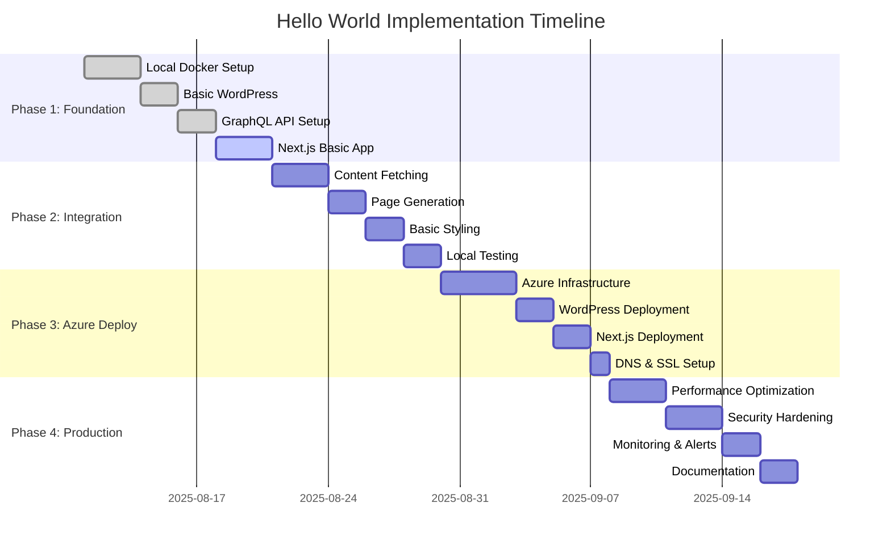

# Hello World Implementation Strategy
## Headless WordPress + Next.js Phased Approach

### Document Information
- **Document Version**: 1.0
- **Last Updated**: 2025-08-11
- **Owner**: Technical Architecture Team
- **Estimated Timeline**: 4-6 weeks

---

## Executive Summary

This document outlines a systematic, phased approach to implementing our headless WordPress + Next.js solution. The strategy prioritizes getting a basic working system operational quickly, then incrementally adding complexity and production features.

**Key Principles:**
- **Iterative Development**: Each phase delivers working functionality
- **Risk Mitigation**: Complex features introduced gradually
- **Continuous Validation**: Regular testing and stakeholder feedback
- **Production Readiness**: Final phase focuses on enterprise requirements

---

## Implementation Phases Overview



---

## Phase 1: Foundation Setup (Week 1)

### 1.1 Goals and Objectives

**Primary Goals:**
- Establish local development environment
- Configure headless WordPress with GraphQL
- Create basic Next.js application
- Verify API connectivity

**Success Criteria:**
- [ ] Docker environment running WordPress, MySQL, and Redis
- [ ] WordPress admin accessible with sample content
- [ ] GraphQL endpoint responding to basic queries
- [ ] Next.js app displaying "Hello World" from WordPress

### 1.2 Technical Implementation

#### Docker Development Environment
```yaml
# docker-compose.yml
version: '3.8'

services:
  mysql:
    image: mysql:8.0
    container_name: headless_wp_mysql
    restart: unless-stopped
    environment:
      MYSQL_DATABASE: wordpress
      MYSQL_USER: wordpress
      MYSQL_PASSWORD: wordpress_password
      MYSQL_ROOT_PASSWORD: root_password
    volumes:
      - mysql_data:/var/lib/mysql
      - ./mysql/init:/docker-entrypoint-initdb.d
    ports:
      - "3306:3306"
    networks:
      - headless_wp_network

  redis:
    image: redis:7-alpine
    container_name: headless_wp_redis
    restart: unless-stopped
    command: redis-server --appendonly yes
    volumes:
      - redis_data:/data
    ports:
      - "6379:6379"
    networks:
      - headless_wp_network

  wordpress:
    build:
      context: ./wordpress
      dockerfile: Dockerfile
    container_name: headless_wp_backend
    restart: unless-stopped
    environment:
      WORDPRESS_DB_HOST: mysql
      WORDPRESS_DB_USER: wordpress
      WORDPRESS_DB_PASSWORD: wordpress_password
      WORDPRESS_DB_NAME: wordpress
      WORDPRESS_CONFIG_EXTRA: |
        define('WP_DEBUG', true);
        define('WP_DEBUG_LOG', true);
        define('GRAPHQL_DEBUG', true);
        define('WP_REDIS_HOST', 'redis');
        define('WP_REDIS_PORT', 6379);
    volumes:
      - ./wordpress/themes:/var/www/html/wp-content/themes
      - ./wordpress/plugins:/var/www/html/wp-content/plugins
      - ./wordpress/uploads:/var/www/html/wp-content/uploads
      - wordpress_data:/var/www/html
    ports:
      - "8080:80"
    depends_on:
      - mysql
      - redis
    networks:
      - headless_wp_network

  frontend:
    build:
      context: ./frontend
      dockerfile: Dockerfile.dev
    container_name: headless_wp_frontend
    restart: unless-stopped
    environment:
      NEXT_PUBLIC_WORDPRESS_URL: http://wordpress
      NEXT_PUBLIC_GRAPHQL_ENDPOINT: http://localhost:8080/graphql
      NODE_ENV: development
    volumes:
      - ./frontend:/app
      - /app/node_modules
      - /app/.next
    ports:
      - "3000:3000"
    depends_on:
      - wordpress
    networks:
      - headless_wp_network
    command: npm run dev

volumes:
  mysql_data:
  redis_data:
  wordpress_data:

networks:
  headless_wp_network:
    driver: bridge
```

#### WordPress Dockerfile
```dockerfile
# wordpress/Dockerfile
FROM wordpress:6.4-php8.2-apache

# Install additional PHP extensions
RUN docker-php-ext-install opcache

# Install Redis PHP extension
RUN pecl install redis && docker-php-ext-enable redis

# Configure PHP
COPY php.ini /usr/local/etc/php/conf.d/custom.ini

# Install WP-CLI
RUN curl -O https://raw.githubusercontent.com/wp-cli/wp-cli/main/phar/wp-cli.phar && \
    chmod +x wp-cli.phar && \
    mv wp-cli.phar /usr/local/bin/wp

# Copy custom themes and plugins
COPY themes/ /var/www/html/wp-content/themes/
COPY plugins/ /var/www/html/wp-content/plugins/

# Copy WordPress configuration script
COPY wp-setup.sh /usr/local/bin/wp-setup.sh
RUN chmod +x /usr/local/bin/wp-setup.sh

# Set up entrypoint
COPY docker-entrypoint.sh /usr/local/bin/
RUN chmod +x /usr/local/bin/docker-entrypoint.sh

ENTRYPOINT ["/usr/local/bin/docker-entrypoint.sh"]
CMD ["apache2-foreground"]
```

#### WordPress Setup Script
```bash
#!/bin/bash
# wordpress/wp-setup.sh

set -e

# Wait for MySQL to be ready
until wp db check --allow-root; do
    echo "Waiting for MySQL..."
    sleep 2
done

# Install WordPress if not already installed
if ! wp core is-installed --allow-root; then
    echo "Installing WordPress..."
    wp core install \
        --url="http://localhost:8080" \
        --title="Headless WordPress" \
        --admin_user="admin" \
        --admin_password="admin_password" \
        --admin_email="admin@example.com" \
        --allow-root
fi

# Install and activate required plugins
echo "Installing plugins..."
wp plugin install wp-graphql --activate --allow-root
wp plugin install advanced-custom-fields --activate --allow-root
wp plugin install wp-graphql-acf --activate --allow-root
wp plugin install redis-cache --activate --allow-root

# Create sample content
echo "Creating sample content..."
wp post create --post_title="Hello World from WordPress" \
    --post_content="<p>This is a sample post fetched via GraphQL API from our headless WordPress backend.</p><p>This demonstrates the basic connectivity between WordPress and Next.js.</p>" \
    --post_status="publish" \
    --allow-root

# Create a sample page
wp post create --post_type="page" \
    --post_title="About Us" \
    --post_content="<p>This is a sample page content that will be rendered by our Next.js frontend.</p>" \
    --post_status="publish" \
    --allow-root

# Set up Redis object cache
wp redis enable --allow-root

# Configure GraphQL settings
wp option update graphql_general_settings '{"show_in_graphql":true}' --format=json --allow-root

echo "WordPress setup completed!"
```

#### Next.js Development Setup
```dockerfile
# frontend/Dockerfile.dev
FROM node:18-alpine

WORKDIR /app

# Install dependencies
COPY package*.json ./
RUN npm ci

# Copy source code
COPY . .

# Expose port
EXPOSE 3000

# Start development server
CMD ["npm", "run", "dev"]
```

#### Basic Next.js Configuration
```javascript
// frontend/next.config.js
/** @type {import('next').NextConfig} */
const nextConfig = {
  experimental: {
    appDir: true
  },
  images: {
    domains: ['localhost'],
    remotePatterns: [
      {
        protocol: 'http',
        hostname: 'localhost',
        port: '8080',
        pathname: '/wp-content/uploads/**'
      }
    ]
  },
  env: {
    WORDPRESS_URL: process.env.NEXT_PUBLIC_WORDPRESS_URL || 'http://localhost:8080',
    GRAPHQL_ENDPOINT: process.env.NEXT_PUBLIC_GRAPHQL_ENDPOINT || 'http://localhost:8080/graphql'
  }
};

module.exports = nextConfig;
```

### 1.3 Validation and Testing

#### Phase 1 Checklist
- [ ] **Environment Setup**
  - [ ] Docker Compose starts all services
  - [ ] WordPress accessible at http://localhost:8080
  - [ ] Next.js accessible at http://localhost:3000
  - [ ] MySQL and Redis containers running

- [ ] **WordPress Configuration**
  - [ ] Admin login successful (admin/admin_password)
  - [ ] WPGraphQL plugin active
  - [ ] GraphQL endpoint responding at /graphql
  - [ ] Sample content created

- [ ] **Basic Connectivity**
  - [ ] GraphQL query returns WordPress data
  - [ ] Next.js can fetch data from WordPress
  - [ ] Hot reloading working in development

#### Testing Commands
```bash
# Start the development environment
docker-compose up -d

# Check service health
docker-compose ps

# Test GraphQL endpoint
curl -X POST http://localhost:8080/graphql \
  -H "Content-Type: application/json" \
  -d '{
    "query": "query GetPosts { posts { nodes { title content } } }"
  }'

# View logs
docker-compose logs -f wordpress
docker-compose logs -f frontend
```

---

## Phase 2: Content Integration (Week 2)

### 2.1 Goals and Objectives

**Primary Goals:**
- Implement GraphQL data fetching in Next.js
- Create dynamic pages for posts and pages
- Add basic styling and layout
- Implement Static Site Generation (SSG)

**Success Criteria:**
- [ ] Homepage displays list of posts from WordPress
- [ ] Individual post pages render content
- [ ] Basic responsive layout implemented
- [ ] Static generation working for all pages

### 2.2 Technical Implementation

#### GraphQL Client Setup
```typescript
// frontend/lib/apollo-client.ts
import { ApolloClient, InMemoryCache, createHttpLink } from '@apollo/client';
import { setContext } from '@apollo/client/link/context';

const httpLink = createHttpLink({
  uri: process.env.NEXT_PUBLIC_GRAPHQL_ENDPOINT,
  credentials: 'same-origin'
});

const authLink = setContext((_, { headers }) => {
  return {
    headers: {
      ...headers,
      'Content-Type': 'application/json'
    }
  };
});

const client = new ApolloClient({
  link: authLink.concat(httpLink),
  cache: new InMemoryCache({
    typePolicies: {
      Post: {
        fields: {
          categories: {
            merge(existing, incoming) {
              return incoming;
            }
          }
        }
      }
    }
  }),
  defaultOptions: {
    watchQuery: {
      errorPolicy: 'ignore'
    },
    query: {
      errorPolicy: 'all'
    }
  }
});

export default client;
```

#### GraphQL Queries
```typescript
// frontend/lib/queries.ts
import { gql } from '@apollo/client';

export const GET_POSTS = gql`
  query GetPosts($first: Int = 10, $after: String) {
    posts(first: $first, after: $after, where: { status: PUBLISH }) {
      pageInfo {
        hasNextPage
        hasPreviousPage
        startCursor
        endCursor
      }
      nodes {
        id
        databaseId
        title
        content
        excerpt
        slug
        date
        modified
        author {
          node {
            name
            avatar {
              url
            }
          }
        }
        featuredImage {
          node {
            sourceUrl
            altText
            mediaDetails {
              width
              height
            }
          }
        }
        categories {
          nodes {
            name
            slug
          }
        }
        tags {
          nodes {
            name
            slug
          }
        }
      }
    }
  }
`;

export const GET_POST_BY_SLUG = gql`
  query GetPostBySlug($slug: ID!) {
    post(id: $slug, idType: SLUG) {
      id
      databaseId
      title
      content
      excerpt
      slug
      date
      modified
      author {
        node {
          name
          description
          avatar {
            url
          }
        }
      }
      featuredImage {
        node {
          sourceUrl
          altText
          mediaDetails {
            width
            height
          }
        }
      }
      categories {
        nodes {
          name
          slug
        }
      }
      tags {
        nodes {
          name
          slug
        }
      }
    }
  }
`;

export const GET_PAGES = gql`
  query GetPages($first: Int = 10) {
    pages(first: $first, where: { status: PUBLISH }) {
      nodes {
        id
        databaseId
        title
        content
        slug
        date
        modified
        featuredImage {
          node {
            sourceUrl
            altText
            mediaDetails {
              width
              height
            }
          }
        }
      }
    }
  }
`;

export const GET_PAGE_BY_SLUG = gql`
  query GetPageBySlug($slug: ID!) {
    page(id: $slug, idType: URI) {
      id
      databaseId
      title
      content
      slug
      date
      modified
      featuredImage {
        node {
          sourceUrl
          altText
          mediaDetails {
            width
            height
          }
        }
      }
    }
  }
`;
```

#### Homepage Implementation
```tsx
// frontend/src/app/page.tsx
import { Suspense } from 'react';
import { PostsList } from '@/components/PostsList';
import { LoadingSpinner } from '@/components/LoadingSpinner';

export default function HomePage() {
  return (
    <main className="container mx-auto px-4 py-8">
      <h1 className="text-4xl font-bold text-center mb-8">
        Welcome to Headless WordPress + Next.js
      </h1>
      
      <div className="prose prose-lg mx-auto mb-12">
        <p className="text-xl text-gray-600 text-center">
          This is a demonstration of a headless WordPress backend powering a Next.js frontend
          with GraphQL API integration and static site generation.
        </p>
      </div>
      
      <section>
        <h2 className="text-2xl font-semibold mb-6">Latest Posts</h2>
        <Suspense fallback={<LoadingSpinner />}>
          <PostsList />
        </Suspense>
      </section>
    </main>
  );
}

export const metadata = {
  title: 'Home | Headless WordPress + Next.js',
  description: 'A modern headless WordPress implementation with Next.js frontend'
};
```

#### Posts List Component
```tsx
// frontend/src/components/PostsList.tsx
'use client';

import { useQuery } from '@apollo/client';
import Link from 'next/link';
import Image from 'next/image';
import { GET_POSTS } from '@/lib/queries';
import { formatDate } from '@/lib/utils';

export function PostsList() {
  const { loading, error, data } = useQuery(GET_POSTS, {
    variables: { first: 6 }
  });

  if (loading) return <div>Loading posts...</div>;
  if (error) return <div>Error loading posts: {error.message}</div>;
  if (!data?.posts?.nodes?.length) return <div>No posts found.</div>;

  return (
    <div className="grid gap-8 md:grid-cols-2 lg:grid-cols-3">
      {data.posts.nodes.map((post: any) => (
        <article key={post.id} className="bg-white rounded-lg shadow-md overflow-hidden hover:shadow-lg transition-shadow">
          {post.featuredImage?.node && (
            <div className="aspect-w-16 aspect-h-9">
              <Image
                src={post.featuredImage.node.sourceUrl}
                alt={post.featuredImage.node.altText || post.title}
                width={400}
                height={225}
                className="object-cover w-full h-48"
              />
            </div>
          )}
          
          <div className="p-6">
            <h3 className="text-xl font-semibold mb-2">
              <Link 
                href={`/posts/${post.slug}`}
                className="text-gray-900 hover:text-blue-600 transition-colors"
              >
                {post.title}
              </Link>
            </h3>
            
            <div className="text-sm text-gray-500 mb-3">
              <span>By {post.author.node.name}</span>
              <span className="mx-2">•</span>
              <time dateTime={post.date}>
                {formatDate(post.date)}
              </time>
            </div>
            
            {post.excerpt && (
              <div 
                className="text-gray-600 text-sm leading-relaxed"
                dangerouslySetInnerHTML={{ __html: post.excerpt }}
              />
            )}
            
            <div className="mt-4 flex flex-wrap gap-2">
              {post.categories.nodes.map((category: any) => (
                <span 
                  key={category.slug}
                  className="inline-block bg-blue-100 text-blue-800 text-xs px-2 py-1 rounded"
                >
                  {category.name}
                </span>
              ))}
            </div>
            
            <div className="mt-4">
              <Link 
                href={`/posts/${post.slug}`}
                className="text-blue-600 hover:text-blue-800 font-medium text-sm"
              >
                Read More →
              </Link>
            </div>
          </div>
        </article>
      ))}
    </div>
  );
}
```

#### Dynamic Post Pages
```tsx
// frontend/src/app/posts/[slug]/page.tsx
import { notFound } from 'next/navigation';
import Image from 'next/image';
import { getPost, getAllPostSlugs } from '@/lib/wordpress';
import { formatDate } from '@/lib/utils';

interface PostPageProps {
  params: {
    slug: string;
  };
}

export default async function PostPage({ params }: PostPageProps) {
  const post = await getPost(params.slug);
  
  if (!post) {
    notFound();
  }

  return (
    <main className="container mx-auto px-4 py-8">
      <article className="prose prose-lg mx-auto">
        {post.featuredImage?.node && (
          <div className="mb-8">
            <Image
              src={post.featuredImage.node.sourceUrl}
              alt={post.featuredImage.node.altText || post.title}
              width={800}
              height={450}
              className="rounded-lg shadow-md"
              priority
            />
          </div>
        )}
        
        <header className="mb-8">
          <h1 className="text-4xl font-bold mb-4">{post.title}</h1>
          
          <div className="flex items-center gap-4 text-gray-600 text-sm mb-6">
            <div className="flex items-center gap-2">
              {post.author.node.avatar?.url && (
                <Image
                  src={post.author.node.avatar.url}
                  alt={post.author.node.name}
                  width={32}
                  height={32}
                  className="rounded-full"
                />
              )}
              <span>By {post.author.node.name}</span>
            </div>
            
            <span>•</span>
            
            <time dateTime={post.date}>
              {formatDate(post.date)}
            </time>
            
            {post.modified !== post.date && (
              <>
                <span>•</span>
                <span>Updated {formatDate(post.modified)}</span>
              </>
            )}
          </div>
          
          {(post.categories.nodes.length > 0 || post.tags.nodes.length > 0) && (
            <div className="flex flex-wrap gap-2 mb-6">
              {post.categories.nodes.map((category: any) => (
                <span 
                  key={category.slug}
                  className="inline-block bg-blue-100 text-blue-800 text-xs px-3 py-1 rounded-full"
                >
                  {category.name}
                </span>
              ))}
              {post.tags.nodes.map((tag: any) => (
                <span 
                  key={tag.slug}
                  className="inline-block bg-gray-100 text-gray-700 text-xs px-3 py-1 rounded-full"
                >
                  #{tag.name}
                </span>
              ))}
            </div>
          )}
        </header>
        
        <div 
          className="prose prose-lg max-w-none"
          dangerouslySetInnerHTML={{ __html: post.content }}
        />
      </article>
    </main>
  );
}

// Generate static params for all posts
export async function generateStaticParams() {
  const slugs = await getAllPostSlugs();
  
  return slugs.map((slug) => ({
    slug
  }));
}

// Generate metadata for SEO
export async function generateMetadata({ params }: PostPageProps) {
  const post = await getPost(params.slug);
  
  if (!post) {
    return {
      title: 'Post Not Found'
    };
  }

  return {
    title: `${post.title} | Headless WordPress + Next.js`,
    description: post.excerpt?.replace(/<[^>]*>/g, '').substring(0, 160),
    openGraph: {
      title: post.title,
      description: post.excerpt?.replace(/<[^>]*>/g, '').substring(0, 160),
      images: post.featuredImage?.node?.sourceUrl ? [{
        url: post.featuredImage.node.sourceUrl,
        width: post.featuredImage.node.mediaDetails?.width || 800,
        height: post.featuredImage.node.mediaDetails?.height || 450,
        alt: post.featuredImage.node.altText || post.title
      }] : []
    }
  };
}
```

### 2.3 Validation and Testing

#### Phase 2 Checklist
- [ ] **Data Fetching**
  - [ ] GraphQL queries return expected data
  - [ ] Apollo Client caching working
  - [ ] Error handling for failed requests

- [ ] **Page Generation**
  - [ ] Homepage displays posts list
  - [ ] Individual post pages render correctly
  - [ ] Static generation working for all routes
  - [ ] Dynamic routes generating properly

- [ ] **UI/UX**
  - [ ] Responsive design working on mobile/desktop
  - [ ] Images loading and optimizing
  - [ ] Typography and spacing consistent
  - [ ] Loading states implemented

---

## Phase 3: Azure Deployment (Week 3)

### 3.1 Goals and Objectives

**Primary Goals:**
- Deploy WordPress backend to Azure Container Instances
- Deploy Next.js frontend to Azure Static Web Apps
- Configure Azure MySQL database
- Set up CDN and SSL certificates

**Success Criteria:**
- [ ] WordPress backend accessible via Azure
- [ ] Next.js frontend deployed and serving content
- [ ] Database connectivity working
- [ ] SSL certificates configured
- [ ] Custom domain configured

### 3.2 Infrastructure Deployment

#### Terraform Infrastructure
```hcl
# infrastructure/terraform/main.tf
terraform {
  required_version = ">= 1.6"
  required_providers {
    azurerm = {
      source  = "hashicorp/azurerm"
      version = "~> 3.0"
    }
  }
}

provider "azurerm" {
  features {}
}

# Resource Group
resource "azurerm_resource_group" "main" {
  name     = "rg-headless-wp-hello-world"
  location = "East US"
  
  tags = {
    Environment = "Development"
    Project     = "Headless WordPress Hello World"
  }
}

# MySQL Database
resource "azurerm_mysql_flexible_server" "main" {
  name                   = "mysql-headless-wp-hello-world"
  resource_group_name    = azurerm_resource_group.main.name
  location              = azurerm_resource_group.main.location
  administrator_login    = var.mysql_admin_username
  administrator_password = var.mysql_admin_password
  sku_name              = "B_Standard_B1s"
  version               = "8.0.21"
  
  storage {
    size_gb = 20
  }
  
  backup_retention_days = 7
  
  tags = {
    Environment = "Development"
  }
}

resource "azurerm_mysql_flexible_database" "wordpress" {
  name                = "wordpress"
  resource_group_name = azurerm_resource_group.main.name
  server_name        = azurerm_mysql_flexible_server.main.name
  charset            = "utf8mb4"
  collation          = "utf8mb4_unicode_ci"
}

# Container Instance for WordPress
resource "azurerm_container_group" "wordpress" {
  name                = "ci-wordpress-hello-world"
  location            = azurerm_resource_group.main.location
  resource_group_name = azurerm_resource_group.main.name
  ip_address_type     = "Public"
  dns_name_label      = "headless-wp-hello-world"
  os_type             = "Linux"
  
  container {
    name   = "wordpress"
    image  = "wordpress:6.4-php8.2-apache"
    cpu    = "1"
    memory = "2"
    
    ports {
      port     = 80
      protocol = "TCP"
    }
    
    environment_variables = {
      WORDPRESS_DB_HOST     = azurerm_mysql_flexible_server.main.fqdn
      WORDPRESS_DB_NAME     = azurerm_mysql_flexible_database.wordpress.name
      WORDPRESS_DB_USER     = var.mysql_admin_username
      WORDPRESS_DB_PASSWORD = var.mysql_admin_password
    }
  }
  
  tags = {
    Environment = "Development"
  }
}

# Static Web App for Next.js
resource "azurerm_static_site" "frontend" {
  name                = "swa-headless-wp-hello-world"
  resource_group_name = azurerm_resource_group.main.name
  location            = "East US 2"
  sku_tier            = "Free"
  
  tags = {
    Environment = "Development"
  }
}

# Outputs
output "wordpress_url" {
  value = "http://${azurerm_container_group.wordpress.fqdn}"
}

output "frontend_url" {
  value = azurerm_static_site.frontend.default_host_name
}

output "database_fqdn" {
  value = azurerm_mysql_flexible_server.main.fqdn
}
```

#### GitHub Actions Workflow
```yaml
# .github/workflows/deploy-hello-world.yml
name: Deploy Hello World to Azure

on:
  push:
    branches: [main]
  pull_request:
    branches: [main]

env:
  AZURE_WEBAPP_NAME: headless-wp-hello-world
  NODE_VERSION: '18'

jobs:
  infrastructure:
    runs-on: ubuntu-latest
    if: github.ref == 'refs/heads/main'
    
    steps:
    - uses: actions/checkout@v4
    
    - name: Setup Terraform
      uses: hashicorp/setup-terraform@v2
      with:
        terraform_version: 1.6.0
    
    - name: Azure Login
      uses: azure/login@v1
      with:
        creds: ${{ secrets.AZURE_CREDENTIALS }}
    
    - name: Terraform Init
      run: |
        cd infrastructure/terraform
        terraform init
    
    - name: Terraform Plan
      run: |
        cd infrastructure/terraform
        terraform plan -var="mysql_admin_username=${{ secrets.MYSQL_ADMIN_USERNAME }}" \
                       -var="mysql_admin_password=${{ secrets.MYSQL_ADMIN_PASSWORD }}"
    
    - name: Terraform Apply
      if: github.ref == 'refs/heads/main'
      run: |
        cd infrastructure/terraform
        terraform apply -auto-approve \
                        -var="mysql_admin_username=${{ secrets.MYSQL_ADMIN_USERNAME }}" \
                        -var="mysql_admin_password=${{ secrets.MYSQL_ADMIN_PASSWORD }}"

  build-and-deploy:
    runs-on: ubuntu-latest
    needs: infrastructure
    if: github.ref == 'refs/heads/main'
    
    steps:
    - uses: actions/checkout@v4
      with:
        submodules: true
    
    - name: Set up Node.js
      uses: actions/setup-node@v4
      with:
        node-version: ${{ env.NODE_VERSION }}
        cache: 'npm'
        cache-dependency-path: frontend/package-lock.json
    
    - name: Install dependencies
      run: |
        cd frontend
        npm ci
    
    - name: Build Next.js app
      run: |
        cd frontend
        npm run build
      env:
        NEXT_PUBLIC_WORDPRESS_URL: ${{ secrets.WORDPRESS_URL }}
        NEXT_PUBLIC_GRAPHQL_ENDPOINT: ${{ secrets.GRAPHQL_ENDPOINT }}
    
    - name: Deploy to Azure Static Web Apps
      uses: Azure/static-web-apps-deploy@v1
      with:
        azure_static_web_apps_api_token: ${{ secrets.AZURE_STATIC_WEB_APPS_API_TOKEN }}
        repo_token: ${{ secrets.GITHUB_TOKEN }}
        action: "upload"
        app_location: "frontend"
        api_location: ""
        output_location: "out"
```

### 3.3 Validation and Testing

#### Phase 3 Checklist
- [ ] **Infrastructure**
  - [ ] All Azure resources deployed successfully
  - [ ] MySQL database accessible
  - [ ] Container instance running WordPress
  - [ ] Static Web App hosting frontend

- [ ] **Connectivity**
  - [ ] WordPress admin accessible via public URL
  - [ ] GraphQL endpoint responding
  - [ ] Frontend fetching data from backend
  - [ ] SSL certificates working

- [ ] **Performance**
  - [ ] Page load times under 3 seconds
  - [ ] Images loading properly via CDN
  - [ ] No console errors

---

## Phase 4: Production Features (Week 4)

### 4.1 Goals and Objectives

**Primary Goals:**
- Implement performance optimizations
- Add security hardening
- Set up monitoring and alerting
- Create comprehensive documentation

**Success Criteria:**
- [ ] Performance meets target metrics
- [ ] Security best practices implemented
- [ ] Monitoring dashboard configured
- [ ] Documentation complete and accessible

### 4.2 Performance Optimization

#### Caching Implementation
```javascript
// frontend/lib/cache.ts
import { InMemoryCache } from '@apollo/client';

export const cache = new InMemoryCache({
  typePolicies: {
    Post: {
      keyFields: ['slug'],
      fields: {
        categories: {
          merge: false
        },
        tags: {
          merge: false
        }
      }
    },
    Query: {
      fields: {
        posts: {
          keyArgs: ['where', 'orderBy'],
          merge(existing, incoming, { args }) {
            const merged = existing ? existing.slice(0) : [];
            if (args?.after) {
              merged.push(...incoming.nodes);
            } else {
              merged.splice(0, merged.length, ...incoming.nodes);
            }
            return {
              ...incoming,
              nodes: merged
            };
          }
        }
      }
    }
  }
});
```

#### Image Optimization
```javascript
// frontend/next.config.js
/** @type {import('next').NextConfig} */
const nextConfig = {
  output: 'export',
  trailingSlash: true,
  images: {
    unoptimized: false,
    domains: [process.env.WORDPRESS_DOMAIN],
    formats: ['image/webp', 'image/avif'],
    minimumCacheTTL: 31536000,
    deviceSizes: [640, 750, 828, 1080, 1200, 1920, 2048, 3840],
    imageSizes: [16, 32, 48, 64, 96, 128, 256, 384]
  },
  compiler: {
    removeConsole: process.env.NODE_ENV === 'production'
  },
  experimental: {
    optimizeCss: true,
    optimizePackageImports: ['@apollo/client']
  }
};

module.exports = nextConfig;
```

### 4.3 Security Implementation

#### Content Security Policy
```javascript
// frontend/middleware.ts
import { NextRequest, NextResponse } from 'next/server';

export function middleware(request: NextRequest) {
  const nonce = Buffer.from(crypto.randomUUID()).toString('base64');
  
  const cspHeader = `
    default-src 'self';
    script-src 'self' 'nonce-${nonce}' 'strict-dynamic';
    style-src 'self' 'unsafe-inline';
    img-src 'self' blob: data: ${process.env.WORDPRESS_DOMAIN};
    font-src 'self';
    connect-src 'self' ${process.env.GRAPHQL_ENDPOINT};
    media-src 'self' ${process.env.WORDPRESS_DOMAIN};
    worker-src 'self';
    child-src 'self';
    form-action 'self';
    base-uri 'self';
    upgrade-insecure-requests;
  `.replace(/\s{2,}/g, ' ').trim();
  
  const requestHeaders = new Headers(request.headers);
  requestHeaders.set('x-nonce', nonce);
  requestHeaders.set('Content-Security-Policy', cspHeader);
  
  const response = NextResponse.next({
    request: {
      headers: requestHeaders
    }
  });
  
  response.headers.set('Content-Security-Policy', cspHeader);
  response.headers.set('X-Frame-Options', 'DENY');
  response.headers.set('X-Content-Type-Options', 'nosniff');
  response.headers.set('Referrer-Policy', 'strict-origin-when-cross-origin');
  response.headers.set('Permissions-Policy', 'geolocation=(), camera=(), microphone=()');
  
  return response;
}

export const config = {
  matcher: '/((?!api|_next/static|_next/image|favicon.ico).*)'
};
```

### 4.4 Monitoring Setup

#### Application Insights Configuration
```javascript
// frontend/lib/telemetry.ts
import { ApplicationInsights } from '@microsoft/applicationinsights-web';

const appInsights = new ApplicationInsights({
  config: {
    instrumentationKey: process.env.NEXT_PUBLIC_APPINSIGHTS_INSTRUMENTATIONKEY,
    enableAutoRouteTracking: true,
    enableCorsCorrelation: true,
    enableRequestHeaderTracking: true,
    enableResponseHeaderTracking: true
  }
});

if (typeof window !== 'undefined' && process.env.NODE_ENV === 'production') {
  appInsights.loadAppInsights();
  appInsights.trackPageView();
}

export { appInsights };
```

### 4.5 Final Validation

#### Phase 4 Checklist
- [ ] **Performance**
  - [ ] Lighthouse score > 90 for all metrics
  - [ ] First Contentful Paint < 1.5s
  - [ ] Largest Contentful Paint < 2.5s
  - [ ] Cumulative Layout Shift < 0.1

- [ ] **Security**
  - [ ] HTTPS enforced across all endpoints
  - [ ] Content Security Policy implemented
  - [ ] Security headers configured
  - [ ] Input validation working

- [ ] **Monitoring**
  - [ ] Application Insights collecting data
  - [ ] Error tracking working
  - [ ] Performance metrics visible
  - [ ] Alerts configured

- [ ] **Documentation**
  - [ ] Deployment guide complete
  - [ ] Architecture documentation updated
  - [ ] Troubleshooting guide created
  - [ ] Code documentation complete

---

## Success Metrics and KPIs

### Technical Metrics
- **Performance**: Core Web Vitals scores > 90
- **Availability**: 99.9% uptime
- **Response Time**: < 200ms API response time
- **Build Time**: < 5 minutes for full site generation
- **Error Rate**: < 1% of total requests

### Business Metrics
- **Development Velocity**: Feature delivery time
- **Content Publishing**: Time from creation to live
- **User Experience**: Page load satisfaction scores
- **SEO Performance**: Search engine visibility metrics

### Operational Metrics
- **Deployment Success Rate**: > 95%
- **Security Incidents**: 0 critical vulnerabilities
- **Monitoring Coverage**: 100% of critical paths
- **Documentation Quality**: Developer onboarding time < 2 hours

---

## Risk Management and Mitigation

### Identified Risks

1. **GraphQL Performance Issues**
   - **Risk**: Complex queries causing slow response times
   - **Mitigation**: Query complexity analysis, caching, optimization
   - **Timeline**: Address in Phase 2

2. **Azure Service Limits**
   - **Risk**: Free tier limitations affecting development
   - **Mitigation**: Monitor usage, upgrade plan if needed
   - **Timeline**: Monitor throughout Phase 3

3. **Content Migration Challenges**
   - **Risk**: Existing content not compatible with headless setup
   - **Mitigation**: Content audit, migration scripts, testing
   - **Timeline**: Address in Phase 1

4. **SSL Certificate Issues**
   - **Risk**: Certificate provisioning delays
   - **Mitigation**: Manual certificate backup, Azure support
   - **Timeline**: Address in Phase 3

### Rollback Strategies

- **Phase 1**: Return to local development environment
- **Phase 2**: Revert to basic static content
- **Phase 3**: Fallback to staging environment
- **Phase 4**: Disable new features, maintain core functionality

---

## Post-Implementation Next Steps

### Immediate Enhancements (Week 5-6)
- [ ] Add search functionality
- [ ] Implement contact forms
- [ ] Add social media integration
- [ ] Create admin preview functionality

### Medium-term Roadmap (Month 2-3)
- [ ] Multi-language support
- [ ] Advanced caching strategies
- [ ] Content personalization
- [ ] Analytics integration

### Long-term Vision (Month 4+)
- [ ] Microservices architecture
- [ ] Advanced security features
- [ ] Machine learning integrations
- [ ] Progressive Web App features

---

## Conclusion

This phased implementation strategy provides a systematic approach to building a production-ready headless WordPress + Next.js solution. Each phase builds upon the previous one, ensuring stable progress while minimizing risk.

The Hello World approach allows for:
- **Quick wins** to demonstrate value early
- **Iterative learning** and course correction
- **Stakeholder engagement** throughout the process
- **Risk mitigation** through incremental complexity

By following this strategy, we ensure a solid foundation for future enhancements while delivering immediate business value.
