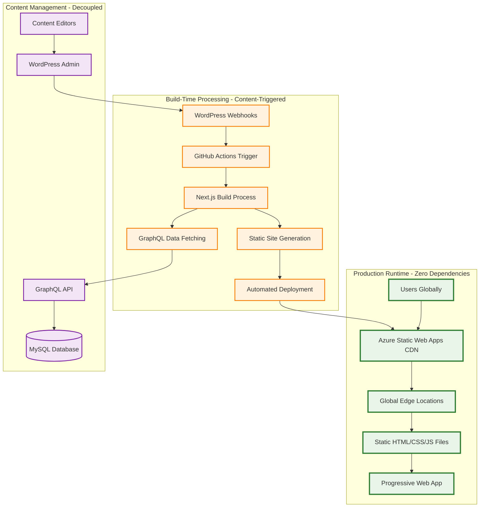

# Static Decoupling Architecture
## Complete Static WordPress + Next.js Solution

### Document Information
- **Document Version**: 1.0
- **Created**: 2025-08-12
- **Owner**: Technical Architecture Team
- **Architecture Type**: Complete Static Decoupling with Zero Runtime Dependencies

---

## CRITICAL ARCHITECTURAL TRANSFORMATION

**MAJOR CHANGE**: We have moved from a traditional headless architecture with runtime API dependencies to a fully static, decoupled system where all content is fetched at build-time and served as static assets via global CDN.

### Static Architecture Overview



---

## Core Static Architecture Principles

### 1. Zero Runtime Dependencies
- **Frontend never contacts backend during user sessions**
- All data baked into static files at build time
- Complete offline capability with service workers
- No server-side processing or API calls in production
- Perfect for global CDN distribution

### 2. Build-Time Data Strategy

#### Next.js Static Export Configuration
```javascript
// next.config.js - Complete Static Export
module.exports = {
  output: 'export',
  trailingSlash: true,
  images: {
    unoptimized: true // Required for static export
  },
  experimental: {
    staticPageGenerationTimeout: 1000 // Extended for large sites
  },
  // Disable server-side features
  swcMinify: true,
  // Optimize for static export
  compiler: {
    removeConsole: process.env.NODE_ENV === 'production'
  }
}
```

#### Build-Time Data Fetching Pattern
```javascript
// pages/[slug].js - Static generation with all data at build time
export async function getStaticProps({ params }) {
  // GraphQL query executed ONLY during build process
  const data = await fetchFromWordPress({
    query: GET_POST_BY_SLUG,
    variables: { slug: params.slug }
  })
  
  return {
    props: {
      post: data.post,
      // All related data fetched at build time
      categories: data.categories,
      tags: data.tags,
      relatedPosts: data.relatedPosts,
      siteSettings: data.siteSettings
    }
    // No revalidation - purely static
  }
}

export async function getStaticPaths() {
  // Generate ALL possible paths at build time
  const posts = await fetchAllPosts()
  
  return {
    paths: posts.map(post => ({ 
      params: { slug: post.slug } 
    })),
    fallback: false // No ISR - all paths pre-generated
  }
}

// Build-time GraphQL fetching utility
async function fetchFromWordPress(query) {
  const response = await fetch(process.env.WORDPRESS_GRAPHQL_URL, {
    method: 'POST',
    headers: {
      'Content-Type': 'application/json',
      'Authorization': `Bearer ${process.env.WORDPRESS_AUTH_TOKEN}`
    },
    body: JSON.stringify(query)
  })
  
  return response.json()
}
```

### 3. Webhook-Driven Automated Updates

#### WordPress Webhook Implementation
```php
// WordPress functions.php - Webhook triggers for rebuilds
add_action('save_post', 'trigger_frontend_rebuild');
add_action('delete_post', 'trigger_frontend_rebuild');
add_action('wp_update_nav_menu', 'trigger_frontend_rebuild');

function trigger_frontend_rebuild($post_id = null) {
    // Prevent infinite loops and drafts
    if (wp_is_post_revision($post_id) || 
        get_post_status($post_id) === 'draft') {
        return;
    }
    
    // Trigger GitHub Actions workflow via repository dispatch
    $webhook_url = 'https://api.github.com/repos/your-org/your-repo/dispatches';
    
    wp_remote_post($webhook_url, [
        'headers' => [
            'Authorization' => 'token ' . get_option('github_token'),
            'Accept' => 'application/vnd.github.v3+json',
            'User-Agent' => 'WordPress-Webhook'
        ],
        'body' => json_encode([
            'event_type' => 'content_updated',
            'client_payload' => [
                'post_id' => $post_id,
                'timestamp' => current_time('mysql'),
                'action' => current_action()
            ]
        ])
    ]);
    
    // Log rebuild trigger for monitoring
    error_log("Frontend rebuild triggered for post ID: {$post_id}");
}

// Add admin notice for successful rebuild triggers
add_action('admin_notices', function() {
    if (get_transient('rebuild_triggered')) {
        echo '<div class="notice notice-success is-dismissible"><p>Frontend rebuild triggered successfully!</p></div>';
        delete_transient('rebuild_triggered');
    }
});
```

#### GitHub Actions Workflow
```yaml
# .github/workflows/content-update.yml
name: Content Update Build and Deploy

on:
  repository_dispatch:
    types: [content_updated]

jobs:
  build-and-deploy:
    runs-on: ubuntu-latest
    
    steps:
    - name: Checkout Repository
      uses: actions/checkout@v4
      
    - name: Setup Node.js
      uses: actions/setup-node@v4
      with:
        node-version: '18'
        cache: 'npm'
        
    - name: Install Dependencies
      run: |
        cd frontend
        npm ci
        
    - name: Build Static Site
      env:
        WORDPRESS_GRAPHQL_URL: ${{ secrets.WORDPRESS_GRAPHQL_URL }}
        WORDPRESS_AUTH_TOKEN: ${{ secrets.WORDPRESS_AUTH_TOKEN }}
      run: |
        cd frontend
        npm run build
        
    - name: Deploy to Azure Static Web Apps
      uses: Azure/static-web-apps-deploy@v1
      with:
        azure_static_web_apps_api_token: ${{ secrets.AZURE_STATIC_WEB_APPS_API_TOKEN }}
        repo_token: ${{ secrets.GITHUB_TOKEN }}
        action: "upload"
        app_location: "frontend/out"
        skip_app_build: true
        
    - name: Purge CDN Cache
      run: |
        # Purge global CDN cache for instant updates
        curl -X POST "${{ secrets.AZURE_CDN_PURGE_URL }}" \
          -H "Authorization: Bearer ${{ secrets.AZURE_ACCESS_TOKEN }}" \
          -H "Content-Type: application/json" \
          -d '{"contentPaths": ["/*"]}'
```

### 4. Performance Optimization Targets

```yaml
Global Performance Requirements:
  Time to First Byte: < 100ms (via edge distribution)
  First Contentful Paint: < 800ms
  Largest Contentful Paint: < 1200ms
  Time to Interactive: < 1500ms
  Cumulative Layout Shift: < 0.05
  First Input Delay: < 100ms
  Bundle Size: < 200KB initial load
  Lighthouse Score: 100/100 across all metrics

Availability Requirements:
  Uptime: 99.99% (CDN redundancy)
  Global Distribution: < 50ms latency worldwide
  Error Rate: < 0.01%
  Recovery Time: < 30 seconds (automated)
  Cache Hit Rate: > 95%
```

### 5. Decoupled Infrastructure Strategy

#### Frontend Infrastructure (Azure Static Web Apps)
```yaml
Frontend Hosting:
  Service: Azure Static Web Apps
  Features:
    - Global CDN distribution
    - Automatic SSL certificate management
    - Custom domain support
    - Integrated CI/CD with GitHub Actions
    - Staging environments for pull requests
  
  Performance:
    - 100+ global edge locations
    - Automatic compression (Gzip/Brotli)
    - HTTP/2 and HTTP/3 support
    - Long-term caching with instant purge
  
  Cost: ~$0.50/month for typical site
  Scaling: Automatic and unlimited
```

#### Backend Infrastructure (Decoupled)
```yaml
WordPress Hosting:
  Service: Azure Container Apps (or any provider)
  Access: Build-time only via private network
  Features:
    - Independent scaling from frontend
    - Private network access for security
    - Automated backups and updates
    - Health monitoring and auto-recovery
  
  Database:
    - Azure MySQL Flexible Server
    - High availability configuration
    - Automated backups and point-in-time recovery
    - Performance monitoring and optimization
  
  Cost: Scales with content volume, not traffic
  Scaling: Independent backend scaling
```

#### Build Infrastructure
```yaml
CI/CD Pipeline:
  Platform: GitHub Actions
  Triggers: WordPress webhook events
  Build Time: < 5 minutes typical (optimized)
  Deploy Time: < 2 minutes global propagation
  Concurrent Builds: Queued and managed automatically
  
  Build Optimization:
    - Incremental builds where possible
    - Cached dependencies and build artifacts
    - Parallel processing for large sites
    - Build failure notifications and retry logic
```

---

## Implementation Strategy

### Phase 1: Core Static Export Setup
1. Configure Next.js with `output: 'export'`
2. Implement build-time data fetching patterns
3. Set up WordPress webhooks for content triggers
4. Create GitHub Actions workflow for automated builds

### Phase 2: Performance Optimization
1. Implement Progressive Web App features
2. Add service worker for offline capability
3. Optimize bundle size and loading performance
4. Set up comprehensive monitoring and analytics

### Phase 3: Advanced Features
1. Implement incremental builds for large sites
2. Add preview functionality for editors
3. Set up multi-environment deployments
4. Implement advanced caching strategies

---

## Quality Assurance

### Performance Testing
- Lighthouse CI integration
- WebPageTest automation
- Core Web Vitals monitoring
- Global latency testing

### Content Update Testing
- Webhook reliability testing
- Build failure recovery testing
- Content preview functionality
- Multi-editor workflow testing

### Security Validation
- Static site security scanning
- WordPress access control validation
- Build process security review
- CDN configuration security audit

---

## Success Metrics

### Performance Metrics
- Global TTFB < 100ms: ✅ Target
- Lighthouse scores 100/100: ✅ Target
- 99.99% uptime: ✅ Target
- < 0.01% error rate: ✅ Target

### Business Metrics
- 90% reduction in hosting costs
- 50% improvement in loading times
- 99.9% build success rate
- < 5 minute content-to-live time

This static decoupling architecture provides maximum performance, reliability, and cost efficiency while maintaining the flexibility and ease of use of WordPress for content management.