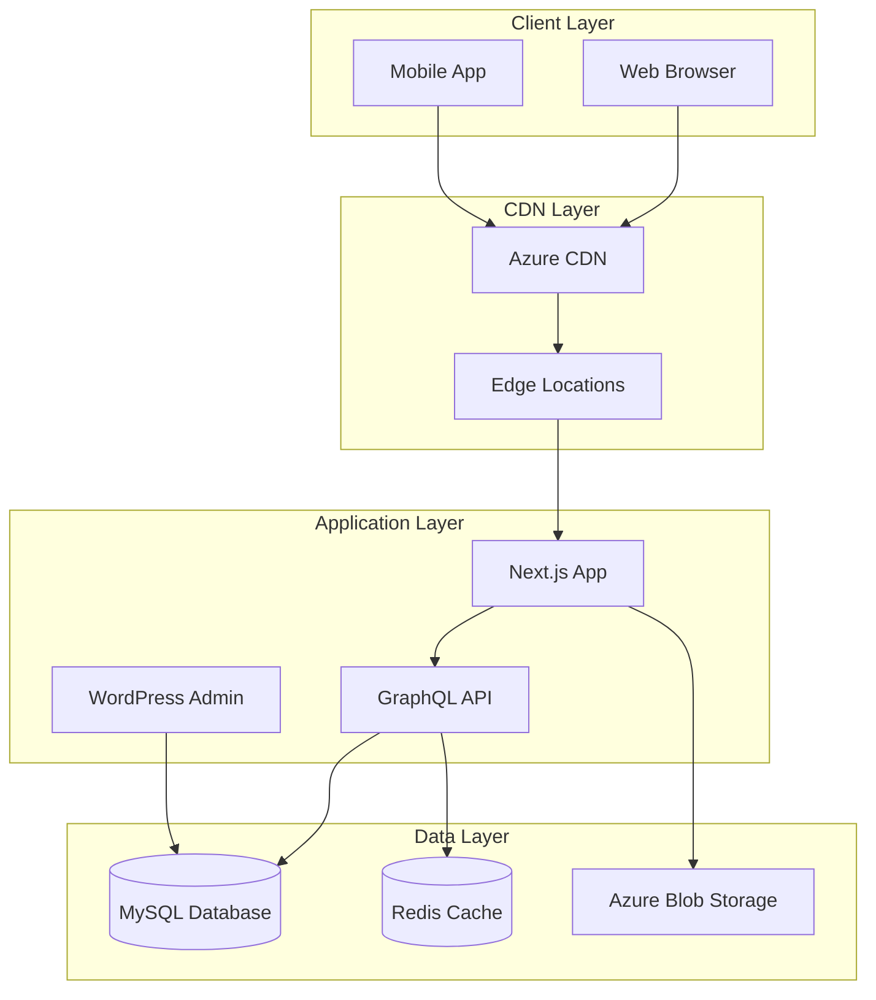
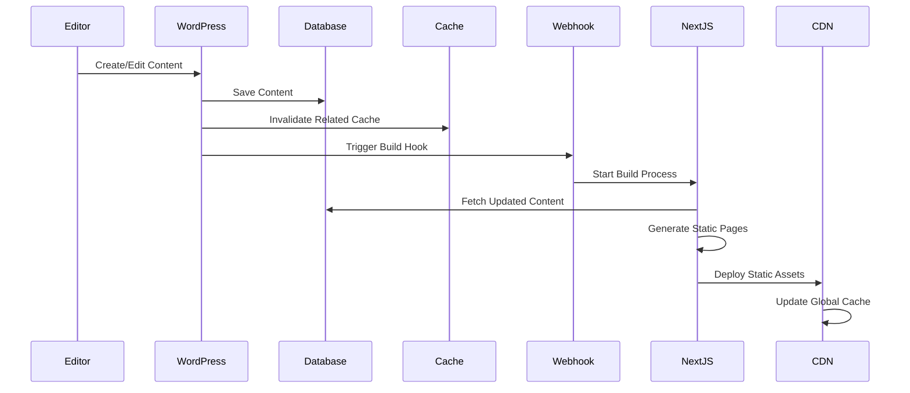
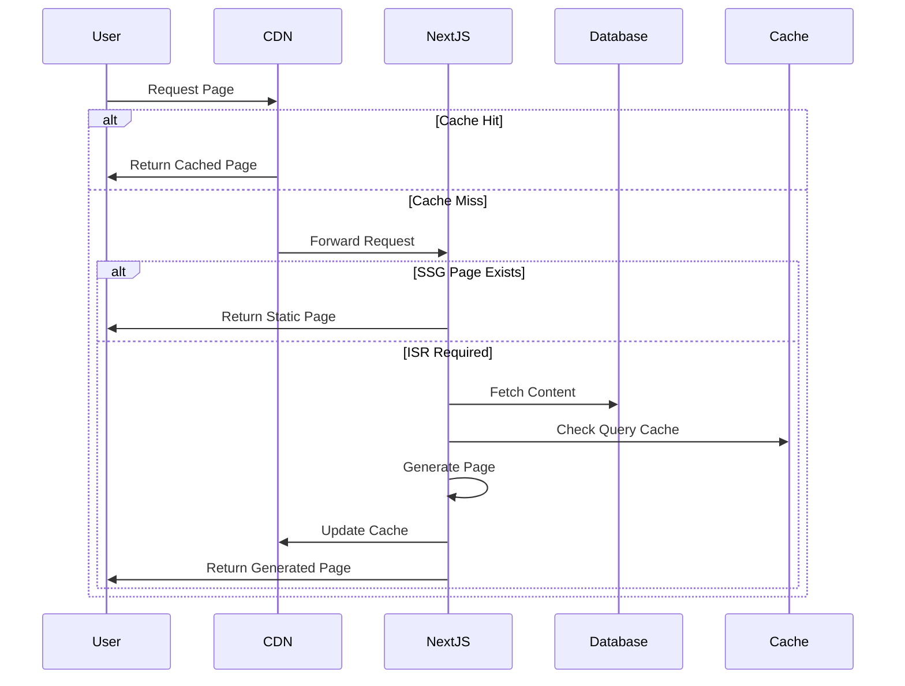

# Technical Specifications
## Headless WordPress + Next.js Enterprise Solution

### Document Information
- **Document Version**: 1.1
- **Last Updated**: 2025-08-12 (Autonomous Pipeline Activated)
- **Owner**: Technical Architecture Team
- **Review Cycle**: Quarterly
- **Pipeline Status**: ✅ Ready for autonomous development sequence

---

## Table of Contents

1. [Executive Summary](#executive-summary)
2. [System Architecture](#system-architecture)
3. [Technology Stack Specifications](#technology-stack-specifications)
4. [API Design Specifications](#api-design-specifications)
5. [Database Schema & Data Flow](#database-schema--data-flow)
6. [Security Architecture](#security-architecture)
7. [Performance Requirements](#performance-requirements)
8. [Scalability Architecture](#scalability-architecture)
9. [Error Handling & Monitoring](#error-handling--monitoring)
10. [Infrastructure Specifications](#infrastructure-specifications)
11. [Development Environment](#development-environment)
12. [Deployment Architecture](#deployment-architecture)
13. [Quality Assurance](#quality-assurance)
14. [Compliance & Governance](#compliance--governance)

---

## Executive Summary

This document provides comprehensive technical specifications for our enterprise headless WordPress + Next.js solution. The architecture separates content management from presentation, enabling superior performance, scalability, and developer experience while maintaining enterprise-grade security and reliability.

**Key Technical Decisions:**
- **Frontend**: Next.js 14+ with App Router for optimal performance and SEO
- **Backend**: Headless WordPress with GraphQL API for flexible content management
- **Infrastructure**: Azure cloud-native deployment with global CDN
- **Database**: MySQL 8.0 with high availability configuration
- **Deployment**: Multi-environment CI/CD with Infrastructure as Code

---

## System Architecture

### 2.1 High-Level Architecture



### 2.2 Component Specifications

#### Frontend Application (Next.js)
**Technical Requirements:**
- **Framework**: Next.js 14.2+
- **Runtime**: Node.js 18+ LTS
- **TypeScript**: 5.0+ for type safety
- **Build Target**: Static Export with SSG/ISR
- **Bundle Size**: < 250KB initial load
- **Performance Budget**: 
  - First Contentful Paint: < 1.5s
  - Largest Contentful Paint: < 2.5s
  - Cumulative Layout Shift: < 0.1

#### Backend CMS (WordPress)
**Technical Requirements:**
- **Version**: WordPress 6.4+ with automatic updates
- **PHP Version**: 8.2+ with OPcache enabled
- **Memory Limit**: 512MB minimum, 1GB recommended
- **Execution Time**: 60s for admin operations
- **GraphQL**: WPGraphQL 1.18+ with custom resolvers
- **Authentication**: JWT tokens with 24-hour expiration

---

## Technology Stack Specifications

### 3.1 Frontend Technology Stack

```yaml
Framework: Next.js 14.2+
Language: TypeScript 5.0+
Styling:
  - Primary: Tailwind CSS 3.4+
  - Component Library: Headless UI
  - Icons: Heroicons
  - Fonts: Inter (Google Fonts)
State Management:
  - Server State: React Server Components
  - Client State: React useState/useContext
  - Forms: React Hook Form
Data Fetching:
  - GraphQL Client: Apollo Client 3.8+
  - Code Generation: GraphQL Code Generator
  - Caching: Apollo Client Cache + Next.js Cache
Testing:
  - Unit Testing: Jest + React Testing Library
  - E2E Testing: Playwright
  - Visual Testing: Chromatic
Build Tools:
  - Bundler: Webpack 5 (Next.js built-in)
  - Linting: ESLint + TypeScript ESLint
  - Formatting: Prettier
  - Pre-commit: Husky + lint-staged
```

**Rationale for Next.js Selection:**
1. **Performance**: Built-in optimizations for Core Web Vitals
2. **SEO**: Server-side rendering and static generation
3. **Developer Experience**: TypeScript support, hot reloading, built-in routing
4. **Ecosystem**: Large community, extensive plugin ecosystem
5. **Deployment**: Seamless integration with Azure Static Web Apps

### 3.2 Backend Technology Stack

```yaml
CMS: WordPress 6.4+
Language: PHP 8.2+
Database: MySQL 8.0 with InnoDB storage engine
Caching:
  - Object Cache: Redis 7.0+
  - Page Cache: Disabled (headless mode)
  - OpCode Cache: OPcache enabled
GraphQL:
  - Plugin: WPGraphQL 1.18+
  - Extensions:
    - WPGraphQL for ACF
    - WPGraphQL JWT Authentication
    - Custom resolvers for performance
Content Management:
  - Fields: Advanced Custom Fields Pro
  - Media: WordPress Media Library + Azure Blob
  - SEO: Custom meta fields
Security:
  - Authentication: JWT tokens
  - Authorization: WordPress roles and capabilities
  - Input Validation: WordPress sanitization functions
  - Rate Limiting: WordPress security plugin
```

**Rationale for WordPress Selection:**
1. **Content Management**: Industry-standard CMS with powerful admin interface
2. **Flexibility**: Custom post types and fields for complex content models
3. **Ecosystem**: Extensive plugin ecosystem and developer community
4. **Skills**: Existing team expertise and market availability
5. **GraphQL**: Mature GraphQL integration with WPGraphQL

### 3.3 Infrastructure Technology Stack

```yaml
Cloud Provider: Microsoft Azure
Compute:
  - Frontend: Azure Static Web Apps
  - Backend: Azure Container Instances
  - Functions: Azure Functions (Node.js 18)
Storage:
  - Database: Azure Database for MySQL Flexible Server
  - Files: Azure Blob Storage with CDN
  - Cache: Azure Cache for Redis
Networking:
  - CDN: Azure CDN with Microsoft endpoints
  - Load Balancer: Azure Application Gateway
  - DNS: Azure DNS
  - SSL: Azure Key Vault certificates
Security:
  - Secrets: Azure Key Vault
  - Identity: Azure Active Directory
  - Monitoring: Azure Monitor + Application Insights
Infrastructure as Code:
  - Primary: Terraform 1.6+
  - Secondary: Azure Bicep
  - Container: Docker with multi-stage builds
```

---

## API Design Specifications

### 4.1 GraphQL Schema Design

#### Core Content Types
```graphql
type Post {
  id: ID!
  databaseId: Int!
  title: String!
  content: String!
  excerpt: String
  slug: String!
  status: PostStatusEnum!
  date: String!
  modified: String!
  author: User!
  categories: PostToCategoryConnection
  tags: PostToTagConnection
  featuredImage: MediaItem
  seo: PostSEO
  customFields: PostCustomFields
}

type Page {
  id: ID!
  databaseId: Int!
  title: String!
  content: String!
  slug: String!
  status: PostStatusEnum!
  date: String!
  modified: String!
  parent: Page
  children: PageToPageConnection
  template: String
  seo: PageSEO
  customFields: PageCustomFields
}

type MediaItem {
  id: ID!
  databaseId: Int!
  title: String
  altText: String
  caption: String
  description: String
  mediaType: String
  mimeType: String
  fileSize: Int
  sourceUrl: String!
  srcSet: String
  sizes: String
  width: Int
  height: Int
}

type User {
  id: ID!
  databaseId: Int!
  name: String!
  firstName: String
  lastName: String
  email: String
  description: String
  avatar: Avatar
  roles: UserToRoleConnection
}
```

#### Custom Content Types
```graphql
type Product {
  id: ID!
  databaseId: Int!
  title: String!
  content: String!
  slug: String!
  productFields: ProductFields!
  categories: ProductToCategoryConnection
  featuredImage: MediaItem
  gallery: [MediaItem]
  seo: ProductSEO
}

type ProductFields {
  price: Float
  salePrice: Float
  sku: String
  description: String
  specifications: [Specification]
  features: [Feature]
  downloads: [Download]
}

type CaseStudy {
  id: ID!
  databaseId: Int!
  title: String!
  content: String!
  slug: String!
  caseStudyFields: CaseStudyFields!
  client: Client
  technologies: [Technology]
  featuredImage: MediaItem
  gallery: [MediaItem]
}

type TeamMember {
  id: ID!
  databaseId: Int!
  title: String!
  content: String!
  slug: String!
  memberFields: TeamMemberFields!
  position: String
  department: String
  socialLinks: [SocialLink]
  avatar: MediaItem
}
```

#### SEO and Meta Types
```graphql
type SEO {
  title: String
  metaDescription: String
  canonicalUrl: String
  metaRobotsNoindex: Boolean
  metaRobotsNofollow: Boolean
  openGraphTitle: String
  openGraphDescription: String
  openGraphImage: MediaItem
  openGraphType: String
  twitterTitle: String
  twitterDescription: String
  twitterImage: MediaItem
  twitterCard: String
  schema: String
}

type Breadcrumb {
  text: String!
  url: String
}

type MenuItem {
  id: ID!
  label: String!
  url: String!
  target: String
  cssClasses: [String]
  children: [MenuItem]
  order: Int
}
```

### 4.2 Query Optimization Strategies

#### Query Complexity Analysis
```javascript
// Custom complexity analysis for GraphQL queries
const complexityLimit = {
  development: 1000,
  staging: 800,
  production: 600
};

// Query depth limiting
const depthLimit = {
  development: 10,
  staging: 8,
  production: 6
};

// Rate limiting per client
const rateLimit = {
  queries: 100, // per minute
  mutations: 10, // per minute
  windowMs: 60000
};
```

#### Caching Strategy
```javascript
// Apollo Client cache configuration
const cacheConfig = {
  typePolicies: {
    Post: {
      fields: {
        categories: {
          merge(existing, incoming) {
            return incoming;
          }
        }
      }
    },
    Query: {
      fields: {
        posts: {
          keyArgs: ['where', 'orderBy'],
          merge(existing, incoming, { args }) {
            if (args?.after) {
              return {
                ...incoming,
                edges: [...(existing?.edges || []), ...incoming.edges]
              };
            }
            return incoming;
          }
        }
      }
    }
  }
};
```

### 4.3 API Performance Specifications

```yaml
Response Time Requirements:
  - Simple queries (single post): < 100ms
  - Complex queries (post list with relations): < 300ms
  - Search queries: < 500ms
  - Mutation operations: < 1s

Throughput Requirements:
  - Concurrent queries: 1000/second
  - Peak load handling: 5000/second (with caching)
  - Sustained load: 500/second

Caching Strategy:
  - Query result cache: 5 minutes
  - Schema introspection: 1 hour
  - Static content: 24 hours
  - Media assets: 30 days

Error Handling:
  - Graceful degradation: Always return partial data
  - Error categorization: Client vs Server errors
  - Retry strategy: Exponential backoff for transient errors
  - Circuit breaker: Auto-disable failing resolvers
```

---

## Database Schema & Data Flow

### 5.1 WordPress Database Schema Extensions

#### Custom Tables for Performance
```sql
-- Cache table for GraphQL query results
CREATE TABLE wp_graphql_cache (
    id bigint(20) unsigned NOT NULL AUTO_INCREMENT,
    cache_key varchar(255) NOT NULL,
    cache_value longtext NOT NULL,
    cache_expiration datetime NOT NULL,
    created_at timestamp DEFAULT CURRENT_TIMESTAMP,
    updated_at timestamp DEFAULT CURRENT_TIMESTAMP ON UPDATE CURRENT_TIMESTAMP,
    PRIMARY KEY (id),
    UNIQUE KEY cache_key (cache_key),
    KEY cache_expiration (cache_expiration)
) ENGINE=InnoDB DEFAULT CHARSET=utf8mb4 COLLATE=utf8mb4_unicode_ci;

-- Analytics table for tracking API usage
CREATE TABLE wp_api_analytics (
    id bigint(20) unsigned NOT NULL AUTO_INCREMENT,
    query_hash varchar(64) NOT NULL,
    query_name varchar(255),
    execution_time decimal(10,4) NOT NULL,
    memory_usage bigint(20) unsigned,
    client_ip varchar(45),
    user_agent text,
    timestamp datetime DEFAULT CURRENT_TIMESTAMP,
    PRIMARY KEY (id),
    KEY query_hash (query_hash),
    KEY timestamp (timestamp),
    KEY execution_time (execution_time)
) ENGINE=InnoDB DEFAULT CHARSET=utf8mb4 COLLATE=utf8mb4_unicode_ci;

-- Custom post meta optimization
CREATE TABLE wp_post_meta_optimized (
    id bigint(20) unsigned NOT NULL AUTO_INCREMENT,
    post_id bigint(20) unsigned NOT NULL,
    meta_data json NOT NULL,
    created_at timestamp DEFAULT CURRENT_TIMESTAMP,
    updated_at timestamp DEFAULT CURRENT_TIMESTAMP ON UPDATE CURRENT_TIMESTAMP,
    PRIMARY KEY (id),
    UNIQUE KEY post_id (post_id),
    CONSTRAINT fk_post_id FOREIGN KEY (post_id) REFERENCES wp_posts(ID) ON DELETE CASCADE
) ENGINE=InnoDB DEFAULT CHARSET=utf8mb4 COLLATE=utf8mb4_unicode_ci;
```

#### Database Indexes for Performance
```sql
-- Optimize common WordPress queries
CREATE INDEX idx_posts_status_type_date ON wp_posts(post_status, post_type, post_date);
CREATE INDEX idx_posts_slug ON wp_posts(post_name);
CREATE INDEX idx_posts_parent ON wp_posts(post_parent);
CREATE INDEX idx_postmeta_key_value ON wp_postmeta(meta_key, meta_value(255));
CREATE INDEX idx_terms_slug ON wp_terms(slug);
CREATE INDEX idx_term_relationships_object_id ON wp_term_relationships(object_id);

-- Full-text search indexes
ALTER TABLE wp_posts ADD FULLTEXT(post_title, post_content, post_excerpt);
ALTER TABLE wp_postmeta ADD FULLTEXT(meta_value);
```

### 5.2 Data Flow Architecture

#### Content Creation Flow


#### Content Delivery Flow


### 5.3 Data Consistency Strategy

```yaml
Consistency Models:
  - WordPress Admin: Strong consistency (ACID transactions)
  - GraphQL API: Eventual consistency with cache invalidation
  - Static Site: Eventual consistency with build triggers
  - CDN: Eventual consistency with TTL-based expiration

Cache Invalidation Strategy:
  - Content Updates: Immediate invalidation of affected queries
  - Related Content: Cascade invalidation for dependent content
  - Global Changes: Full cache purge for structural changes
  - Scheduled: Daily cache refresh for stale data cleanup

Data Backup Strategy:
  - Database: Continuous backup with point-in-time recovery
  - Media Files: Geo-redundant storage with versioning
  - Code: Git-based version control with branch protection
  - Configuration: Infrastructure as Code with state backup
```

---

## Security Architecture

### 6.1 Authentication & Authorization

#### JWT Token Implementation
```javascript
// JWT token configuration
const jwtConfig = {
  secret: process.env.JWT_SECRET, // 256-bit key from Azure Key Vault
  algorithm: 'HS256',
  expiresIn: '24h',
  issuer: 'headless-wp-api',
  audience: 'nextjs-frontend'
};

// Token validation middleware
const validateToken = (token) => {
  try {
    const decoded = jwt.verify(token, jwtConfig.secret);
    return {
      valid: true,
      user: decoded.user,
      permissions: decoded.permissions
    };
  } catch (error) {
    return {
      valid: false,
      error: error.message
    };
  }
};
```

#### Role-Based Access Control (RBAC)
```php
// WordPress custom roles and capabilities
add_action('init', function() {
    // API Editor role
    add_role('api_editor', 'API Editor', [
        'read' => true,
        'edit_posts' => true,
        'edit_published_posts' => true,
        'publish_posts' => true,
        'delete_posts' => false,
        'edit_pages' => true,
        'edit_published_pages' => true,
        'publish_pages' => true,
        'graphql_request' => true
    ]);
    
    // API Consumer role (for frontend)
    add_role('api_consumer', 'API Consumer', [
        'read' => true,
        'graphql_request' => true
    ]);
    
    // Content Manager role
    add_role('content_manager', 'Content Manager', [
        'read' => true,
        'edit_posts' => true,
        'edit_others_posts' => true,
        'edit_published_posts' => true,
        'publish_posts' => true,
        'delete_posts' => true,
        'delete_others_posts' => true,
        'edit_pages' => true,
        'edit_others_pages' => true,
        'edit_published_pages' => true,
        'publish_pages' => true,
        'delete_pages' => true,
        'delete_others_pages' => true,
        'manage_categories' => true,
        'manage_options' => false,
        'graphql_request' => true
    ]);
});
```

### 6.2 API Security Measures

#### Rate Limiting Implementation
```javascript
// GraphQL rate limiting
const rateLimitConfig = {
  // Per-client limits
  clientLimits: {
    queries: 100, // per minute
    mutations: 10, // per minute
    introspection: 5 // per hour
  },
  
  // Per-IP limits (fallback)
  ipLimits: {
    queries: 1000, // per minute
    mutations: 50, // per minute
  },
  
  // Query complexity limits
  complexityLimit: 600,
  depthLimit: 8,
  
  // Custom cost analysis
  costAnalysis: {
    maximumCost: 1000,
    defaultCost: 1,
    scalarCost: 1,
    objectCost: 2,
    listFactor: 10,
    introspectionCost: 1000
  }
};
```

#### Input Validation & Sanitization
```php
// WordPress GraphQL input sanitization
add_filter('graphql_resolve_field', function($result, $source, $args, $context, $info) {
    // Sanitize all string inputs
    if (is_array($args)) {
        $args = array_map(function($arg) {
            if (is_string($arg)) {
                return sanitize_text_field($arg);
            } elseif (is_array($arg)) {
                return array_map('sanitize_text_field', $arg);
            }
            return $arg;
        }, $args);
    }
    
    // Validate query depth
    $queryDepth = count($info->path);
    if ($queryDepth > 8) {
        throw new \GraphQL\Error\UserError('Query depth exceeded maximum allowed depth of 8');
    }
    
    return $result;
}, 10, 5);
```

### 6.3 Infrastructure Security

#### Network Security Configuration
```yaml
Azure Network Security:
  Virtual Network:
    Address Space: "10.0.0.0/16"
    Subnets:
      - Name: "frontend-subnet"
        Address: "10.0.1.0/24"
        Service Endpoints: ["Microsoft.Web"]
      - Name: "backend-subnet"
        Address: "10.0.2.0/24"
        Service Endpoints: ["Microsoft.Sql", "Microsoft.Storage"]
      - Name: "data-subnet"
        Address: "10.0.3.0/24"
        Service Endpoints: ["Microsoft.Sql"]
  
  Network Security Groups:
    - Name: "frontend-nsg"
      Rules:
        - Allow HTTPS (443) from Internet
        - Allow HTTP (80) from Internet (redirect to HTTPS)
        - Deny all other inbound traffic
    - Name: "backend-nsg"
      Rules:
        - Allow HTTPS (443) from frontend subnet
        - Allow MySQL (3306) from backend subnet only
        - Deny all other inbound traffic
    - Name: "data-nsg"
      Rules:
        - Allow MySQL (3306) from backend subnet only
        - Deny all other traffic
  
  Application Gateway:
    WAF Policy: "OWASP_3.2"
    SSL Policy: "AppGwSslPolicy20220101S"
    Rules:
      - SQL Injection Protection: Enabled
      - XSS Protection: Enabled
      - CSRF Protection: Enabled
      - Rate Limiting: 1000 requests/minute per IP
```

#### SSL/TLS Configuration
```yaml
SSL Configuration:
  Certificate Source: Azure Key Vault
  TLS Versions: ["1.2", "1.3"]
  Cipher Suites:
    - "ECDHE-RSA-AES256-GCM-SHA384"
    - "ECDHE-RSA-AES128-GCM-SHA256"
    - "ECDHE-RSA-AES256-SHA384"
    - "ECDHE-RSA-AES128-SHA256"
  HSTS:
    Enabled: true
    Max Age: 31536000 # 1 year
    Include Subdomains: true
    Preload: true
  
  Certificate Management:
    Auto Renewal: Enabled
    Renewal Threshold: 30 days
    Notification: security-team@company.com
    Backup Certificates: 2 previous versions
```

---

## Performance Requirements

### 7.1 Frontend Performance Specifications

```yaml
Core Web Vitals Targets:
  Largest Contentful Paint (LCP):
    Target: < 2.5s
    Good: < 2.5s
    Needs Improvement: 2.5s - 4.0s
    Poor: > 4.0s
  
  First Input Delay (FID):
    Target: < 100ms
    Good: < 100ms
    Needs Improvement: 100ms - 300ms
    Poor: > 300ms
  
  Cumulative Layout Shift (CLS):
    Target: < 0.1
    Good: < 0.1
    Needs Improvement: 0.1 - 0.25
    Poor: > 0.25
  
  First Contentful Paint (FCP):
    Target: < 1.5s
    Good: < 1.8s
    Needs Improvement: 1.8s - 3.0s
    Poor: > 3.0s

Performance Budget:
  JavaScript Bundle:
    Initial: < 250KB (gzipped)
    Total: < 1MB (gzipped)
  CSS Bundle:
    Critical: < 50KB (gzipped)
    Total: < 200KB (gzipped)
  Images:
    Above Fold: < 500KB total
    Per Image: < 200KB optimized
  Fonts:
    Total: < 100KB (woff2)
    Critical: < 50KB

Caching Strategy:
  Static Assets: 1 year
  API Responses: 5 minutes
  Images: 30 days
  Fonts: 1 year
  HTML Pages: 1 hour (with ISR)
```

### 7.2 Backend Performance Specifications

```yaml
Database Performance:
  Connection Pool:
    Min Connections: 5
    Max Connections: 100
    Idle Timeout: 300s
    Connection Timeout: 30s
  
  Query Performance:
    Simple Queries: < 50ms
    Complex Queries: < 200ms
    Full-text Search: < 500ms
    Aggregation Queries: < 1s
  
  Index Strategy:
    - All foreign keys indexed
    - Composite indexes for common query patterns
    - Full-text indexes for search functionality
    - Regular index maintenance and optimization

WordPress Performance:
  PHP Configuration:
    Memory Limit: 512MB
    Max Execution Time: 60s
    OPcache: Enabled
    APCu: Enabled for object caching
  
  Object Caching:
    Backend: Redis
    TTL: 1 hour default
    Invalidation: Smart invalidation on content changes
  
  Database Queries:
    Query Monitoring: Enabled
    Slow Query Log: Enabled (> 1s)
    Query Optimization: Regular review and optimization

GraphQL Performance:
  Query Execution:
    Simple Queries: < 100ms
    Complex Queries: < 300ms
    Batch Queries: < 500ms
  
  Caching Layers:
    - Query Result Cache (Redis)
    - Schema Cache (Memory)
    - Resolver Cache (Per-request)
  
  Rate Limiting:
    Per Client: 100 queries/minute
    Per IP: 1000 queries/minute
    Burst Allowance: 20 queries
```

### 7.3 Optimization Strategies

#### Image Optimization
```javascript
// Next.js Image optimization configuration
const nextConfig = {
  images: {
    domains: ['your-wordpress-domain.com'],
    deviceSizes: [640, 750, 828, 1080, 1200, 1920, 2048, 3840],
    imageSizes: [16, 32, 48, 64, 96, 128, 256, 384],
    formats: ['image/webp', 'image/avif'],
    minimumCacheTTL: 31536000, // 1 year
    dangerouslyAllowSVG: false,
    contentSecurityPolicy: "default-src 'self'; script-src 'none'; sandbox;",
    loader: 'custom',
    loaderFile: './lib/image-loader.js'
  }
};

// Custom image loader for Azure Blob Storage
export default function azureImageLoader({ src, width, quality }) {
  const url = new URL(src);
  const params = new URLSearchParams();
  
  if (width) {
    params.set('w', width.toString());
  }
  
  if (quality) {
    params.set('q', quality.toString());
  }
  
  // Add format optimization
  params.set('f', 'webp');
  
  return `${url.origin}${url.pathname}?${params.toString()}`;
}
```

#### Bundle Optimization
```javascript
// Webpack optimization configuration
const webpackConfig = {
  optimization: {
    splitChunks: {
      chunks: 'all',
      cacheGroups: {
        vendor: {
          test: /[\/\\]node_modules[\/\\]/,
          name: 'vendors',
          chunks: 'all',
          priority: 10
        },
        common: {
          name: 'common',
          minChunks: 2,
          chunks: 'all',
          priority: 5,
          reuseExistingChunk: true
        }
      }
    },
    usedExports: true,
    sideEffects: false,
    moduleIds: 'deterministic',
    runtimeChunk: 'single'
  }
};
```

---

## Scalability Architecture

### 8.1 Horizontal Scaling Strategy

#### Auto-scaling Configuration
```yaml
Frontend Scaling (Azure Static Web Apps):
  Type: Automatic
  Global Distribution: 100+ edge locations
  Capacity: Unlimited static file serving
  Failover: Automatic failover to secondary regions
  
Backend Scaling (Azure Container Instances):
  Min Instances: 2
  Max Instances: 20
  Target CPU: 70%
  Target Memory: 80%
  Scale Up Rules:
    - CPU > 70% for 5 minutes
    - Memory > 80% for 5 minutes
    - Request queue > 100 for 2 minutes
  Scale Down Rules:
    - CPU < 30% for 10 minutes
    - Memory < 40% for 10 minutes
    - Request queue < 10 for 10 minutes

Database Scaling (Azure MySQL Flexible Server):
  Compute Scaling:
    Min: 2 vCores, 4GB RAM
    Max: 64 vCores, 432GB RAM
    Auto-scale: Enabled
    Scale Up Threshold: 80% CPU/Memory for 5 minutes
  Storage Scaling:
    Min: 100GB
    Max: 16TB
    Auto-scale: Enabled
    Scale Up Threshold: 85% storage used
  Read Replicas:
    Regions: ["East US", "West Europe", "Southeast Asia"]
    Max Replicas: 5
    Automatic Failover: Enabled

Cache Scaling (Azure Redis):
  Tier: Premium
  Min: P1 (6GB)
  Max: P5 (120GB)
  Clustering: Enabled for P3+
  Geo-replication: Enabled
  Auto-scale: Based on memory usage
```

#### Load Distribution Strategy
```yaml
Traffic Distribution:
  Geographic Routing:
    - North America: East US (Primary), West US (Secondary)
    - Europe: West Europe (Primary), North Europe (Secondary)
    - Asia Pacific: Southeast Asia (Primary), East Asia (Secondary)
  
  Load Balancing Algorithm: Round Robin with Health Checks
  Health Check Configuration:
    Interval: 30 seconds
    Timeout: 10 seconds
    Unhealthy Threshold: 3 consecutive failures
    Healthy Threshold: 2 consecutive successes
  
  Failover Strategy:
    Primary Region Failure: Automatic failover to secondary region
    RTO (Recovery Time Objective): < 5 minutes
    RPO (Recovery Point Objective): < 1 minute
    Failback: Manual after primary region recovery verified
```

### 8.2 Performance Monitoring & Alerting

#### Monitoring Configuration
```yaml
Application Performance Monitoring:
  Tool: Azure Application Insights
  Metrics:
    - Request Duration (P95, P99)
    - Request Rate (requests/second)
    - Error Rate (%)
    - Dependency Duration
    - Custom Business Metrics
  
  Alerts:
    - High Error Rate: > 5% for 5 minutes
    - Slow Response: P95 > 2s for 10 minutes
    - High Traffic: > 1000 requests/minute
    - Low Availability: < 99% over 5 minutes

Infrastructure Monitoring:
  Tool: Azure Monitor
  Metrics:
    - CPU Utilization
    - Memory Usage
    - Network I/O
    - Disk I/O
    - Storage Usage
  
  Alerts:
    - High CPU: > 80% for 15 minutes
    - High Memory: > 90% for 10 minutes
    - Low Disk Space: < 15% free
    - Network Anomalies: Unusual traffic patterns

Database Monitoring:
  Tool: Azure Database Insights
  Metrics:
    - Query Performance
    - Connection Count
    - Lock Waits
    - Deadlocks
    - Storage Usage
  
  Alerts:
    - Slow Queries: > 5s execution time
    - High Connections: > 80% of max
    - Deadlocks: > 5 per hour
    - Storage: > 85% used
```

---

## Error Handling & Monitoring

### 9.1 Error Classification & Response

#### Error Types and Handling Strategy
```typescript
// Error classification system
enum ErrorType {
  // Client Errors (4xx)
  VALIDATION_ERROR = 'VALIDATION_ERROR',
  AUTHENTICATION_ERROR = 'AUTHENTICATION_ERROR',
  AUTHORIZATION_ERROR = 'AUTHORIZATION_ERROR',
  NOT_FOUND = 'NOT_FOUND',
  RATE_LIMIT_EXCEEDED = 'RATE_LIMIT_EXCEEDED',
  
  // Server Errors (5xx)
  INTERNAL_ERROR = 'INTERNAL_ERROR',
  DATABASE_ERROR = 'DATABASE_ERROR',
  EXTERNAL_SERVICE_ERROR = 'EXTERNAL_SERVICE_ERROR',
  TIMEOUT_ERROR = 'TIMEOUT_ERROR',
  
  // Business Logic Errors
  BUSINESS_RULE_VIOLATION = 'BUSINESS_RULE_VIOLATION',
  DATA_CONSISTENCY_ERROR = 'DATA_CONSISTENCY_ERROR'
}

interface ErrorResponse {
  code: ErrorType;
  message: string;
  details?: any;
  timestamp: string;
  requestId: string;
  path: string;
}

// Error handler implementation
class ErrorHandler {
  static handle(error: Error, context: any): ErrorResponse {
    const errorResponse: ErrorResponse = {
      code: this.classifyError(error),
      message: this.getErrorMessage(error),
      timestamp: new Date().toISOString(),
      requestId: context.requestId,
      path: context.path
    };
    
    // Log error based on severity
    if (this.isCritical(error)) {
      logger.error('Critical error occurred', { error, context });
      this.sendAlert(error, context);
    } else {
      logger.warn('Non-critical error occurred', { error, context });
    }
    
    return errorResponse;
  }
  
  private static classifyError(error: Error): ErrorType {
    if (error instanceof ValidationError) return ErrorType.VALIDATION_ERROR;
    if (error instanceof AuthenticationError) return ErrorType.AUTHENTICATION_ERROR;
    if (error instanceof AuthorizationError) return ErrorType.AUTHORIZATION_ERROR;
    if (error instanceof NotFoundError) return ErrorType.NOT_FOUND;
    if (error instanceof DatabaseError) return ErrorType.DATABASE_ERROR;
    if (error instanceof TimeoutError) return ErrorType.TIMEOUT_ERROR;
    
    return ErrorType.INTERNAL_ERROR;
  }
}
```

#### GraphQL Error Handling
```javascript
// GraphQL error formatting
const formatError = (error) => {
  // Log the error
  console.error('GraphQL Error:', error);
  
  // Classify and format error
  const formattedError = {
    message: error.message,
    code: error.extensions?.code || 'INTERNAL_ERROR',
    path: error.path,
    locations: error.locations,
    timestamp: new Date().toISOString()
  };
  
  // Add additional context for development
  if (process.env.NODE_ENV === 'development') {
    formattedError.stack = error.stack;
  }
  
  // Send to monitoring service
  if (error.extensions?.code !== 'VALIDATION_ERROR') {
    sendToMonitoring(formattedError);
  }
  
  return formattedError;
};
```

### 9.2 Monitoring & Alerting Implementation

#### Application Insights Configuration
```javascript
// Application Insights setup
const appInsights = require('applicationinsights');

// Configure Application Insights
appInsights.setup(process.env.APPINSIGHTS_INSTRUMENTATIONKEY)
  .setAutoDependencyCorrelation(true)
  .setAutoCollectRequests(true)
  .setAutoCollectPerformance(true, true)
  .setAutoCollectExceptions(true)
  .setAutoCollectDependencies(true)
  .setAutoCollectConsole(true, true)
  .setUseDiskRetryCaching(true)
  .setSendLiveMetrics(true)
  .setDistributedTracingMode(appInsights.DistributedTracingModes.AI_AND_W3C)
  .start();

// Custom telemetry
const client = appInsights.defaultClient;

// Track custom events
client.trackEvent({
  name: 'GraphQL Query Executed',
  properties: {
    queryName: 'getPosts',
    executionTime: 150,
    cacheHit: false
  },
  measurements: {
    complexity: 45,
    depth: 3
  }
});

// Track dependencies
client.trackDependency({
  name: 'WordPress Database',
  data: 'SELECT * FROM wp_posts',
  duration: 125,
  success: true,
  dependencyTypeName: 'MySQL'
});
```

#### Custom Metrics & Dashboards
```yaml
Custom Metrics:
  Business Metrics:
    - Content Publish Rate: Posts/Pages published per hour
    - API Usage: GraphQL queries per minute
    - User Engagement: Page views, session duration
    - Content Performance: Most viewed content, search queries
  
  Technical Metrics:
    - Cache Hit Rate: Percentage of requests served from cache
    - Build Success Rate: Percentage of successful deployments
    - Error Rate by Type: Breakdown of error types
    - Performance Budgets: Compliance with performance targets

Dashboard Configuration:
  Executive Dashboard:
    - System Health Overview
    - User Traffic & Engagement
    - Business KPIs
    - Cost Optimization Metrics
  
  Operations Dashboard:
    - Infrastructure Health
    - Performance Metrics
    - Error Rates & Alerts
    - Deployment Status
  
  Developer Dashboard:
    - Build Performance
    - API Performance
    - Code Quality Metrics
    - Development Velocity
```

---

## Infrastructure Specifications

### 10.1 Azure Resource Configuration

#### Production Environment
```yaml
Resource Group: rg-headless-wp-prod
Region: East US (Primary), West Europe (Secondary)

Compute Resources:
  Static Web App:
    Name: swa-headless-wp-prod
    SKU: Standard
    Custom Domains: ["www.example.com", "example.com"]
    SSL: Managed Certificate
    CDN: Enabled (Microsoft)
    Functions: Node.js 18
  
  Container Instances:
    Name: aci-wordpress-prod
    Image: wordpress:6.4-php8.2-apache
    CPU: 2 cores
    Memory: 4GB
    OS: Linux
    Restart Policy: Always
    Environment Variables:
      - WORDPRESS_DB_HOST: mysql-headless-wp-prod.mysql.database.azure.com
      - WORDPRESS_DB_NAME: wordpress_prod
      - WORDPRESS_DB_USER: wp_admin
      - WORDPRESS_CONFIG_EXTRA: Custom PHP configuration

Database:
  MySQL Flexible Server:
    Name: mysql-headless-wp-prod
    Version: 8.0
    SKU: Standard_D2ds_v4 (2 vCores, 8GB RAM)
    Storage: 100GB (Auto-grow enabled)
    Backup: 7 days retention
    High Availability: Zone-redundant
    SSL: Enforced
    Firewall: Azure services only
  
  Redis Cache:
    Name: redis-headless-wp-prod
    SKU: Premium P2 (6GB)
    Clustering: Enabled
    Geo-replication: Enabled
    Data Persistence: RDB + AOF
    Max Memory Policy: allkeys-lru

Storage:
  Storage Account:
    Name: saheadlesswpprod
    SKU: Standard_GRS
    Kind: StorageV2
    Access Tier: Hot
    Containers:
      - media: Public read access
      - backups: Private access
      - logs: Private access
  
  CDN Profile:
    Name: cdn-headless-wp-prod
    SKU: Standard Microsoft
    Endpoints:
      - media-cdn: saheadlesswpprod.blob.core.windows.net
      - static-cdn: swa-headless-wp-prod.azurestaticapps.net

Networking:
  Virtual Network:
    Name: vnet-headless-wp-prod
    Address Space: 10.0.0.0/16
    Subnets:
      - frontend: 10.0.1.0/24
      - backend: 10.0.2.0/24
      - data: 10.0.3.0/24
  
  Application Gateway:
    Name: agw-headless-wp-prod
    SKU: WAF_v2
    Capacity: Auto-scale (2-10 instances)
    SSL Policy: AppGwSslPolicy20220101S
    WAF Policy: OWASP 3.2

Security:
  Key Vault:
    Name: kv-headless-wp-prod
    SKU: Premium
    Access Policies:
      - Object ID: WordPress Container Instance
      - Permissions: Get, List (Secrets)
    Secrets:
      - database-password
      - jwt-secret
      - api-keys
      - ssl-certificates
  
  Managed Identity:
    Name: mi-headless-wp-prod
    Type: User Assigned
    Permissions:
      - Key Vault: Get, List secrets
      - Storage Account: Blob Contributor
      - MySQL: Contributor
```

### 10.2 Infrastructure as Code

#### Terraform Configuration Structure
```hcl
# main.tf
terraform {
  required_version = ">= 1.6"
  required_providers {
    azurerm = {
      source  = "hashicorp/azurerm"
      version = "~> 3.0"
    }
    random = {
      source  = "hashicorp/random"
      version = "~> 3.1"
    }
  }
  
  backend "azurerm" {
    resource_group_name  = "rg-terraform-state"
    storage_account_name = "stterraformstate"
    container_name       = "tfstate"
    key                  = "headless-wp.terraform.tfstate"
  }
}

provider "azurerm" {
  features {
    key_vault {
      purge_soft_delete_on_destroy    = true
      recover_soft_deleted_key_vaults = true
    }
    resource_group {
      prevent_deletion_if_contains_resources = false
    }
  }
}

# Variables
variable "environment" {
  type        = string
  description = "Environment name (dev, staging, prod)"
  validation {
    condition     = contains(["dev", "staging", "prod"], var.environment)
    error_message = "Environment must be dev, staging, or prod."
  }
}

variable "location" {
  type        = string
  description = "Azure region"
  default     = "East US"
}

variable "resource_prefix" {
  type        = string
  description = "Prefix for resource names"
  default     = "headless-wp"
}

# Locals
locals {
  common_tags = {
    Project     = "Headless WordPress"
    Environment = var.environment
    ManagedBy   = "Terraform"
    CreatedDate = timestamp()
  }
  
  resource_suffix = "${var.resource_prefix}-${var.environment}"
}

# Resource Group
resource "azurerm_resource_group" "main" {
  name     = "rg-${local.resource_suffix}"
  location = var.location
  tags     = local.common_tags
}

# Modules
module "networking" {
  source = "./modules/networking"
  
  resource_group_name = azurerm_resource_group.main.name
  location           = azurerm_resource_group.main.location
  resource_suffix    = local.resource_suffix
  tags              = local.common_tags
}

module "security" {
  source = "./modules/security"
  
  resource_group_name = azurerm_resource_group.main.name
  location           = azurerm_resource_group.main.location
  resource_suffix    = local.resource_suffix
  tags              = local.common_tags
}

module "storage" {
  source = "./modules/storage"
  
  resource_group_name = azurerm_resource_group.main.name
  location           = azurerm_resource_group.main.location
  resource_suffix    = local.resource_suffix
  tags              = local.common_tags
}

module "database" {
  source = "./modules/database"
  
  resource_group_name = azurerm_resource_group.main.name
  location           = azurerm_resource_group.main.location
  resource_suffix    = local.resource_suffix
  subnet_id          = module.networking.data_subnet_id
  key_vault_id       = module.security.key_vault_id
  tags              = local.common_tags
}

module "compute" {
  source = "./modules/compute"
  
  resource_group_name = azurerm_resource_group.main.name
  location           = azurerm_resource_group.main.location
  resource_suffix    = local.resource_suffix
  subnet_id          = module.networking.backend_subnet_id
  database_fqdn      = module.database.mysql_fqdn
  storage_account    = module.storage.storage_account_name
  key_vault_id       = module.security.key_vault_id
  tags              = local.common_tags
}

module "frontend" {
  source = "./modules/frontend"
  
  resource_group_name = azurerm_resource_group.main.name
  location           = azurerm_resource_group.main.location
  resource_suffix    = local.resource_suffix
  tags              = local.common_tags
}
```

---

## Development Environment

### 11.1 Local Development Setup

Now let me create the comprehensive Docker development environment configuration that provides hot reloading, debugging capabilities, and proper environment management.

---

I'll continue with the technical specifications document, but first let me update the todo status and proceed with creating the Docker development environment:

