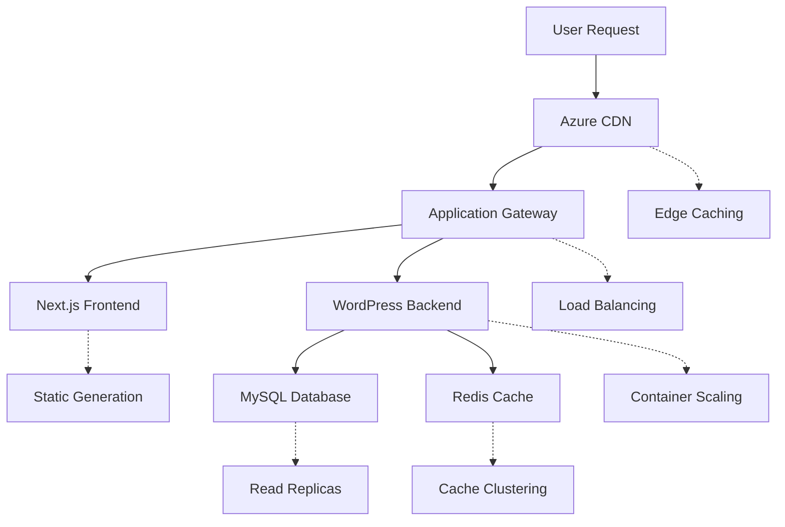

# Scaling and Performance Configuration Guide

This guide provides comprehensive instructions for configuring auto-scaling, performance optimization, and high availability for your headless WordPress + Next.js application on Azure.

## Table of Contents

1. [Architecture Overview](#architecture-overview)
2. [Auto-Scaling Configuration](#auto-scaling-configuration)
3. [Load Balancing Strategy](#load-balancing-strategy)
4. [Performance Optimization](#performance-optimization)
5. [Caching Strategy](#caching-strategy)
6. [Database Scaling](#database-scaling)
7. [CDN Configuration](#cdn-configuration)
8. [Monitoring and Metrics](#monitoring-and-metrics)
9. [Cost Optimization](#cost-optimization)
10. [Troubleshooting](#troubleshooting)

## Architecture Overview

### Scalability Components

```yaml
Scaling Tiers:
  Frontend (Next.js):
    - Azure Static Web Apps (auto-scaling)
    - Azure CDN (global edge caching)
    - Application Gateway (load balancing)
  
  Backend (WordPress):
    - Azure Container Instances (horizontal scaling)
    - Azure Container Apps (advanced scaling)
    - Application Gateway (backend pool management)
  
  Database:
    - Azure MySQL Flexible Server (vertical scaling)
    - Read replicas (horizontal scaling)
    - Connection pooling
  
  Caching:
    - Azure Cache for Redis (cluster mode)
    - Application Gateway caching
    - CDN edge caching
```

### Traffic Flow and Scaling Points



## Auto-Scaling Configuration

### Container Apps Auto-Scaling

```bash
# Create Container App Environment
az containerapp env create \
  --name cae-wordpress-prod \
  --resource-group rg-app-prod \
  --location eastus \
  --logs-workspace-id <LOG_ANALYTICS_WORKSPACE_ID>

# Create WordPress Container App with scaling rules
az containerapp create \
  --name ca-wordpress-prod \
  --resource-group rg-app-prod \
  --environment cae-wordpress-prod \
  --image <ACR_NAME>.azurecr.io/wordpress:latest \
  --cpu 1.0 \
  --memory 2.0Gi \
  --min-replicas 2 \
  --max-replicas 20 \
  --env-vars \
    WORDPRESS_DB_HOST=mysql-wordpress-prod.mysql.database.azure.com \
    WORDPRESS_DB_NAME=wordpress \
    REDIS_HOST=redis-wordpress-prod.redis.cache.windows.net
```

#### HTTP Scaling Rules

```yaml
# scaling-rules.yaml
properties:
  configuration:
    scale:
      minReplicas: 2
      maxReplicas: 20
      rules:
      - name: http-scale-rule
        http:
          metadata:
            concurrentRequests: '50'
            targetValueType: 'AverageValue'
      - name: cpu-scale-rule
        custom:
          type: cpu
          metadata:
            type: Utilization
            value: '70'
      - name: memory-scale-rule
        custom:
          type: memory
          metadata:
            type: Utilization
            value: '80'
```

```bash
# Apply scaling rules
az containerapp update \
  --name ca-wordpress-prod \
  --resource-group rg-app-prod \
  --yaml scaling-rules.yaml
```

### Container Instances Scaling

```bash
# Create Container Group with scaling profile
az container create \
  --resource-group rg-app-prod \
  --name ci-wordpress-prod \
  --image <ACR_NAME>.azurecr.io/wordpress:latest \
  --cpu 2 \
  --memory 4 \
  --restart-policy OnFailure \
  --environment-variables \
    WORDPRESS_DB_HOST=mysql-wordpress-prod.mysql.database.azure.com \
    REDIS_HOST=redis-wordpress-prod.redis.cache.windows.net

# Create scaling profile using Azure Automation
az automation account create \
  --name automation-scaling-prod \
  --resource-group rg-automation-prod \
  --location eastus
```

#### PowerShell Scaling Script

```powershell
# scaling-automation.ps1
param(
    [Parameter(Mandatory=$true)]
    [string]$ResourceGroupName,
    
    [Parameter(Mandatory=$true)]
    [string]$ContainerGroupName,
    
    [Parameter(Mandatory=$true)]
    [int]$TargetInstances
)

# Connect to Azure
Connect-AzAccount -Identity

# Get current instances
$currentInstances = Get-AzContainerGroup -ResourceGroupName $ResourceGroupName | Measure-Object | Select-Object -ExpandProperty Count

if ($currentInstances -lt $TargetInstances) {
    # Scale out
    for ($i = $currentInstances; $i -lt $TargetInstances; $i++) {
        $newName = "$ContainerGroupName-$i"
        New-AzContainerGroup -ResourceGroupName $ResourceGroupName -Name $newName -Image "<ACR_NAME>.azurecr.io/wordpress:latest"
    }
} elseif ($currentInstances -gt $TargetInstances) {
    # Scale in
    $instancesToRemove = $currentInstances - $TargetInstances
    $containers = Get-AzContainerGroup -ResourceGroupName $ResourceGroupName | Sort-Object Name -Descending | Select-Object -First $instancesToRemove
    
    foreach ($container in $containers) {
        Remove-AzContainerGroup -ResourceGroupName $ResourceGroupName -Name $container.Name -Force
    }
}
```

## Load Balancing Strategy

### Application Gateway Load Balancing

```bash
# Create backend pool with multiple instances
az network application-gateway address-pool create \
  --gateway-name ag-wordpress-prod \
  --resource-group rg-app-prod \
  --name pool-wordpress-scaled \
  --servers \
    wordpress-1.eastus.azurecontainer.io \
    wordpress-2.eastus.azurecontainer.io \
    wordpress-3.eastus.azurecontainer.io

# Configure health probe
az network application-gateway probe create \
  --gateway-name ag-wordpress-prod \
  --resource-group rg-app-prod \
  --name probe-wordpress-health \
  --protocol Http \
  --host-name-from-http-settings true \
  --path /wp-admin/admin-ajax.php \
  --interval 30 \
  --timeout 30 \
  --threshold 3 \
  --match-status-codes 200-399

# Update HTTP settings
az network application-gateway http-settings update \
  --gateway-name ag-wordpress-prod \
  --resource-group rg-app-prod \
  --name settings-wordpress \
  --probe probe-wordpress-health \
  --affinity-cookie-name "ApplicationGatewayAffinity" \
  --cookie-based-affinity Enabled
```

### Session Affinity Configuration

```bash
# Configure session affinity for WordPress admin
az network application-gateway http-settings create \
  --gateway-name ag-wordpress-prod \
  --resource-group rg-app-prod \
  --name settings-wordpress-admin \
  --protocol Http \
  --port 80 \
  --cookie-based-affinity Enabled \
  --affinity-cookie-name "wp-admin-session" \
  --probe probe-wordpress-health

# Create path-based routing for admin
az network application-gateway url-path-map create \
  --gateway-name ag-wordpress-prod \
  --resource-group rg-app-prod \
  --name urlpathmap-wordpress \
  --default-address-pool pool-wordpress-scaled \
  --default-http-settings settings-wordpress

az network application-gateway url-path-map rule create \
  --gateway-name ag-wordpress-prod \
  --resource-group rg-app-prod \
  --path-map-name urlpathmap-wordpress \
  --name rule-admin \
  --paths "/wp-admin/*" "/wp-login.php" \
  --address-pool pool-wordpress-scaled \
  --http-settings settings-wordpress-admin
```

## Performance Optimization

### Application Gateway Performance

```bash
# Configure Application Gateway for high performance
az network application-gateway create \
  --name ag-wordpress-prod \
  --resource-group rg-app-prod \
  --location eastus \
  --sku WAF_v2 \
  --capacity 10 \
  --min-capacity 2 \
  --max-capacity 100 \
  --frontend-port 80 \
  --http-settings-cookie-based-affinity Disabled \
  --http-settings-protocol Http \
  --public-ip-address pip-ag-wordpress-prod

# Enable autoscaling
az network application-gateway autoscale-config create \
  --gateway-name ag-wordpress-prod \
  --resource-group rg-app-prod \
  --min-capacity 2 \
  --max-capacity 100
```

### Container Performance Tuning

```dockerfile
# Optimized WordPress Dockerfile for scaling
FROM php:8.1-apache

# Install PHP extensions for performance
RUN docker-php-ext-install opcache mysqli

# Configure OPcache for production
RUN { \
    echo 'opcache.enable=1'; \
    echo 'opcache.memory_consumption=128'; \
    echo 'opcache.interned_strings_buffer=8'; \
    echo 'opcache.max_accelerated_files=4000'; \
    echo 'opcache.revalidate_freq=2'; \
    echo 'opcache.fast_shutdown=1'; \
    echo 'opcache.enable_cli=1'; \
} > /usr/local/etc/php/conf.d/opcache-recommended.ini

# Configure Apache for performance
RUN { \
    echo 'ServerTokens Prod'; \
    echo 'ServerSignature Off'; \
    echo 'StartServers 2'; \
    echo 'MinSpareServers 5'; \
    echo 'MaxSpareServers 10'; \
    echo 'MaxRequestWorkers 150'; \
    echo 'ThreadsPerChild 25'; \
} >> /etc/apache2/apache2.conf

# Enable compression
RUN a2enmod deflate rewrite headers expires

COPY apache-performance.conf /etc/apache2/sites-available/000-default.conf
```

### WordPress Performance Configuration

```php
<?php
// wp-config-performance.php

// Redis Object Cache
define('WP_REDIS_HOST', getenv('REDIS_HOST'));
define('WP_REDIS_PORT', 6380);
define('WP_REDIS_PASSWORD', getenv('REDIS_PASSWORD'));
define('WP_REDIS_SELECTIVE_FLUSH', true);
define('WP_REDIS_MAXTTL', 86400);

// Database optimizations
define('WP_CACHE', true);
define('COMPRESS_CSS', true);
define('COMPRESS_SCRIPTS', true);
define('CONCATENATE_SCRIPTS', false);
define('ENFORCE_GZIP', true);

// Memory limits
ini_set('memory_limit', '512M');
define('WP_MEMORY_LIMIT', '512M');
define('WP_MAX_MEMORY_LIMIT', '1024M');

// Disable file editing in admin
define('DISALLOW_FILE_EDIT', true);
define('DISALLOW_FILE_MODS', true);

// Optimize database queries
define('WP_DEBUG', false);
define('WP_DEBUG_LOG', false);
define('WP_DEBUG_DISPLAY', false);
define('SCRIPT_DEBUG', false);

// Auto-save intervals
define('AUTOSAVE_INTERVAL', 300);
define('WP_POST_REVISIONS', 5);
define('EMPTY_TRASH_DAYS', 30);
?>
```

## Caching Strategy

### Redis Cluster Configuration

```bash
# Create Redis cluster for high availability
az redis create \
  --name redis-wordpress-prod \
  --resource-group rg-cache-prod \
  --location eastus \
  --sku Premium \
  --vm-size P3 \
  --redis-configuration '{"maxmemory-policy":"allkeys-lru"}' \
  --shard-count 3 \
  --enable-non-ssl-port false \
  --minimum-tls-version 1.2

# Configure Redis failover
az redis patch-schedule create \
  --name redis-wordpress-prod \
  --resource-group rg-cache-prod \
  --schedule-entries '[{"day-of-week":"Sunday","start-hour-utc":3,"maintenance-window":"PT5H"}]'
```

### Application-Level Caching

```yaml
# WordPress caching configuration
WordPress_Caching:
  Object_Cache:
    Provider: Redis
    TTL: 86400
    Groups:
      - posts
      - terms
      - users
      - options
  
  Page_Cache:
    Provider: Application_Gateway
    TTL: 3600
    Conditions:
      - No cookies
      - GET requests only
  
  Database_Cache:
    Query_Cache: Enabled
    Result_Cache: 300
    Connection_Pool: 20
```

### CDN Caching Rules

```bash
# Configure CDN caching rules
az cdn endpoint rule add \
  --name cdn-wordpress-prod \
  --profile-name cdnprofile-wordpress-prod \
  --resource-group rg-cdn-prod \
  --order 1 \
  --rule-name CacheStaticAssets \
  --match-variable RequestUri \
  --operator BeginsWith \
  --match-values '/wp-content/uploads/' '/wp-content/themes/' '/wp-includes/' \
  --action-name CacheExpiration \
  --cache-behavior SetIfMissing \
  --cache-duration 30.00:00:00

az cdn endpoint rule add \
  --name cdn-wordpress-prod \
  --profile-name cdnprofile-wordpress-prod \
  --resource-group rg-cdn-prod \
  --order 2 \
  --rule-name CacheApiResponses \
  --match-variable RequestUri \
  --operator BeginsWith \
  --match-values '/graphql' '/wp-json/' \
  --action-name CacheExpiration \
  --cache-behavior SetIfMissing \
  --cache-duration 01:00:00
```

## Database Scaling

### MySQL Flexible Server Scaling

```bash
# Configure MySQL for high performance
az mysql flexible-server create \
  --name mysql-wordpress-prod \
  --resource-group rg-db-prod \
  --location eastus \
  --admin-user dbadmin \
  --admin-password <SECURE_PASSWORD> \
  --sku-name Standard_D4ds_v4 \
  --tier GeneralPurpose \
  --storage-size 512 \
  --storage-auto-grow Enabled \
  --iops 2000 \
  --high-availability Enabled \
  --zone 1 \
  --standby-zone 2

# Configure read replicas
az mysql flexible-server replica create \
  --name mysql-wordpress-prod-read1 \
  --resource-group rg-db-prod \
  --source-server mysql-wordpress-prod \
  --location eastus2

az mysql flexible-server replica create \
  --name mysql-wordpress-prod-read2 \
  --resource-group rg-db-prod \
  --source-server mysql-wordpress-prod \
  --location westus2
```

### Database Connection Pooling

```php
<?php
// Database connection pooling in WordPress
class DatabasePool {
    private static $connections = [];
    private static $maxConnections = 20;
    
    public static function getConnection($server = 'write') {
        $servers = [
            'write' => 'mysql-wordpress-prod.mysql.database.azure.com',
            'read1' => 'mysql-wordpress-prod-read1.mysql.database.azure.com',
            'read2' => 'mysql-wordpress-prod-read2.mysql.database.azure.com'
        ];
        
        if (count(self::$connections) < self::$maxConnections) {
            $connection = new PDO(
                "mysql:host={$servers[$server]};dbname=wordpress",
                getenv('DB_USER'),
                getenv('DB_PASSWORD'),
                [
                    PDO::ATTR_PERSISTENT => true,
                    PDO::ATTR_TIMEOUT => 5,
                    PDO::MYSQL_ATTR_USE_BUFFERED_QUERY => true
                ]
            );
            
            self::$connections[] = $connection;
            return $connection;
        }
        
        return array_rand(self::$connections);
    }
}
?>
```

### Database Performance Optimization

```sql
-- MySQL optimization queries
-- Analyze slow queries
SET GLOBAL slow_query_log = 'ON';
SET GLOBAL long_query_time = 2;
SET GLOBAL log_queries_not_using_indexes = 'ON';

-- Optimize WordPress tables
OPTIMIZE TABLE wp_posts, wp_postmeta, wp_options, wp_users, wp_usermeta;

-- Create performance indexes
CREATE INDEX idx_post_status_date ON wp_posts(post_status, post_date);
CREATE INDEX idx_meta_key_value ON wp_postmeta(meta_key, meta_value(255));
CREATE INDEX idx_option_autoload ON wp_options(autoload, option_name);

-- Configure MySQL variables for performance
SET GLOBAL innodb_buffer_pool_size = 2147483648;  -- 2GB
SET GLOBAL max_connections = 200;
SET GLOBAL query_cache_size = 268435456;  -- 256MB
SET GLOBAL tmp_table_size = 134217728;    -- 128MB
```

## Monitoring and Metrics

### Application Insights Configuration

```bash
# Create Application Insights
az monitor app-insights component create \
  --app ai-wordpress-prod \
  --location eastus \
  --resource-group rg-monitoring-prod \
  --application-type web \
  --retention-time 90

# Configure autoscale based on metrics
az monitor autoscale create \
  --resource-group rg-app-prod \
  --resource /subscriptions/<subscription-id>/resourceGroups/rg-app-prod/providers/Microsoft.ContainerInstance/containerGroups/ci-wordpress-prod \
  --name autoscale-wordpress-prod \
  --min-count 2 \
  --max-count 20 \
  --count 3

# Add scaling rules
az monitor autoscale rule create \
  --resource-group rg-app-prod \
  --autoscale-name autoscale-wordpress-prod \
  --condition "Percentage CPU > 70 avg 10m" \
  --scale out 2

az monitor autoscale rule create \
  --resource-group rg-app-prod \
  --autoscale-name autoscale-wordpress-prod \
  --condition "Percentage CPU < 30 avg 10m" \
  --scale in 1
```

### Custom Metrics and Alerts

```bash
# Create custom metrics alert for response time
az monitor metrics alert create \
  --name alert-response-time \
  --resource-group rg-monitoring-prod \
  --scopes /subscriptions/<subscription-id>/resourceGroups/rg-app-prod/providers/Microsoft.Network/applicationGateways/ag-wordpress-prod \
  --condition "avg 'Response Time' > 2000" \
  --description "Average response time exceeds 2 seconds" \
  --evaluation-frequency 1m \
  --window-size 5m \
  --severity 2

# Create alert for high error rate
az monitor metrics alert create \
  --name alert-error-rate \
  --resource-group rg-monitoring-prod \
  --scopes /subscriptions/<subscription-id>/resourceGroups/rg-app-prod/providers/Microsoft.Network/applicationGateways/ag-wordpress-prod \
  --condition "avg 'Failed Requests' > 10" \
  --description "High error rate detected" \
  --evaluation-frequency 1m \
  --window-size 5m \
  --severity 1
```

## Cost Optimization

### Reserved Instances

```bash
# Calculate potential savings with reserved instances
az consumption reservation recommendation list \
  --resource-group rg-app-prod \
  --resource-type VirtualMachines

# Purchase reserved instances
az reservations reservation-order purchase \
  --reservation-order-id <ORDER_ID> \
  --sku Standard_D2s_v3 \
  --location eastus \
  --quantity 3 \
  --term P1Y
```

### Scaling Policies for Cost Control

```yaml
# Cost-optimized scaling policy
Cost_Optimization:
  Business_Hours:
    Min_Instances: 3
    Max_Instances: 10
    Schedule: "Mon-Fri 6:00-18:00 EST"
  
  Off_Hours:
    Min_Instances: 1
    Max_Instances: 5
    Schedule: "Mon-Fri 18:00-6:00 EST, Weekends"
  
  Burst_Capacity:
    Max_Instances: 20
    Trigger: "CPU > 85% for 5 minutes"
    Duration: "Maximum 2 hours"
    Cool_Down: "10 minutes"
```

```bash
# Implement time-based scaling
az monitor autoscale profile create \
  --autoscale-name autoscale-wordpress-prod \
  --resource-group rg-app-prod \
  --name profile-business-hours \
  --min-count 3 \
  --max-count 10 \
  --count 5 \
  --recurrence-frequency Week \
  --schedule-days Monday Tuesday Wednesday Thursday Friday \
  --schedule-hours 6 \
  --schedule-minutes 0 \
  --schedule-timezone "Eastern Standard Time"

az monitor autoscale profile create \
  --autoscale-name autoscale-wordpress-prod \
  --resource-group rg-app-prod \
  --name profile-off-hours \
  --min-count 1 \
  --max-count 5 \
  --count 2 \
  --recurrence-frequency Week \
  --schedule-days Monday Tuesday Wednesday Thursday Friday \
  --schedule-hours 18 \
  --schedule-minutes 0 \
  --schedule-timezone "Eastern Standard Time"
```

## Troubleshooting

### Common Scaling Issues

#### Slow Scale-Out Response

```bash
# Check scaling metrics and logs
az monitor activity-log list \
  --resource-group rg-app-prod \
  --start-time 2024-01-01T00:00:00Z \
  --end-time 2024-01-01T23:59:59Z \
  --query "[?contains(operationName.value, 'Microsoft.Insights/AutoscaleSettings')]"

# Verify scaling rules
az monitor autoscale show \
  --name autoscale-wordpress-prod \
  --resource-group rg-app-prod
```

#### Database Connection Pool Exhaustion

```sql
-- Check MySQL connection status
SHOW STATUS LIKE 'Threads_connected';
SHOW STATUS LIKE 'Max_used_connections';
SHOW VARIABLES LIKE 'max_connections';

-- Monitor slow queries
SELECT * FROM mysql.slow_log WHERE start_time > DATE_SUB(NOW(), INTERVAL 1 HOUR);
```

#### Memory Issues

```bash
# Monitor container memory usage
az container logs \
  --resource-group rg-app-prod \
  --name ci-wordpress-prod \
  --container-name wordpress

# Check Application Gateway metrics
az monitor metrics list \
  --resource /subscriptions/<subscription-id>/resourceGroups/rg-app-prod/providers/Microsoft.Network/applicationGateways/ag-wordpress-prod \
  --metric "Capacity Units" \
  --start-time 2024-01-01T00:00:00Z \
  --end-time 2024-01-01T23:59:59Z
```

### Performance Debugging

```bash
#!/bin/bash
# Performance diagnosis script

# Check Application Gateway health
echo "Checking Application Gateway health..."
az network application-gateway show-backend-health \
  --name ag-wordpress-prod \
  --resource-group rg-app-prod

# Check container resource usage
echo "Checking container resource usage..."
az container show \
  --resource-group rg-app-prod \
  --name ci-wordpress-prod \
  --query "containers[0].resources"

# Check Redis performance
echo "Checking Redis performance..."
az redis show-server-properties \
  --name redis-wordpress-prod \
  --resource-group rg-cache-prod

# Test database connectivity
echo "Testing database connectivity..."
mysql -h mysql-wordpress-prod.mysql.database.azure.com -u dbadmin -p -e "SELECT 1"
```

## Best Practices

1. **Start Small, Scale Gradually**: Begin with minimal resources and scale based on actual usage
2. **Monitor Key Metrics**: Track CPU, memory, response time, and error rates
3. **Test Scaling Policies**: Validate scaling behavior in staging before production
4. **Implement Circuit Breakers**: Protect backend services from cascade failures
5. **Use Health Checks**: Ensure only healthy instances receive traffic
6. **Plan for Peak Traffic**: Consider seasonal or event-driven traffic spikes
7. **Regular Performance Reviews**: Monthly analysis of scaling patterns and costs
8. **Automate Scaling Decisions**: Reduce manual intervention with well-defined policies

## Next Steps

1. Configure [monitoring and alerting](../monitoring/azure-monitor-setup.md)
2. Implement [disaster recovery](../backup-dr/disaster-recovery-plan.md)
3. Set up [cost monitoring](cost-optimization.md)
4. Review [security considerations](../infrastructure/security-hardening.md)
