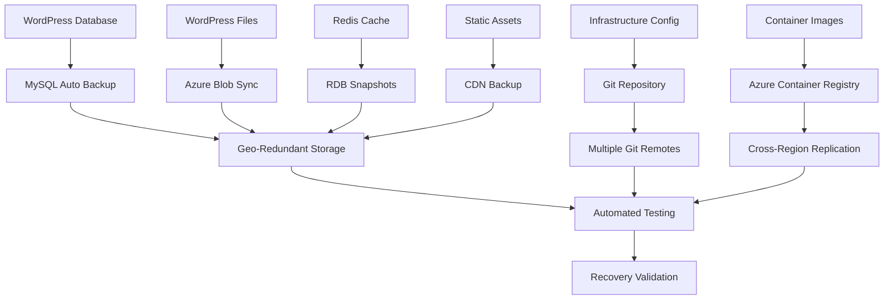

# Backup Strategy Guide

This guide provides comprehensive backup strategies and procedures for the headless WordPress + Next.js application to ensure data protection and business continuity.

## Table of Contents

1. [Backup Architecture](#backup-architecture)
2. [Database Backup Strategy](#database-backup-strategy)
3. [File System and Media Backup](#file-system-and-media-backup)
4. [Infrastructure Configuration Backup](#infrastructure-configuration-backup)
5. [Application Code Backup](#application-code-backup)
6. [Automated Backup Implementation](#automated-backup-implementation)
7. [Backup Testing and Validation](#backup-testing-and-validation)
8. [Restore Procedures](#restore-procedures)
9. [Cross-Region Backup Replication](#cross-region-backup-replication)
10. [Compliance and Retention](#compliance-and-retention)

## Backup Architecture

### Backup Overview



### Backup Components

```yaml
Backup_Components:
  Database_Tier:
    Primary: "MySQL Flexible Server automated backups"
    Secondary: "Custom dump backups to blob storage"
    Frequency: "Continuous (point-in-time) + Daily dumps"
    Retention: "35 days automated, 365 days custom"
    
  File_System:
    WordPress_Files: "wp-content uploads and themes"
    Configuration: "wp-config.php and custom configs"
    Logs: "Application and access logs"
    Frequency: "Daily incremental, Weekly full"
    
  Infrastructure:
    IaC_Templates: "Bicep/Terraform configurations"
    Secrets: "Key Vault backup"
    Configuration: "Environment variables and settings"
    Frequency: "On every change (Git-based)"
    
  Application:
    Container_Images: "WordPress and Next.js containers"
    Source_Code: "Git repository with multiple remotes"
    Dependencies: "Package manifests and lock files"
    Frequency: "On every build/deployment"
```

## Database Backup Strategy

### MySQL Flexible Server Automated Backups

```bash
# Configure automated backups for MySQL Flexible Server
az mysql flexible-server create \
  --name "mysql-wordpress-prod" \
  --resource-group "rg-db-prod" \
  --location "eastus" \
  --admin-user "dbadmin" \
  --admin-password "$SECURE_PASSWORD" \
  --backup-retention-days 35 \
  --geo-redundant-backup "Enabled" \
  --storage-auto-grow "Enabled" \
  --sku-name "Standard_D2ds_v4"

# Verify backup configuration
az mysql flexible-server show \
  --name "mysql-wordpress-prod" \
  --resource-group "rg-db-prod" \
  --query '{backupRetentionDays:backupRetentionDays, geoRedundantBackup:geoRedundantBackup}'

# List available backups
az mysql flexible-server backup list \
  --server-name "mysql-wordpress-prod" \
  --resource-group "rg-db-prod"
```

### Custom Database Backup Script

```bash
#!/bin/bash
# scripts/backup-database.sh

set -e

# Configuration
ENVIRONMENT=${1:-"production"}
BACKUP_TYPE=${2:-"full"}  # full, incremental, or schema
RETENTION_DAYS=${3:-365}

# Source environment configuration
source ".env.$ENVIRONMENT"

# Backup metadata
BACKUP_DATE=$(date +"%Y-%m-%d_%H-%M-%S")
BACKUP_PREFIX="wordpress-db-$ENVIRONMENT"
BACKUP_FILE="${BACKUP_PREFIX}_${BACKUP_TYPE}_${BACKUP_DATE}.sql"
COMPRESSED_FILE="${BACKUP_FILE}.gz"

# Storage configuration
STORAGE_ACCOUNT="sawordpressbackups$ENVIRONMENT"
CONTAINER_NAME="database-backups"
BLOB_PATH="$ENVIRONMENT/$(date +"%Y")/$(date +"%m")/$COMPRESSED_FILE"

echo "Starting $BACKUP_TYPE database backup for $ENVIRONMENT environment..."

# Create backup directory
mkdir -p "./backups/database"
cd "./backups/database"

# Perform backup based on type
case $BACKUP_TYPE in
    "full")
        echo "Performing full database backup..."
        mysqldump \
            --host="$WORDPRESS_DB_HOST" \
            --user="$WORDPRESS_DB_USER" \
            --password="$WORDPRESS_DB_PASSWORD" \
            --single-transaction \
            --routines \
            --triggers \
            --events \
            --hex-blob \
            --complete-insert \
            --extended-insert \
            --compress \
            "$WORDPRESS_DB_NAME" > "$BACKUP_FILE"
        ;;
        
    "incremental")
        echo "Performing incremental backup..."
        # Note: MySQL doesn't have native incremental backups
        # This creates a backup with binlog position for point-in-time recovery
        mysqldump \
            --host="$WORDPRESS_DB_HOST" \
            --user="$WORDPRESS_DB_USER" \
            --password="$WORDPRESS_DB_PASSWORD" \
            --single-transaction \
            --master-data=2 \
            --flush-logs \
            --routines \
            --triggers \
            "$WORDPRESS_DB_NAME" > "$BACKUP_FILE"
        ;;
        
    "schema")
        echo "Performing schema-only backup..."
        mysqldump \
            --host="$WORDPRESS_DB_HOST" \
            --user="$WORDPRESS_DB_USER" \
            --password="$WORDPRESS_DB_PASSWORD" \
            --no-data \
            --routines \
            --triggers \
            --events \
            "$WORDPRESS_DB_NAME" > "$BACKUP_FILE"
        ;;
        
    *)
        echo "Error: Unknown backup type '$BACKUP_TYPE'"
        exit 1
        ;;
esac

# Verify backup file
if [[ ! -f "$BACKUP_FILE" ]]; then
    echo "Error: Backup file not created"
    exit 1
fi

BACKUP_SIZE=$(stat -f%z "$BACKUP_FILE" 2>/dev/null || stat -c%s "$BACKUP_FILE")
echo "Backup created successfully: $BACKUP_FILE (${BACKUP_SIZE} bytes)"

# Compress backup
echo "Compressing backup..."
gzip "$BACKUP_FILE"

# Verify compressed file
COMPRESSED_SIZE=$(stat -f%z "$COMPRESSED_FILE" 2>/dev/null || stat -c%s "$COMPRESSED_FILE")
COMPRESSION_RATIO=$(echo "scale=2; $COMPRESSED_SIZE * 100 / $BACKUP_SIZE" | bc)
echo "Backup compressed: $COMPRESSED_FILE (${COMPRESSED_SIZE} bytes, ${COMPRESSION_RATIO}% of original)"

# Upload to Azure Blob Storage
echo "Uploading backup to Azure Blob Storage..."
az storage blob upload \
    --account-name "$STORAGE_ACCOUNT" \
    --container-name "$CONTAINER_NAME" \
    --name "$BLOB_PATH" \
    --file "$COMPRESSED_FILE" \
    --overwrite \
    --tier "Cool"  # Use Cool tier for cost optimization

# Add metadata to blob
az storage blob metadata update \
    --account-name "$STORAGE_ACCOUNT" \
    --container-name "$CONTAINER_NAME" \
    --name "$BLOB_PATH" \
    --metadata \
        environment="$ENVIRONMENT" \
        backup_type="$BACKUP_TYPE" \
        backup_date="$BACKUP_DATE" \
        database_name="$WORDPRESS_DB_NAME" \
        original_size="$BACKUP_SIZE" \
        compressed_size="$COMPRESSED_SIZE"

echo "Backup uploaded successfully to: $BLOB_PATH"

# Clean up local files
rm "$COMPRESSED_FILE"
echo "Local backup file cleaned up"

# Cleanup old backups based on retention policy
echo "Cleaning up old backups (retention: $RETENTION_DAYS days)..."
CUTOFF_DATE=$(date -d "$RETENTION_DAYS days ago" +"%Y-%m-%dT%H:%M:%SZ")

# List and delete old backups
az storage blob list \
    --account-name "$STORAGE_ACCOUNT" \
    --container-name "$CONTAINER_NAME" \
    --prefix "$ENVIRONMENT/" \
    --query "[?properties.lastModified < '$CUTOFF_DATE'].name" \
    --output tsv | while read -r blob_name; do
    if [[ -n "$blob_name" ]]; then
        echo "Deleting old backup: $blob_name"
        az storage blob delete \
            --account-name "$STORAGE_ACCOUNT" \
            --container-name "$CONTAINER_NAME" \
            --name "$blob_name"
    fi
done

# Generate backup report
echo "Backup completed successfully!"
echo "----------------------------------------"
echo "Environment: $ENVIRONMENT"
echo "Backup Type: $BACKUP_TYPE"
echo "Backup File: $BLOB_PATH"
echo "Original Size: $BACKUP_SIZE bytes"
echo "Compressed Size: $COMPRESSED_SIZE bytes"
echo "Compression Ratio: ${COMPRESSION_RATIO}%"
echo "Upload Time: $(date)"
echo "----------------------------------------"
```

### Point-in-Time Recovery Setup

```bash
# Enable point-in-time recovery for MySQL Flexible Server
az mysql flexible-server parameter set \
    --server-name "mysql-wordpress-prod" \
    --resource-group "rg-db-prod" \
    --name "binlog_expire_logs_seconds" \
    --value 604800  # 7 days

# Verify binary logging is enabled
az mysql flexible-server parameter show \
    --server-name "mysql-wordpress-prod" \
    --resource-group "rg-db-prod" \
    --name "log_bin"

# Create point-in-time restore
PITR_TIME="2024-12-01T12:00:00Z"
az mysql flexible-server restore \
    --restore-time "$PITR_TIME" \
    --source-server "mysql-wordpress-prod" \
    --name "mysql-wordpress-prod-restored" \
    --resource-group "rg-db-prod"
```

## File System and Media Backup

### WordPress Files Backup

```bash
#!/bin/bash
# scripts/backup-wordpress-files.sh

set -e

ENVIRONMENT=${1:-"production"}
BACKUP_TYPE=${2:-"incremental"}  # full or incremental

# Configuration
CONTAINER_APP_NAME="ca-wordpress-$ENVIRONMENT"
RESOURCE_GROUP="rg-app-$ENVIRONMENT"
STORAGE_ACCOUNT="sawordpressbackups$ENVIRONMENT"
CONTAINER_NAME="file-backups"
BACKUP_DATE=$(date +"%Y-%m-%d_%H-%M-%S")

echo "Starting WordPress files backup for $ENVIRONMENT environment..."

# Create temporary backup directory
BACKUP_DIR="./backups/wordpress-files/$BACKUP_DATE"
mkdir -p "$BACKUP_DIR"

# Download files from container app
echo "Downloading WordPress files from container..."

# Get container app details
CONTAINER_FQDN=$(az containerapp show \
    --name "$CONTAINER_APP_NAME" \
    --resource-group "$RESOURCE_GROUP" \
    --query "properties.configuration.ingress.fqdn" -o tsv)

# Copy files using container exec (if supported) or rsync
if [[ "$BACKUP_TYPE" == "full" ]]; then
    echo "Performing full file backup..."
    # Full backup of wp-content directory
    BACKUP_PATHS=(
        "/var/www/html/wp-content/uploads"
        "/var/www/html/wp-content/themes"
        "/var/www/html/wp-content/plugins"
        "/var/www/html/wp-config.php"
        "/var/www/html/.htaccess"
    )
else
    echo "Performing incremental file backup..."
    # Incremental backup (files modified in last 24 hours)
    BACKUP_PATHS=(
        "/var/www/html/wp-content/uploads"
    )
fi

# Alternative approach: Use Azure Files or persistent volume for WordPress files
# This assumes WordPress files are stored in Azure Files
AZURE_FILES_SHARE="wordpress-files-$ENVIRONMENT"

# Mount Azure Files share
echo "Mounting Azure Files share..."
sudo mkdir -p "/mnt/wordpress-files"
sudo mount -t cifs \
    "//sawordpress$ENVIRONMENT.file.core.windows.net/$AZURE_FILES_SHARE" \
    "/mnt/wordpress-files" \
    -o username="sawordpress$ENVIRONMENT",password="$STORAGE_ACCOUNT_KEY",uid=1000,gid=1000

# Create archive
ARCHIVE_FILE="wordpress-files-$ENVIRONMENT-$BACKUP_TYPE-$BACKUP_DATE.tar.gz"
echo "Creating archive: $ARCHIVE_FILE"

if [[ "$BACKUP_TYPE" == "full" ]]; then
    tar -czf "$BACKUP_DIR/$ARCHIVE_FILE" -C "/mnt/wordpress-files" .
else
    # Incremental backup - files modified in last 24 hours
    find "/mnt/wordpress-files" -type f -mtime -1 | \
        tar -czf "$BACKUP_DIR/$ARCHIVE_FILE" -C "/mnt/wordpress-files" -T -
fi

# Unmount Azure Files
sudo umount "/mnt/wordpress-files"

# Upload to blob storage
echo "Uploading file backup to Azure Blob Storage..."
BLOB_PATH="$ENVIRONMENT/files/$(date +"%Y")/$(date +"%m")/$ARCHIVE_FILE"

az storage blob upload \
    --account-name "$STORAGE_ACCOUNT" \
    --container-name "$CONTAINER_NAME" \
    --name "$BLOB_PATH" \
    --file "$BACKUP_DIR/$ARCHIVE_FILE" \
    --tier "Cool"

# Add metadata
FILE_SIZE=$(stat -f%z "$BACKUP_DIR/$ARCHIVE_FILE" 2>/dev/null || stat -c%s "$BACKUP_DIR/$ARCHIVE_FILE")
az storage blob metadata update \
    --account-name "$STORAGE_ACCOUNT" \
    --container-name "$CONTAINER_NAME" \
    --name "$BLOB_PATH" \
    --metadata \
        environment="$ENVIRONMENT" \
        backup_type="$BACKUP_TYPE" \
        backup_date="$BACKUP_DATE" \
        file_size="$FILE_SIZE" \
        content_type="wordpress_files"

echo "File backup completed: $BLOB_PATH"

# Cleanup
rm -rf "$BACKUP_DIR"
echo "Local backup files cleaned up"
```

### Media Files Synchronization

```bash
#!/bin/bash
# scripts/sync-media-files.sh

set -e

ENVIRONMENT=${1:-"production"}
SOURCE_CONTAINER="wordpress-uploads"
BACKUP_CONTAINER="uploads-backup"
STORAGE_ACCOUNT="sawordpress$ENVIRONMENT"

echo "Synchronizing WordPress media files..."

# Use AzCopy for efficient synchronization
az storage container create \
    --name "$BACKUP_CONTAINER" \
    --account-name "$STORAGE_ACCOUNT" \
    --public-access off

# Get storage account key
STORAGE_KEY=$(az storage account keys list \
    --account-name "$STORAGE_ACCOUNT" \
    --resource-group "rg-storage-$ENVIRONMENT" \
    --query '[0].value' -o tsv)

# Sync using AzCopy
azcopy sync \
    "https://$STORAGE_ACCOUNT.blob.core.windows.net/$SOURCE_CONTAINER" \
    "https://$STORAGE_ACCOUNT.blob.core.windows.net/$BACKUP_CONTAINER" \
    --recursive \
    --delete-destination=false \
    --log-level=INFO

echo "Media files synchronization completed"
```

## Infrastructure Configuration Backup

### Git-Based Infrastructure Backup

```bash
#!/bin/bash
# scripts/backup-infrastructure-config.sh

set -e

echo "Backing up infrastructure configuration..."

# Ensure we're in the project root
cd "$(git rev-parse --show-toplevel)"

# Create infrastructure backup branch
BACKUP_BRANCH="backup/infrastructure-$(date +"%Y-%m-%d_%H-%M-%S")"
git checkout -b "$BACKUP_BRANCH"

# Export current infrastructure state
echo "Exporting current infrastructure state..."

# Export Terraform state (if using Terraform)
for env in development staging production; do
    if [[ -d "infrastructure/terraform/environments/$env" ]]; then
        cd "infrastructure/terraform/environments/$env"
        if [[ -f ".terraform/terraform.tfstate" ]]; then
            terraform state pull > "../../../../backups/terraform-state-$env-$(date +%Y%m%d).json"
        fi
        cd "../../../.."
    fi
done

# Export Azure resource configurations
echo "Exporting Azure resource configurations..."
mkdir -p "backups/azure-config"

# Export resource groups
for env in development staging production; do
    echo "Exporting $env environment resources..."
    
    # Export all resources in environment resource groups
    az resource list \
        --query "[?resourceGroup | contains(@, '$env')]" \
        --output json > "backups/azure-config/resources-$env-$(date +%Y%m%d).json"
    
    # Export specific service configurations
    az mysql flexible-server list \
        --resource-group "rg-db-$env" \
        --output json > "backups/azure-config/mysql-$env-$(date +%Y%m%d).json" 2>/dev/null || true
    
    az containerapp list \
        --resource-group "rg-app-$env" \
        --output json > "backups/azure-config/containerapp-$env-$(date +%Y%m%d).json" 2>/dev/null || true
    
    az redis list \
        --resource-group "rg-cache-$env" \
        --output json > "backups/azure-config/redis-$env-$(date +%Y%m%d).json" 2>/dev/null || true
done

# Commit backup
git add .
git commit -m "Infrastructure configuration backup - $(date)"

# Push to multiple remotes for redundancy
REMOTES=("origin" "backup" "gitlab")
for remote in "${REMOTES[@]}"; do
    if git remote get-url "$remote" >/dev/null 2>&1; then
        echo "Pushing to $remote..."
        git push "$remote" "$BACKUP_BRANCH" || echo "Failed to push to $remote"
    fi
done

# Return to main branch
git checkout main

echo "Infrastructure configuration backup completed: $BACKUP_BRANCH"
```

### Key Vault Backup

```bash
#!/bin/bash
# scripts/backup-keyvault.sh

set -e

ENVIRONMENT=${1:-"production"}
KEY_VAULT_NAME="kv-wordpress-$ENVIRONMENT"
BACKUP_DATE=$(date +"%Y-%m-%d_%H-%M-%S")
BACKUP_DIR="./backups/keyvault/$BACKUP_DATE"

echo "Backing up Key Vault: $KEY_VAULT_NAME"

# Create backup directory
mkdir -p "$BACKUP_DIR"

# Export secrets (metadata only, not values for security)
az keyvault secret list \
    --vault-name "$KEY_VAULT_NAME" \
    --output json > "$BACKUP_DIR/secrets-metadata.json"

# Export keys (metadata only)
az keyvault key list \
    --vault-name "$KEY_VAULT_NAME" \
    --output json > "$BACKUP_DIR/keys-metadata.json"

# Export certificates
az keyvault certificate list \
    --vault-name "$KEY_VAULT_NAME" \
    --output json > "$BACKUP_DIR/certificates-metadata.json"

# Create backup archive
tar -czf "keyvault-$ENVIRONMENT-$BACKUP_DATE.tar.gz" -C "./backups/keyvault" "$BACKUP_DATE"

# Upload to secure backup storage
STORAGE_ACCOUNT="sawordpresssecure$ENVIRONMENT"
CONTAINER_NAME="keyvault-backups"
BLOB_PATH="$ENVIRONMENT/$(date +"%Y")/$(date +"%m")/keyvault-$ENVIRONMENT-$BACKUP_DATE.tar.gz"

az storage blob upload \
    --account-name "$STORAGE_ACCOUNT" \
    --container-name "$CONTAINER_NAME" \
    --name "$BLOB_PATH" \
    --file "keyvault-$ENVIRONMENT-$BACKUP_DATE.tar.gz" \
    --tier "Hot"  # Use Hot tier for frequent access

# Cleanup local files
rm -rf "$BACKUP_DIR"
rm "keyvault-$ENVIRONMENT-$BACKUP_DATE.tar.gz"

echo "Key Vault backup completed: $BLOB_PATH"
```

## Application Code Backup

### Container Image Backup

```bash
#!/bin/bash
# scripts/backup-container-images.sh

set -e

ENVIRONMENT=${1:-"production"}
SOURCE_REGISTRY="acrwordpress$ENVIRONMENT.azurecr.io"
BACKUP_REGISTRY="acrwordpressbackup.azurecr.io"

echo "Backing up container images for $ENVIRONMENT environment..."

# Login to both registries
az acr login --name "acrwordpress$ENVIRONMENT"
az acr login --name "acrwordpressbackup"

# Get list of repositories
REPOSITORIES=$(az acr repository list --name "acrwordpress$ENVIRONMENT" --output tsv)

for repo in $REPOSITORIES; do
    echo "Backing up repository: $repo"
    
    # Get list of tags
    TAGS=$(az acr repository show-tags --name "acrwordpress$ENVIRONMENT" --repository "$repo" --output tsv)
    
    for tag in $TAGS; do
        echo "  Backing up image: $repo:$tag"
        
        # Pull from source
        docker pull "$SOURCE_REGISTRY/$repo:$tag"
        
        # Tag for backup registry
        docker tag "$SOURCE_REGISTRY/$repo:$tag" "$BACKUP_REGISTRY/$repo:$tag"
        
        # Push to backup registry
        docker push "$BACKUP_REGISTRY/$repo:$tag"
        
        # Clean up local images
        docker rmi "$SOURCE_REGISTRY/$repo:$tag" "$BACKUP_REGISTRY/$repo:$tag"
    done
done

echo "Container image backup completed"
```

## Automated Backup Implementation

### Azure Automation Runbook

```powershell
# runbooks/BackupWordPressData.ps1
param(
    [Parameter(Mandatory=$true)]
    [string]$Environment,
    
    [Parameter(Mandatory=$false)]
    [string]$BackupType = "full"
)

# Import required modules
Import-Module Az.Accounts
Import-Module Az.Storage
Import-Module Az.MySql
Import-Module Az.ContainerInstance

# Connect using managed identity
Connect-AzAccount -Identity

try {
    Write-Output "Starting backup process for environment: $Environment"
    
    # Database backup
    Write-Output "Starting database backup..."
    $dbBackupResult = Start-AzAutomationRunbook -AutomationAccountName "automation-wordpress-prod" -Name "BackupDatabase" -Parameters @{Environment=$Environment; BackupType=$BackupType}
    
    # File backup
    Write-Output "Starting file backup..."
    $fileBackupResult = Start-AzAutomationRunbook -AutomationAccountName "automation-wordpress-prod" -Name "BackupFiles" -Parameters @{Environment=$Environment; BackupType=$BackupType}
    
    # Wait for completion
    do {
        Start-Sleep -Seconds 30
        $dbStatus = Get-AzAutomationJob -AutomationAccountName "automation-wordpress-prod" -Id $dbBackupResult.JobId
        $fileStatus = Get-AzAutomationJob -AutomationAccountName "automation-wordpress-prod" -Id $fileBackupResult.JobId
        Write-Output "Database backup status: $($dbStatus.Status), File backup status: $($fileStatus.Status)"
    } while ($dbStatus.Status -eq "Running" -or $fileStatus.Status -eq "Running")
    
    # Check results
    if ($dbStatus.Status -eq "Completed" -and $fileStatus.Status -eq "Completed") {
        Write-Output "Backup completed successfully"
        
        # Send success notification
        $webhookUri = Get-AutomationVariable -Name "SlackWebhookUri"
        $message = @{
            text = "Backup completed successfully for $Environment environment"
            channel = "#devops-alerts"
            username = "Azure Automation"
        } | ConvertTo-Json
        
        Invoke-RestMethod -Uri $webhookUri -Method Post -Body $message -ContentType "application/json"
    } else {
        throw "Backup failed. Database status: $($dbStatus.Status), File status: $($fileStatus.Status)"
    }
    
} catch {
    Write-Error "Backup process failed: $_"
    
    # Send failure notification
    $webhookUri = Get-AutomationVariable -Name "SlackWebhookUri"
    $message = @{
        text = "ALERT: Backup failed for $Environment environment. Error: $_"
        channel = "#devops-alerts"
        username = "Azure Automation"
    } | ConvertTo-Json
    
    Invoke-RestMethod -Uri $webhookUri -Method Post -Body $message -ContentType "application/json"
    
    throw
}
```

### GitHub Actions Backup Workflow

```yaml
# .github/workflows/backup.yml
name: Automated Backup

on:
  schedule:
    - cron: '0 2 * * *'  # Daily at 2 AM UTC
    - cron: '0 2 * * 0'  # Weekly on Sunday at 2 AM UTC (full backup)
  workflow_dispatch:
    inputs:
      environment:
        description: 'Environment to backup'
        required: true
        type: choice
        options:
        - development
        - staging
        - production
      backup_type:
        description: 'Backup type'
        required: true
        type: choice
        options:
        - incremental
        - full

env:
  AZURE_CLIENT_ID: ${{ secrets.AZURE_CLIENT_ID }}
  AZURE_CLIENT_SECRET: ${{ secrets.AZURE_CLIENT_SECRET }}
  AZURE_TENANT_ID: ${{ secrets.AZURE_TENANT_ID }}
  AZURE_SUBSCRIPTION_ID: ${{ secrets.AZURE_SUBSCRIPTION_ID }}

jobs:
  determine-backup-type:
    runs-on: ubuntu-latest
    outputs:
      backup_type: ${{ steps.backup-type.outputs.backup_type }}
      environments: ${{ steps.environments.outputs.environments }}
      
    steps:
    - name: Determine backup type
      id: backup-type
      run: |
        if [[ "${{ github.event_name }}" == "workflow_dispatch" ]]; then
          echo "backup_type=${{ github.event.inputs.backup_type }}" >> $GITHUB_OUTPUT
        elif [[ "$(date +%u)" == "7" ]]; then  # Sunday
          echo "backup_type=full" >> $GITHUB_OUTPUT
        else
          echo "backup_type=incremental" >> $GITHUB_OUTPUT
        fi
        
    - name: Determine environments
      id: environments
      run: |
        if [[ "${{ github.event_name }}" == "workflow_dispatch" ]]; then
          echo "environments=[\"${{ github.event.inputs.environment }}\"]"
        else
          echo "environments=[\"production\", \"staging\"]"
        fi >> $GITHUB_OUTPUT

  backup:
    runs-on: ubuntu-latest
    needs: determine-backup-type
    strategy:
      matrix:
        environment: ${{ fromJson(needs.determine-backup-type.outputs.environments) }}
      fail-fast: false
      
    steps:
    - uses: actions/checkout@v4
    
    - name: Azure Login
      uses: azure/login@v1
      with:
        creds: ${{ secrets.AZURE_CREDENTIALS }}
        
    - name: Install dependencies
      run: |
        sudo apt-get update
        sudo apt-get install -y mysql-client gzip bc
        
    - name: Database Backup
      env:
        ENVIRONMENT: ${{ matrix.environment }}
        BACKUP_TYPE: ${{ needs.determine-backup-type.outputs.backup_type }}
        WORDPRESS_DB_HOST: ${{ secrets[format('DB_HOST_{0}', upper(matrix.environment))] }}
        WORDPRESS_DB_USER: ${{ secrets[format('DB_USER_{0}', upper(matrix.environment))] }}
        WORDPRESS_DB_PASSWORD: ${{ secrets[format('DB_PASSWORD_{0}', upper(matrix.environment))] }}
        WORDPRESS_DB_NAME: ${{ secrets[format('DB_NAME_{0}', upper(matrix.environment))] }}
      run: |
        chmod +x scripts/backup-database.sh
        ./scripts/backup-database.sh "$ENVIRONMENT" "$BACKUP_TYPE"
        
    - name: File System Backup
      env:
        ENVIRONMENT: ${{ matrix.environment }}
        BACKUP_TYPE: ${{ needs.determine-backup-type.outputs.backup_type }}
      run: |
        chmod +x scripts/backup-wordpress-files.sh
        ./scripts/backup-wordpress-files.sh "$ENVIRONMENT" "$BACKUP_TYPE"
        
    - name: Infrastructure Config Backup
      if: needs.determine-backup-type.outputs.backup_type == 'full'
      run: |
        chmod +x scripts/backup-infrastructure-config.sh
        ./scripts/backup-infrastructure-config.sh
        
    - name: Container Image Backup
      if: needs.determine-backup-type.outputs.backup_type == 'full'
      env:
        ENVIRONMENT: ${{ matrix.environment }}
      run: |
        chmod +x scripts/backup-container-images.sh
        ./scripts/backup-container-images.sh "$ENVIRONMENT"
        
    - name: Backup Verification
      env:
        ENVIRONMENT: ${{ matrix.environment }}
      run: |
        echo "Verifying backup completion for $ENVIRONMENT..."
        # Add verification logic here
        
    - name: Notify Success
      if: success()
      uses: 8398a7/action-slack@v3
      with:
        status: success
        text: "Backup completed successfully for ${{ matrix.environment }} environment (${{ needs.determine-backup-type.outputs.backup_type }} backup)"
      env:
        SLACK_WEBHOOK_URL: ${{ secrets.SLACK_WEBHOOK_URL }}
        
    - name: Notify Failure
      if: failure()
      uses: 8398a7/action-slack@v3
      with:
        status: failure
        text: "ALERT: Backup failed for ${{ matrix.environment }} environment"
      env:
        SLACK_WEBHOOK_URL: ${{ secrets.SLACK_WEBHOOK_URL }}
```

## Backup Testing and Validation

### Backup Integrity Testing

```bash
#!/bin/bash
# scripts/test-backup-integrity.sh

set -e

ENVIRONMENT=${1:-"production"}
BACKUP_DATE=${2:-"latest"}

echo "Testing backup integrity for $ENVIRONMENT environment..."

# Test database backup integrity
echo "Testing database backup..."
STORAGE_ACCOUNT="sawordpressbackups$ENVIRONMENT"
CONTAINER_NAME="database-backups"

# Find latest backup if not specified
if [[ "$BACKUP_DATE" == "latest" ]]; then
    BACKUP_FILE=$(az storage blob list \
        --account-name "$STORAGE_ACCOUNT" \
        --container-name "$CONTAINER_NAME" \
        --prefix "$ENVIRONMENT/" \
        --query "max_by([?ends_with(name, '.sql.gz')], &properties.lastModified).name" -o tsv)
else
    BACKUP_FILE=$(az storage blob list \
        --account-name "$STORAGE_ACCOUNT" \
        --container-name "$CONTAINER_NAME" \
        --prefix "$ENVIRONMENT/" \
        --query "[?contains(name, '$BACKUP_DATE')].name" -o tsv | head -1)
fi

if [[ -z "$BACKUP_FILE" ]]; then
    echo "Error: No backup file found"
    exit 1
fi

echo "Testing backup file: $BACKUP_FILE"

# Download backup file
TEST_DIR="./test-restore-$(date +%Y%m%d-%H%M%S)"
mkdir -p "$TEST_DIR"

az storage blob download \
    --account-name "$STORAGE_ACCOUNT" \
    --container-name "$CONTAINER_NAME" \
    --name "$BACKUP_FILE" \
    --file "$TEST_DIR/backup.sql.gz"

# Test file integrity
echo "Testing file integrity..."
if gzip -t "$TEST_DIR/backup.sql.gz"; then
    echo "✓ Backup file integrity test passed"
else
    echo "✗ Backup file is corrupted"
    exit 1
fi

# Extract and test SQL content
echo "Testing SQL content..."
gunzip -c "$TEST_DIR/backup.sql.gz" > "$TEST_DIR/backup.sql"

# Basic SQL syntax check
if head -10 "$TEST_DIR/backup.sql" | grep -q "MySQL dump"; then
    echo "✓ SQL file format is valid"
else
    echo "✗ SQL file format is invalid"
    exit 1
fi

# Count tables and data
TABLE_COUNT=$(grep -c "CREATE TABLE" "$TEST_DIR/backup.sql" || echo 0)
INSERT_COUNT=$(grep -c "INSERT INTO" "$TEST_DIR/backup.sql" || echo 0)

echo "Database backup statistics:"
echo "  Tables: $TABLE_COUNT"
echo "  Insert statements: $INSERT_COUNT"

if [[ $TABLE_COUNT -gt 10 ]]; then  # WordPress has more than 10 default tables
    echo "✓ Database backup contains expected number of tables"
else
    echo "✗ Database backup may be incomplete (too few tables)"
    exit 1
fi

# Test restore to temporary database (optional)
if [[ "$ENVIRONMENT" != "production" ]]; then
    echo "Testing database restore..."
    
    # Create temporary database
    TEMP_DB="wordpress_restore_test_$(date +%s)"
    mysql -h "$WORDPRESS_DB_HOST" -u "$WORDPRESS_DB_USER" -p"$WORDPRESS_DB_PASSWORD" \
        -e "CREATE DATABASE $TEMP_DB;"
    
    # Restore backup
    mysql -h "$WORDPRESS_DB_HOST" -u "$WORDPRESS_DB_USER" -p"$WORDPRESS_DB_PASSWORD" \
        "$TEMP_DB" < "$TEST_DIR/backup.sql"
    
    # Verify restoration
    TABLE_COUNT_RESTORED=$(mysql -h "$WORDPRESS_DB_HOST" -u "$WORDPRESS_DB_USER" -p"$WORDPRESS_DB_PASSWORD" \
        "$TEMP_DB" -e "SHOW TABLES;" | wc -l)
    
    if [[ $TABLE_COUNT_RESTORED -gt 10 ]]; then
        echo "✓ Database restore test passed"
    else
        echo "✗ Database restore test failed"
        exit 1
    fi
    
    # Cleanup temporary database
    mysql -h "$WORDPRESS_DB_HOST" -u "$WORDPRESS_DB_USER" -p"$WORDPRESS_DB_PASSWORD" \
        -e "DROP DATABASE $TEMP_DB;"
fi

# Cleanup test files
rm -rf "$TEST_DIR"

echo "Backup integrity test completed successfully"
```

### Automated Backup Monitoring

```bash
#!/bin/bash
# scripts/monitor-backup-health.sh

set -e

echo "Monitoring backup health..."

# Check backup freshness
for env in production staging development; do
    echo "Checking $env environment backups..."
    
    STORAGE_ACCOUNT="sawordpressbackups$env"
    
    # Check database backup freshness
    LATEST_DB_BACKUP=$(az storage blob list \
        --account-name "$STORAGE_ACCOUNT" \
        --container-name "database-backups" \
        --prefix "$env/" \
        --query "max_by([?ends_with(name, '.sql.gz')], &properties.lastModified).properties.lastModified" -o tsv)
    
    # Check if backup is less than 25 hours old
    if [[ -n "$LATEST_DB_BACKUP" ]]; then
        BACKUP_AGE=$(( ($(date +%s) - $(date -d "$LATEST_DB_BACKUP" +%s)) / 3600 ))
        if [[ $BACKUP_AGE -lt 25 ]]; then
            echo "✓ $env database backup is fresh ($BACKUP_AGE hours old)"
        else
            echo "⚠ $env database backup is stale ($BACKUP_AGE hours old)"
            # Send alert
            send_alert "Database backup is stale for $env environment" "warning"
        fi
    else
        echo "✗ No database backup found for $env environment"
        send_alert "No database backup found for $env environment" "critical"
    fi
    
    # Check file backup freshness
    LATEST_FILE_BACKUP=$(az storage blob list \
        --account-name "$STORAGE_ACCOUNT" \
        --container-name "file-backups" \
        --prefix "$env/" \
        --query "max_by([?ends_with(name, '.tar.gz')], &properties.lastModified).properties.lastModified" -o tsv)
    
    if [[ -n "$LATEST_FILE_BACKUP" ]]; then
        BACKUP_AGE=$(( ($(date +%s) - $(date -d "$LATEST_FILE_BACKUP" +%s)) / 3600 ))
        if [[ $BACKUP_AGE -lt 25 ]]; then
            echo "✓ $env file backup is fresh ($BACKUP_AGE hours old)"
        else
            echo "⚠ $env file backup is stale ($BACKUP_AGE hours old)"
            send_alert "File backup is stale for $env environment" "warning"
        fi
    else
        echo "✗ No file backup found for $env environment"
        send_alert "No file backup found for $env environment" "critical"
    fi
done

# Function to send alerts
send_alert() {
    local message="$1"
    local severity="$2"
    
    # Send to Slack
    if [[ -n "$SLACK_WEBHOOK_URL" ]]; then
        curl -X POST "$SLACK_WEBHOOK_URL" \
            -H "Content-Type: application/json" \
            -d "{
                \"text\": \"Backup Alert: $message\",
                \"channel\": \"#devops-alerts\",
                \"username\": \"Backup Monitor\",
                \"icon_emoji\": \":warning:\"
            }"
    fi
    
    # Log to syslog
    logger -t backup-monitor "$severity: $message"
}

echo "Backup health monitoring completed"
```

## Restore Procedures

### Database Restore Script

```bash
#!/bin/bash
# scripts/restore-database.sh

set -e

ENVIRONMENT=${1:?"Environment is required"}
BACKUP_DATE=${2:-"latest"}
TARGET_DATABASE=${3:-""}
CONFIRM=${4:-"false"}

# Safety check for production
if [[ "$ENVIRONMENT" == "production" && "$CONFIRM" != "yes-i-am-sure" ]]; then
    echo "ERROR: Production database restore requires explicit confirmation"
    echo "Usage: $0 production <backup-date> <target-db> yes-i-am-sure"
    exit 1
fi

echo "Starting database restore for $ENVIRONMENT environment..."
echo "Backup date: $BACKUP_DATE"
echo "Target database: ${TARGET_DATABASE:-'default'}"

# Configuration
STORAGE_ACCOUNT="sawordpressbackups$ENVIRONMENT"
CONTAINER_NAME="database-backups"
RESTORE_DIR="./restore-$(date +%Y%m%d-%H%M%S)"

# Create restore directory
mkdir -p "$RESTORE_DIR"

# Find backup file
if [[ "$BACKUP_DATE" == "latest" ]]; then
    BACKUP_FILE=$(az storage blob list \
        --account-name "$STORAGE_ACCOUNT" \
        --container-name "$CONTAINER_NAME" \
        --prefix "$ENVIRONMENT/" \
        --query "max_by([?ends_with(name, '.sql.gz')], &properties.lastModified).name" -o tsv)
else
    BACKUP_FILE=$(az storage blob list \
        --account-name "$STORAGE_ACCOUNT" \
        --container-name "$CONTAINER_NAME" \
        --prefix "$ENVIRONMENT/" \
        --query "[?contains(name, '$BACKUP_DATE')].name" -o tsv | head -1)
fi

if [[ -z "$BACKUP_FILE" ]]; then
    echo "Error: No backup file found for date $BACKUP_DATE"
    exit 1
fi

echo "Using backup file: $BACKUP_FILE"

# Download backup
echo "Downloading backup file..."
az storage blob download \
    --account-name "$STORAGE_ACCOUNT" \
    --container-name "$CONTAINER_NAME" \
    --name "$BACKUP_FILE" \
    --file "$RESTORE_DIR/backup.sql.gz"

# Extract backup
echo "Extracting backup file..."
gunzip "$RESTORE_DIR/backup.sql.gz"

# Determine target database
if [[ -z "$TARGET_DATABASE" ]]; then
    case $ENVIRONMENT in
        "production")
            TARGET_DB="wordpress"
            DB_HOST="$PROD_DB_HOST"
            DB_USER="$PROD_DB_USER"
            DB_PASSWORD="$PROD_DB_PASSWORD"
            ;;
        "staging")
            TARGET_DB="wordpress"
            DB_HOST="$STAGING_DB_HOST"
            DB_USER="$STAGING_DB_USER"
            DB_PASSWORD="$STAGING_DB_PASSWORD"
            ;;
        "development")
            TARGET_DB="wordpress"
            DB_HOST="$DEV_DB_HOST"
            DB_USER="$DEV_DB_USER"
            DB_PASSWORD="$DEV_DB_PASSWORD"
            ;;
        *)
            echo "Error: Unknown environment $ENVIRONMENT"
            exit 1
            ;;
    esac
else
    TARGET_DB="$TARGET_DATABASE"
fi

# Create backup of current database
echo "Creating backup of current database..."
PRERESTORE_BACKUP="prerestore-backup-$(date +%Y%m%d-%H%M%S).sql"
mysqldump \
    --host="$DB_HOST" \
    --user="$DB_USER" \
    --password="$DB_PASSWORD" \
    --single-transaction \
    --routines \
    --triggers \
    "$TARGET_DB" > "$RESTORE_DIR/$PRERESTORE_BACKUP"

echo "Pre-restore backup created: $PRERESTORE_BACKUP"

# Perform restore
echo "Restoring database..."
mysql \
    --host="$DB_HOST" \
    --user="$DB_USER" \
    --password="$DB_PASSWORD" \
    "$TARGET_DB" < "$RESTORE_DIR/backup.sql"

echo "Database restore completed successfully"

# Verify restore
echo "Verifying database restore..."
TABLE_COUNT=$(mysql \
    --host="$DB_HOST" \
    --user="$DB_USER" \
    --password="$DB_PASSWORD" \
    "$TARGET_DB" \
    -e "SELECT COUNT(*) FROM information_schema.tables WHERE table_schema='$TARGET_DB';" \
    --skip-column-names)

echo "Restored database contains $TABLE_COUNT tables"

if [[ $TABLE_COUNT -gt 10 ]]; then
    echo "✓ Database restore verification passed"
else
    echo "⚠ Database restore may be incomplete"
fi

# Upload pre-restore backup to storage
echo "Uploading pre-restore backup to storage..."
PRE_BACKUP_BLOB="$ENVIRONMENT/pre-restore-backups/$PRERESTORE_BACKUP.gz"
gzip "$RESTORE_DIR/$PRERESTORE_BACKUP"

az storage blob upload \
    --account-name "$STORAGE_ACCOUNT" \
    --container-name "$CONTAINER_NAME" \
    --name "$PRE_BACKUP_BLOB" \
    --file "$RESTORE_DIR/$PRERESTORE_BACKUP.gz" \
    --tier "Cool"

echo "Pre-restore backup uploaded: $PRE_BACKUP_BLOB"

# Cleanup
rm -rf "$RESTORE_DIR"

echo "Database restore process completed successfully!"
echo "Pre-restore backup available at: $PRE_BACKUP_BLOB"
```

### File System Restore Script

```bash
#!/bin/bash
# scripts/restore-wordpress-files.sh

set -e

ENVIRONMENT=${1:?"Environment is required"}
BACKUP_DATE=${2:-"latest"}
RESTORE_PATH=${3:-"/mnt/wordpress-files"}
CONFIRM=${4:-"false"}

# Safety check for production
if [[ "$ENVIRONMENT" == "production" && "$CONFIRM" != "yes-i-am-sure" ]]; then
    echo "ERROR: Production file restore requires explicit confirmation"
    echo "Usage: $0 production <backup-date> <restore-path> yes-i-am-sure"
    exit 1
fi

echo "Starting file system restore for $ENVIRONMENT environment..."
echo "Backup date: $BACKUP_DATE"
echo "Restore path: $RESTORE_PATH"

# Configuration
STORAGE_ACCOUNT="sawordpressbackups$ENVIRONMENT"
CONTAINER_NAME="file-backups"
RESTORE_DIR="./restore-files-$(date +%Y%m%d-%H%M%S)"

# Create restore directory
mkdir -p "$RESTORE_DIR"

# Find backup file
if [[ "$BACKUP_DATE" == "latest" ]]; then
    BACKUP_FILE=$(az storage blob list \
        --account-name "$STORAGE_ACCOUNT" \
        --container-name "$CONTAINER_NAME" \
        --prefix "$ENVIRONMENT/" \
        --query "max_by([?ends_with(name, '.tar.gz')], &properties.lastModified).name" -o tsv)
else
    BACKUP_FILE=$(az storage blob list \
        --account-name "$STORAGE_ACCOUNT" \
        --container-name "$CONTAINER_NAME" \
        --prefix "$ENVIRONMENT/" \
        --query "[?contains(name, '$BACKUP_DATE')].name" -o tsv | head -1)
fi

if [[ -z "$BACKUP_FILE" ]]; then
    echo "Error: No backup file found for date $BACKUP_DATE"
    exit 1
fi

echo "Using backup file: $BACKUP_FILE"

# Download backup
echo "Downloading backup file..."
az storage blob download \
    --account-name "$STORAGE_ACCOUNT" \
    --container-name "$CONTAINER_NAME" \
    --name "$BACKUP_FILE" \
    --file "$RESTORE_DIR/files-backup.tar.gz"

# Create backup of current files
if [[ -d "$RESTORE_PATH" ]]; then
    echo "Creating backup of current files..."
    CURRENT_BACKUP="current-files-backup-$(date +%Y%m%d-%H%M%S).tar.gz"
    tar -czf "$RESTORE_DIR/$CURRENT_BACKUP" -C "$RESTORE_PATH" .
    echo "Current files backed up to: $CURRENT_BACKUP"
fi

# Extract and restore files
echo "Extracting and restoring files..."
mkdir -p "$RESTORE_PATH"
tar -xzf "$RESTORE_DIR/files-backup.tar.gz" -C "$RESTORE_PATH"

# Set correct permissions
echo "Setting file permissions..."
chown -R www-data:www-data "$RESTORE_PATH" 2>/dev/null || \
chown -R 1000:1000 "$RESTORE_PATH" 2>/dev/null || \
echo "Warning: Could not set file ownership"

find "$RESTORE_PATH" -type d -exec chmod 755 {} \;
find "$RESTORE_PATH" -type f -exec chmod 644 {} \;

echo "File system restore completed successfully"

# Upload current backup to storage if created
if [[ -f "$RESTORE_DIR/$CURRENT_BACKUP" ]]; then
    echo "Uploading current files backup to storage..."
    CURRENT_BACKUP_BLOB="$ENVIRONMENT/pre-restore-files/$CURRENT_BACKUP"
    
    az storage blob upload \
        --account-name "$STORAGE_ACCOUNT" \
        --container-name "$CONTAINER_NAME" \
        --name "$CURRENT_BACKUP_BLOB" \
        --file "$RESTORE_DIR/$CURRENT_BACKUP" \
        --tier "Cool"
    
    echo "Current files backup uploaded: $CURRENT_BACKUP_BLOB"
fi

# Cleanup
rm -rf "$RESTORE_DIR"

echo "File system restore process completed successfully!"
```

## Cross-Region Backup Replication

### Geo-Redundant Backup Setup

```bash
#!/bin/bash
# scripts/setup-geo-redundant-backups.sh

set -e

ENVIRONMENT=${1:-"production"}
PRIMARY_REGION="eastus"
SECONDARY_REGION="westus2"

echo "Setting up geo-redundant backups for $ENVIRONMENT environment..."

# Create secondary region storage account
SECONDARY_STORAGE="sawordpressbkp$ENVIRONMENT$SECONDARY_REGION"
az storage account create \
    --name "$SECONDARY_STORAGE" \
    --resource-group "rg-backup-$SECONDARY_REGION" \
    --location "$SECONDARY_REGION" \
    --sku "Standard_GRS" \
    --kind "StorageV2" \
    --access-tier "Cool" \
    --https-only true \
    --min-tls-version "TLS1_2"

# Create containers in secondary storage
CONTAINERS=("database-backups" "file-backups" "infrastructure-backups")
for container in "${CONTAINERS[@]}"; do
    az storage container create \
        --account-name "$SECONDARY_STORAGE" \
        --name "$container" \
        --public-access off
done

# Set up cross-region replication using AzCopy
PRIMARY_STORAGE="sawordpressbackups$ENVIRONMENT"

# Get storage account keys
PRIMARY_KEY=$(az storage account keys list \
    --account-name "$PRIMARY_STORAGE" \
    --resource-group "rg-backup-$PRIMARY_REGION" \
    --query '[0].value' -o tsv)

SECONDARY_KEY=$(az storage account keys list \
    --account-name "$SECONDARY_STORAGE" \
    --resource-group "rg-backup-$SECONDARY_REGION" \
    --query '[0].value' -o tsv)

echo "Storage accounts created and configured"
echo "Primary: $PRIMARY_STORAGE (${PRIMARY_REGION})"
echo "Secondary: $SECONDARY_STORAGE (${SECONDARY_REGION})"

# Create replication script
cat > "replicate-backups-$ENVIRONMENT.sh" << EOF
#!/bin/bash
# Auto-generated backup replication script

set -e

PRIMARY_STORAGE="$PRIMARY_STORAGE"
SECONDARY_STORAGE="$SECONDARY_STORAGE"
PRIMARY_KEY="$PRIMARY_KEY"
SECONDARY_KEY="$SECONDARY_KEY"

echo "Starting backup replication from $PRIMARY_REGION to $SECONDARY_REGION..."

# Replicate each container
for container in "database-backups" "file-backups" "infrastructure-backups"; do
    echo "Replicating container: \$container"
    
    azcopy sync \
        "https://\$PRIMARY_STORAGE.blob.core.windows.net/\$container" \
        "https://\$SECONDARY_STORAGE.blob.core.windows.net/\$container" \
        --recursive \
        --delete-destination=false \
        --log-level=INFO
done

echo "Backup replication completed"
EOF

chmod +x "replicate-backups-$ENVIRONMENT.sh"
echo "Replication script created: replicate-backups-$ENVIRONMENT.sh"
```

### Automated Cross-Region Replication

```yaml
# .github/workflows/backup-replication.yml
name: Cross-Region Backup Replication

on:
  schedule:
    - cron: '0 6 * * *'  # Daily at 6 AM UTC
  workflow_dispatch:
    inputs:
      environment:
        description: 'Environment to replicate'
        required: true
        type: choice
        options:
        - production
        - staging

jobs:
  replicate-backups:
    runs-on: ubuntu-latest
    strategy:
      matrix:
        environment: [production, staging]
      fail-fast: false
      
    steps:
    - uses: actions/checkout@v4
    
    - name: Azure Login
      uses: azure/login@v1
      with:
        creds: ${{ secrets.AZURE_CREDENTIALS }}
        
    - name: Install AzCopy
      run: |
        wget -O azcopy.tar.gz https://aka.ms/downloadazcopy-v10-linux
        tar -xf azcopy.tar.gz --strip-components=1
        sudo mv azcopy /usr/local/bin/
        
    - name: Replicate Backups
      env:
        ENVIRONMENT: ${{ matrix.environment }}
        PRIMARY_STORAGE: sawordpressbackups${{ matrix.environment }}
        SECONDARY_STORAGE: sawordpressbkp${{ matrix.environment }}westus2
      run: |
        echo "Replicating backups for $ENVIRONMENT environment..."
        
        # Get storage account keys
        PRIMARY_KEY=$(az storage account keys list \
          --account-name "$PRIMARY_STORAGE" \
          --resource-group "rg-backup-eastus" \
          --query '[0].value' -o tsv)
        
        SECONDARY_KEY=$(az storage account keys list \
          --account-name "$SECONDARY_STORAGE" \
          --resource-group "rg-backup-westus2" \
          --query '[0].value' -o tsv)
        
        # Replicate containers
        for container in database-backups file-backups infrastructure-backups; do
          echo "Replicating container: $container"
          
          azcopy sync \
            "https://$PRIMARY_STORAGE.blob.core.windows.net/$container?$PRIMARY_KEY" \
            "https://$SECONDARY_STORAGE.blob.core.windows.net/$container?$SECONDARY_KEY" \
            --recursive \
            --delete-destination=false \
            --log-level=INFO
        done
        
    - name: Verify Replication
      env:
        ENVIRONMENT: ${{ matrix.environment }}
      run: |
        # Count files in primary and secondary storage
        PRIMARY_COUNT=$(az storage blob list \
          --account-name "sawordpressbackups$ENVIRONMENT" \
          --container-name "database-backups" \
          --query 'length(@)' -o tsv)
        
        SECONDARY_COUNT=$(az storage blob list \
          --account-name "sawordpressbkp${ENVIRONMENT}westus2" \
          --container-name "database-backups" \
          --query 'length(@)' -o tsv)
        
        echo "Primary storage files: $PRIMARY_COUNT"
        echo "Secondary storage files: $SECONDARY_COUNT"
        
        if [[ $SECONDARY_COUNT -ge $(($PRIMARY_COUNT * 90 / 100)) ]]; then
          echo "✓ Replication verification passed"
        else
          echo "⚠ Replication may be incomplete"
          exit 1
        fi
        
    - name: Notify Success
      if: success()
      uses: 8398a7/action-slack@v3
      with:
        status: success
        text: "Cross-region backup replication completed for ${{ matrix.environment }} environment"
      env:
        SLACK_WEBHOOK_URL: ${{ secrets.SLACK_WEBHOOK_URL }}
```

## Compliance and Retention

### Retention Policy Configuration

```bash
#!/bin/bash
# scripts/configure-backup-retention.sh

set -e

ENVIRONMENT=${1:-"production"}

echo "Configuring backup retention policies for $ENVIRONMENT environment..."

# Storage account configuration
STORAGE_ACCOUNT="sawordpressbackups$ENVIRONMENT"
RESOURCE_GROUP="rg-backup-eastus"

# Configure lifecycle management policy
cat > lifecycle-policy.json << EOF
{
  "rules": [
    {
      "enabled": true,
      "name": "database-backup-lifecycle",
      "type": "Lifecycle",
      "definition": {
        "filters": {
          "blobTypes": ["blockBlob"],
          "prefixMatch": ["$ENVIRONMENT/database-backups/"]
        },
        "actions": {
          "baseBlob": {
            "tierToCool": {
              "daysAfterModificationGreaterThan": 30
            },
            "tierToArchive": {
              "daysAfterModificationGreaterThan": 90
            },
            "delete": {
              "daysAfterModificationGreaterThan": 2555
            }
          },
          "snapshot": {
            "delete": {
              "daysAfterCreationGreaterThan": 90
            }
          }
        }
      }
    },
    {
      "enabled": true,
      "name": "file-backup-lifecycle",
      "type": "Lifecycle",
      "definition": {
        "filters": {
          "blobTypes": ["blockBlob"],
          "prefixMatch": ["$ENVIRONMENT/file-backups/"]
        },
        "actions": {
          "baseBlob": {
            "tierToCool": {
              "daysAfterModificationGreaterThan": 7
            },
            "tierToArchive": {
              "daysAfterModificationGreaterThan": 30
            },
            "delete": {
              "daysAfterModificationGreaterThan": 1095
            }
          }
        }
      }
    },
    {
      "enabled": true,
      "name": "infrastructure-backup-lifecycle",
      "type": "Lifecycle",
      "definition": {
        "filters": {
          "blobTypes": ["blockBlob"],
          "prefixMatch": ["$ENVIRONMENT/infrastructure-backups/"]
        },
        "actions": {
          "baseBlob": {
            "tierToCool": {
              "daysAfterModificationGreaterThan": 1
            },
            "tierToArchive": {
              "daysAfterModificationGreaterThan": 30
            },
            "delete": {
              "daysAfterModificationGreaterThan": 2555
            }
          }
        }
      }
    }
  ]
}
EOF

# Apply lifecycle management policy
az storage account management-policy create \
    --account-name "$STORAGE_ACCOUNT" \
    --resource-group "$RESOURCE_GROUP" \
    --policy @lifecycle-policy.json

echo "Lifecycle management policy applied successfully"

# Configure immutable blob storage for compliance
az storage container immutability-policy create \
    --account-name "$STORAGE_ACCOUNT" \
    --container-name "database-backups" \
    --period 2555  # 7 years in days

echo "Immutable storage policy configured for compliance"

# Enable soft delete
az storage account blob-service-properties update \
    --account-name "$STORAGE_ACCOUNT" \
    --resource-group "$RESOURCE_GROUP" \
    --enable-delete-retention true \
    --delete-retention-days 30

echo "Soft delete enabled with 30-day retention"

# Clean up policy file
rm lifecycle-policy.json

echo "Backup retention policy configuration completed"
```

### Compliance Reporting

```python
#!/usr/bin/env python3
# scripts/generate-backup-compliance-report.py

import os
import json
from datetime import datetime, timedelta
from azure.storage.blob import BlobServiceClient
from azure.identity import DefaultAzureCredential

def generate_compliance_report(environment):
    """Generate backup compliance report for audit purposes"""
    
    credential = DefaultAzureCredential()
    storage_account = f"sawordpressbackups{environment}"
    
    blob_service_client = BlobServiceClient(
        account_url=f"https://{storage_account}.blob.core.windows.net",
        credential=credential
    )
    
    report = {
        'report_date': datetime.utcnow().isoformat(),
        'environment': environment,
        'compliance_period': '365 days',
        'backup_types': {}
    }
    
    containers = ['database-backups', 'file-backups', 'infrastructure-backups']
    
    for container_name in containers:
        container_client = blob_service_client.get_container_client(container_name)
        blobs = list(container_client.list_blobs(name_starts_with=f"{environment}/"))
        
        backup_stats = {
            'total_backups': len(blobs),
            'size_gb': sum([blob.size for blob in blobs]) / (1024**3),
            'oldest_backup': None,
            'newest_backup': None,
            'retention_compliance': {},
            'backup_frequency_compliance': {}
        }
        
        if blobs:
            backup_dates = [blob.last_modified for blob in blobs]
            backup_stats['oldest_backup'] = min(backup_dates).isoformat()
            backup_stats['newest_backup'] = max(backup_dates).isoformat()
            
            # Check retention compliance
            cutoff_date = datetime.utcnow() - timedelta(days=365)
            compliant_backups = [b for b in blobs if b.last_modified >= cutoff_date]
            backup_stats['retention_compliance'] = {
                'required_retention_days': 365,
                'compliant_backups': len(compliant_backups),
                'total_backups': len(blobs),
                'compliance_percentage': (len(compliant_backups) / len(blobs)) * 100
            }
            
            # Check backup frequency (daily backups expected)
            daily_backup_check = check_daily_backup_compliance(blobs, 30)  # Check last 30 days
            backup_stats['backup_frequency_compliance'] = daily_backup_check
        
        report['backup_types'][container_name.replace('-', '_')] = backup_stats
    
    # Generate recommendations
    report['recommendations'] = generate_compliance_recommendations(report)
    
    return report

def check_daily_backup_compliance(blobs, days_to_check):
    """Check if daily backups exist for the specified period"""
    
    end_date = datetime.utcnow().date()
    start_date = end_date - timedelta(days=days_to_check)
    
    expected_dates = set()
    current_date = start_date
    while current_date <= end_date:
        expected_dates.add(current_date)
        current_date += timedelta(days=1)
    
    backup_dates = set([blob.last_modified.date() for blob in blobs 
                       if start_date <= blob.last_modified.date() <= end_date])
    
    missing_dates = expected_dates - backup_dates
    
    return {
        'period_days': days_to_check,
        'expected_backups': len(expected_dates),
        'actual_backups': len(backup_dates),
        'missing_backups': len(missing_dates),
        'compliance_percentage': (len(backup_dates) / len(expected_dates)) * 100,
        'missing_dates': [date.isoformat() for date in sorted(missing_dates)]
    }

def generate_compliance_recommendations(report):
    """Generate actionable compliance recommendations"""
    recommendations = []
    
    for backup_type, stats in report['backup_types'].items():
        # Check retention compliance
        if stats['retention_compliance']['compliance_percentage'] < 95:
            recommendations.append(f"Review {backup_type} retention policy - only {stats['retention_compliance']['compliance_percentage']:.1f}% compliant")
        
        # Check backup frequency
        if stats['backup_frequency_compliance']['compliance_percentage'] < 90:
            recommendations.append(f"Improve {backup_type} frequency - missing {stats['backup_frequency_compliance']['missing_backups']} daily backups")
        
        # Check backup freshness
        if stats['newest_backup']:
            newest_backup = datetime.fromisoformat(stats['newest_backup'].replace('Z', '+00:00'))
            hours_since_backup = (datetime.now(newest_backup.tzinfo) - newest_backup).total_seconds() / 3600
            
            if hours_since_backup > 30:  # More than 30 hours
                recommendations.append(f"Recent {backup_type} backup is stale - {hours_since_backup:.1f} hours old")
    
    return recommendations

if __name__ == '__main__':
    import sys
    
    environment = sys.argv[1] if len(sys.argv) > 1 else 'production'
    report = generate_compliance_report(environment)
    
    # Save report
    report_filename = f"backup-compliance-report-{environment}-{datetime.now().strftime('%Y%m%d')}.json"
    with open(report_filename, 'w') as f:
        json.dump(report, f, indent=2)
    
    print(f"Compliance report generated: {report_filename}")
    print(json.dumps(report, indent=2))
```

This comprehensive backup strategy provides multiple layers of protection for your headless WordPress + Next.js application, ensuring data integrity, business continuity, and compliance with retention requirements. The automated scripts and monitoring ensure that backups are reliable and tested regularly.

## Next Steps

1. Set up [disaster recovery procedures](disaster-recovery-plan.md)
2. Configure [business continuity planning](business-continuity.md)
3. Implement [automated testing procedures](testing-procedures.md)
4. Review [security considerations](../infrastructure/security-hardening.md)
