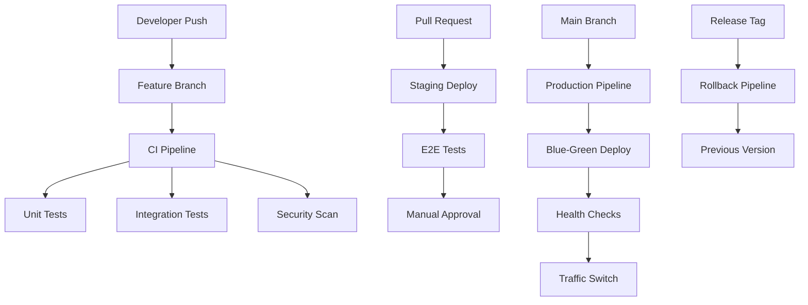

# Deployment Workflows Guide

This guide provides comprehensive multi-environment deployment workflows for the headless WordPress + Next.js application using GitHub Actions.

## Table of Contents

1. [Workflow Architecture](#workflow-architecture)
2. [Environment Strategy](#environment-strategy)
3. [Branch-Based Deployments](#branch-based-deployments)
4. [Build and Test Pipeline](#build-and-test-pipeline)
5. [Container Image Pipeline](#container-image-pipeline)
6. [Infrastructure Deployment](#infrastructure-deployment)
7. [Application Deployment](#application-deployment)
8. [Database Migrations](#database-migrations)
9. [Rollback Strategies](#rollback-strategies)
10. [Monitoring Integration](#monitoring-integration)

## Workflow Architecture

### Pipeline Overview



### Workflow Files Structure

```bash
.github/workflows/
├── ci.yml                    # Continuous Integration
├── deploy-staging.yml        # Staging Deployment
├── deploy-production.yml     # Production Deployment
├── infrastructure.yml        # Infrastructure as Code
├── security.yml             # Security Scanning
├── database.yml             # Database Operations
└── rollback.yml             # Rollback Operations
```

## Environment Strategy

### Environment Configuration

```yaml
# Environment matrix
Environments:
  development:
    branch: develop
    auto_deploy: true
    approval_required: false
    tests: unit, integration
    
  staging:
    branch: main
    auto_deploy: true
    approval_required: false
    tests: unit, integration, e2e
    
  production:
    branch: main
    auto_deploy: false
    approval_required: true
    tests: unit, integration, e2e, performance
    deployment_strategy: blue_green
```

### Environment Variables Management

```yaml
# .github/workflows/deploy-staging.yml
name: Deploy to Staging

on:
  push:
    branches: [main]
  pull_request:
    branches: [main]

env:
  REGISTRY: ${{ secrets.ACR_LOGIN_SERVER }}
  IMAGE_NAME_WORDPRESS: wordpress
  IMAGE_NAME_FRONTEND: frontend
  AZURE_RESOURCE_GROUP: rg-app-staging
  AZURE_WEBAPP_NAME: app-wordpress-staging
  NODE_VERSION: '18'
  PHP_VERSION: '8.1'

jobs:
  build-and-deploy:
    runs-on: ubuntu-latest
    environment: staging
    
    steps:
    - name: Checkout code
      uses: actions/checkout@v4
      
    - name: Azure Login
      uses: azure/login@v1
      with:
        creds: ${{ secrets.AZURE_CREDENTIALS_STAGING }}
        
    - name: Set up environment variables
      run: |
        echo "DATABASE_URL=${{ secrets.DATABASE_URL_STAGING }}" >> $GITHUB_ENV
        echo "REDIS_URL=${{ secrets.REDIS_URL_STAGING }}" >> $GITHUB_ENV
        echo "WORDPRESS_AUTH_KEY=${{ secrets.WORDPRESS_AUTH_KEY_STAGING }}" >> $GITHUB_ENV
```

## Branch-Based Deployments

### Feature Branch Pipeline

```yaml
# .github/workflows/feature-branch.yml
name: Feature Branch CI

on:
  push:
    branches-ignore:
      - main
      - develop
  pull_request:
    branches:
      - main
      - develop

jobs:
  test:
    runs-on: ubuntu-latest
    strategy:
      matrix:
        node-version: [16, 18, 20]
        php-version: [8.0, 8.1, 8.2]
        
    steps:
    - uses: actions/checkout@v4
    
    - name: Setup Node.js
      uses: actions/setup-node@v4
      with:
        node-version: ${{ matrix.node-version }}
        cache: 'npm'
        
    - name: Setup PHP
      uses: shivammathur/setup-php@v2
      with:
        php-version: ${{ matrix.php-version }}
        extensions: mysqli, pdo, pdo_mysql, opcache, redis
        
    - name: Install dependencies
      run: |
        cd frontend && npm ci
        cd ../wordpress && composer install --no-dev --optimize-autoloader
        
    - name: Run tests
      run: |
        cd frontend && npm run test:ci
        cd ../wordpress && ./vendor/bin/phpunit
        
    - name: Build application
      run: |
        cd frontend && npm run build
        
    - name: Security scan
      uses: securecodewarrior/github-action-add-sarif@v1
      with:
        sarif-file: 'security-scan.sarif'
```

### Development Environment Pipeline

```yaml
# .github/workflows/deploy-development.yml
name: Deploy to Development

on:
  push:
    branches: [develop]

env:
  AZURE_RESOURCE_GROUP: rg-app-dev
  ENVIRONMENT: development

jobs:
  deploy:
    runs-on: ubuntu-latest
    environment: development
    
    steps:
    - uses: actions/checkout@v4
    
    - name: Azure Login
      uses: azure/login@v1
      with:
        creds: ${{ secrets.AZURE_CREDENTIALS_DEV }}
        
    - name: Deploy infrastructure
      run: |
        az deployment group create \
          --resource-group ${{ env.AZURE_RESOURCE_GROUP }} \
          --template-file infrastructure/bicep/main.bicep \
          --parameters environment=dev \
          --parameters @infrastructure/parameters/dev.json
          
    - name: Build and push images
      run: |
        # Build WordPress image
        docker build -t ${{ secrets.ACR_LOGIN_SERVER }}/wordpress:dev-${{ github.sha }} \
          -f infrastructure/docker/wordpress/Dockerfile .
        
        # Build Frontend image
        docker build -t ${{ secrets.ACR_LOGIN_SERVER }}/frontend:dev-${{ github.sha }} \
          -f frontend/Dockerfile.dev frontend/
        
        # Push images
        echo ${{ secrets.ACR_PASSWORD }} | docker login ${{ secrets.ACR_LOGIN_SERVER }} -u ${{ secrets.ACR_USERNAME }} --password-stdin
        docker push ${{ secrets.ACR_LOGIN_SERVER }}/wordpress:dev-${{ github.sha }}
        docker push ${{ secrets.ACR_LOGIN_SERVER }}/frontend:dev-${{ github.sha }}
        
    - name: Deploy applications
      run: |
        # Update container apps
        az containerapp update \
          --name ca-wordpress-dev \
          --resource-group ${{ env.AZURE_RESOURCE_GROUP }} \
          --image ${{ secrets.ACR_LOGIN_SERVER }}/wordpress:dev-${{ github.sha }}
        
        # Update static web app
        az staticwebapp update \
          --name swa-frontend-dev \
          --resource-group ${{ env.AZURE_RESOURCE_GROUP }} \
          --source https://github.com/${{ github.repository }}
```

## Build and Test Pipeline

### Comprehensive CI Pipeline

```yaml
# .github/workflows/ci.yml
name: Continuous Integration

on:
  push:
    branches: [main, develop]
  pull_request:
    branches: [main, develop]

env:
  NODE_VERSION: '18'
  PHP_VERSION: '8.1'
  MYSQL_VERSION: '8.0'
  REDIS_VERSION: '7'

jobs:
  lint-and-format:
    runs-on: ubuntu-latest
    steps:
    - uses: actions/checkout@v4
    
    - name: Setup Node.js
      uses: actions/setup-node@v4
      with:
        node-version: ${{ env.NODE_VERSION }}
        cache: 'npm'
        
    - name: Install frontend dependencies
      run: cd frontend && npm ci
      
    - name: Lint frontend code
      run: cd frontend && npm run lint
      
    - name: Format check
      run: cd frontend && npm run format:check
      
    - name: Setup PHP
      uses: shivammathur/setup-php@v2
      with:
        php-version: ${{ env.PHP_VERSION }}
        
    - name: Install PHP dependencies
      run: cd wordpress && composer install
      
    - name: PHP Code Sniffer
      run: cd wordpress && ./vendor/bin/phpcs
      
  unit-tests:
    runs-on: ubuntu-latest
    needs: lint-and-format
    
    services:
      mysql:
        image: mysql:8.0
        env:
          MYSQL_ROOT_PASSWORD: root
          MYSQL_DATABASE: wordpress_test
        options: >-
          --health-cmd="mysqladmin ping"
          --health-interval=10s
          --health-timeout=5s
          --health-retries=3
        ports:
          - 3306:3306
          
      redis:
        image: redis:7-alpine
        options: >-
          --health-cmd="redis-cli ping"
          --health-interval=10s
          --health-timeout=5s
          --health-retries=3
        ports:
          - 6379:6379
    
    steps:
    - uses: actions/checkout@v4
    
    - name: Setup Node.js
      uses: actions/setup-node@v4
      with:
        node-version: ${{ env.NODE_VERSION }}
        cache: 'npm'
        
    - name: Setup PHP
      uses: shivammathur/setup-php@v2
      with:
        php-version: ${{ env.PHP_VERSION }}
        extensions: mysqli, pdo, pdo_mysql, redis
        
    - name: Install dependencies
      run: |
        cd frontend && npm ci
        cd ../wordpress && composer install
        
    - name: Run frontend tests
      run: |
        cd frontend
        npm run test:ci
        npm run test:coverage
        
    - name: Run WordPress tests
      run: |
        cd wordpress
        export WP_TESTS_DB_HOST=127.0.0.1
        export WP_TESTS_DB_NAME=wordpress_test
        export WP_TESTS_DB_USER=root
        export WP_TESTS_DB_PASSWORD=root
        ./vendor/bin/phpunit --coverage-clover coverage.xml
        
    - name: Upload coverage reports
      uses: codecov/codecov-action@v3
      with:
        files: ./frontend/coverage/lcov.info,./wordpress/coverage.xml
        
  integration-tests:
    runs-on: ubuntu-latest
    needs: unit-tests
    
    services:
      mysql:
        image: mysql:8.0
        env:
          MYSQL_ROOT_PASSWORD: root
          MYSQL_DATABASE: wordpress
        ports:
          - 3306:3306
          
      redis:
        image: redis:7-alpine
        ports:
          - 6379:6379
    
    steps:
    - uses: actions/checkout@v4
    
    - name: Build test environment
      run: |
        docker-compose -f docker-compose.test.yml up -d
        sleep 30  # Wait for services to be ready
        
    - name: Run integration tests
      run: |
        docker-compose -f docker-compose.test.yml exec -T wordpress \
          ./vendor/bin/phpunit --testsuite integration
        
        docker-compose -f docker-compose.test.yml exec -T frontend \
          npm run test:integration
        
    - name: Cleanup
      run: docker-compose -f docker-compose.test.yml down
      
  security-scan:
    runs-on: ubuntu-latest
    needs: lint-and-format
    
    steps:
    - uses: actions/checkout@v4
    
    - name: Run Trivy vulnerability scanner
      uses: aquasecurity/trivy-action@master
      with:
        scan-type: 'fs'
        scan-ref: '.'
        format: 'sarif'
        output: 'trivy-results.sarif'
        
    - name: Upload Trivy scan results
      uses: github/codeql-action/upload-sarif@v2
      with:
        sarif_file: 'trivy-results.sarif'
        
    - name: OWASP Dependency Check
      uses: dependency-check/Dependency-Check_Action@main
      with:
        project: 'WordPress-NextJS'
        path: '.'
        format: 'ALL'
        
    - name: Upload dependency check results
      uses: actions/upload-artifact@v3
      with:
        name: dependency-check-report
        path: reports/
```

## Container Image Pipeline

### Multi-Stage Docker Build

```yaml
# .github/workflows/build-images.yml
name: Build and Push Container Images

on:
  push:
    branches: [main, develop]
    tags: ['v*']

env:
  REGISTRY: ${{ secrets.ACR_LOGIN_SERVER }}
  
jobs:
  build-wordpress:
    runs-on: ubuntu-latest
    outputs:
      image-tag: ${{ steps.meta.outputs.tags }}
      image-digest: ${{ steps.build.outputs.digest }}
      
    steps:
    - name: Checkout
      uses: actions/checkout@v4
      
    - name: Set up Docker Buildx
      uses: docker/setup-buildx-action@v3
      
    - name: Login to Azure Container Registry
      uses: docker/login-action@v3
      with:
        registry: ${{ env.REGISTRY }}
        username: ${{ secrets.ACR_USERNAME }}
        password: ${{ secrets.ACR_PASSWORD }}
        
    - name: Extract metadata
      id: meta
      uses: docker/metadata-action@v5
      with:
        images: ${{ env.REGISTRY }}/wordpress
        tags: |
          type=ref,event=branch
          type=ref,event=pr
          type=semver,pattern={{version}}
          type=semver,pattern={{major}}.{{minor}}
          type=sha,prefix={{branch}}-
          
    - name: Build and push WordPress image
      id: build
      uses: docker/build-push-action@v5
      with:
        context: .
        file: infrastructure/docker/wordpress/Dockerfile
        push: true
        tags: ${{ steps.meta.outputs.tags }}
        labels: ${{ steps.meta.outputs.labels }}
        cache-from: type=gha
        cache-to: type=gha,mode=max
        platforms: linux/amd64,linux/arm64
        
    - name: Sign container image
      run: |
        cosign sign --yes ${{ env.REGISTRY }}/wordpress@${{ steps.build.outputs.digest }}
      env:
        COSIGN_PRIVATE_KEY: ${{ secrets.COSIGN_PRIVATE_KEY }}
        COSIGN_PASSWORD: ${{ secrets.COSIGN_PASSWORD }}
        
  build-frontend:
    runs-on: ubuntu-latest
    outputs:
      image-tag: ${{ steps.meta.outputs.tags }}
      image-digest: ${{ steps.build.outputs.digest }}
      
    steps:
    - name: Checkout
      uses: actions/checkout@v4
      
    - name: Set up Docker Buildx
      uses: docker/setup-buildx-action@v3
      
    - name: Login to Azure Container Registry
      uses: docker/login-action@v3
      with:
        registry: ${{ env.REGISTRY }}
        username: ${{ secrets.ACR_USERNAME }}
        password: ${{ secrets.ACR_PASSWORD }}
        
    - name: Extract metadata
      id: meta
      uses: docker/metadata-action@v5
      with:
        images: ${{ env.REGISTRY }}/frontend
        tags: |
          type=ref,event=branch
          type=ref,event=pr
          type=semver,pattern={{version}}
          type=semver,pattern={{major}}.{{minor}}
          type=sha,prefix={{branch}}-
          
    - name: Build and push Frontend image
      id: build
      uses: docker/build-push-action@v5
      with:
        context: frontend/
        file: frontend/Dockerfile
        push: true
        tags: ${{ steps.meta.outputs.tags }}
        labels: ${{ steps.meta.outputs.labels }}
        cache-from: type=gha
        cache-to: type=gha,mode=max
        platforms: linux/amd64,linux/arm64
        
  security-scan:
    runs-on: ubuntu-latest
    needs: [build-wordpress, build-frontend]
    
    strategy:
      matrix:
        image: [wordpress, frontend]
        
    steps:
    - name: Run Trivy vulnerability scanner
      uses: aquasecurity/trivy-action@master
      with:
        image-ref: ${{ env.REGISTRY }}/${{ matrix.image }}@${{ needs[format('build-{0}', matrix.image)].outputs.image-digest }}
        format: 'sarif'
        output: 'trivy-${{ matrix.image }}.sarif'
        
    - name: Upload Trivy scan results
      uses: github/codeql-action/upload-sarif@v2
      with:
        sarif_file: 'trivy-${{ matrix.image }}.sarif'
```

## Infrastructure Deployment

### Infrastructure Pipeline

```yaml
# .github/workflows/infrastructure.yml
name: Deploy Infrastructure

on:
  push:
    paths:
      - 'infrastructure/**'
    branches: [main]
  pull_request:
    paths:
      - 'infrastructure/**'
    branches: [main]
  workflow_dispatch:
    inputs:
      environment:
        description: 'Environment to deploy'
        required: true
        default: 'staging'
        type: choice
        options:
        - staging
        - production

jobs:
  validate:
    runs-on: ubuntu-latest
    steps:
    - uses: actions/checkout@v4
    
    - name: Azure Login
      uses: azure/login@v1
      with:
        creds: ${{ secrets.AZURE_CREDENTIALS }}
        
    - name: Validate Bicep templates
      run: |
        az bicep build --file infrastructure/bicep/main.bicep
        
    - name: Validate Terraform configuration
      uses: hashicorp/setup-terraform@v2
      with:
        terraform_version: 1.5.0
        
    - name: Terraform Format
      run: terraform fmt -check -recursive infrastructure/terraform/
      
    - name: Terraform Validate
      run: |
        cd infrastructure/terraform
        terraform init -backend=false
        terraform validate
        
  plan:
    runs-on: ubuntu-latest
    needs: validate
    if: github.event_name == 'pull_request'
    
    steps:
    - uses: actions/checkout@v4
    
    - name: Azure Login
      uses: azure/login@v1
      with:
        creds: ${{ secrets.AZURE_CREDENTIALS }}
        
    - name: Bicep What-If
      run: |
        az deployment group what-if \
          --resource-group rg-app-staging \
          --template-file infrastructure/bicep/main.bicep \
          --parameters environment=staging \
          --parameters @infrastructure/parameters/staging.json
          
    - name: Terraform Plan
      run: |
        cd infrastructure/terraform
        terraform init
        terraform plan -var-file="staging.tfvars" -out=tfplan
        
    - name: Upload Terraform Plan
      uses: actions/upload-artifact@v3
      with:
        name: terraform-plan
        path: infrastructure/terraform/tfplan
        
  deploy:
    runs-on: ubuntu-latest
    needs: validate
    if: github.ref == 'refs/heads/main' && github.event_name == 'push'
    environment: ${{ github.event.inputs.environment || 'staging' }}
    
    steps:
    - uses: actions/checkout@v4
    
    - name: Azure Login
      uses: azure/login@v1
      with:
        creds: ${{ secrets.AZURE_CREDENTIALS }}
        
    - name: Deploy with Bicep
      run: |
        ENVIRONMENT=${{ github.event.inputs.environment || 'staging' }}
        
        az deployment group create \
          --resource-group rg-app-$ENVIRONMENT \
          --template-file infrastructure/bicep/main.bicep \
          --parameters environment=$ENVIRONMENT \
          --parameters @infrastructure/parameters/$ENVIRONMENT.json \
          --mode Incremental
          
    - name: Deploy with Terraform
      run: |
        cd infrastructure/terraform
        ENVIRONMENT=${{ github.event.inputs.environment || 'staging' }}
        
        terraform init
        terraform apply -var-file="$ENVIRONMENT.tfvars" -auto-approve
        
    - name: Output infrastructure details
      run: |
        az deployment group show \
          --resource-group rg-app-${{ github.event.inputs.environment || 'staging' }} \
          --name main \
          --query properties.outputs
```

## Application Deployment

### Production Deployment with Blue-Green Strategy

```yaml
# .github/workflows/deploy-production.yml
name: Deploy to Production

on:
  release:
    types: [published]
  workflow_dispatch:
    inputs:
      version:
        description: 'Version to deploy'
        required: true
        default: 'latest'

env:
  AZURE_RESOURCE_GROUP: rg-app-prod
  ENVIRONMENT: production

jobs:
  pre-deployment:
    runs-on: ubuntu-latest
    outputs:
      current-slot: ${{ steps.current.outputs.slot }}
      target-slot: ${{ steps.target.outputs.slot }}
      
    steps:
    - name: Azure Login
      uses: azure/login@v1
      with:
        creds: ${{ secrets.AZURE_CREDENTIALS_PROD }}
        
    - name: Get current active slot
      id: current
      run: |
        ACTIVE_SLOT=$(az webapp show \
          --name app-wordpress-prod \
          --resource-group ${{ env.AZURE_RESOURCE_GROUP }} \
          --query "hostNames[0]" -o tsv | grep -o 'blue\|green' || echo 'blue')
        echo "slot=$ACTIVE_SLOT" >> $GITHUB_OUTPUT
        
    - name: Determine target slot
      id: target
      run: |
        if [ "${{ steps.current.outputs.slot }}" == "blue" ]; then
          echo "slot=green" >> $GITHUB_OUTPUT
        else
          echo "slot=blue" >> $GITHUB_OUTPUT
        fi
        
  deploy-wordpress:
    runs-on: ubuntu-latest
    needs: pre-deployment
    environment: production
    
    steps:
    - uses: actions/checkout@v4
    
    - name: Azure Login
      uses: azure/login@v1
      with:
        creds: ${{ secrets.AZURE_CREDENTIALS_PROD }}
        
    - name: Deploy to staging slot
      run: |
        TARGET_SLOT=${{ needs.pre-deployment.outputs.target-slot }}
        VERSION=${{ github.event.inputs.version || github.event.release.tag_name }}
        
        # Update container app with new image
        az containerapp update \
          --name ca-wordpress-prod-$TARGET_SLOT \
          --resource-group ${{ env.AZURE_RESOURCE_GROUP }} \
          --image ${{ secrets.ACR_LOGIN_SERVER }}/wordpress:$VERSION
          
    - name: Wait for deployment
      run: |
        TARGET_SLOT=${{ needs.pre-deployment.outputs.target-slot }}
        
        # Wait for container app to be ready
        az containerapp revision list \
          --name ca-wordpress-prod-$TARGET_SLOT \
          --resource-group ${{ env.AZURE_RESOURCE_GROUP }} \
          --query "[0].properties.runningState" -o tsv
          
        # Wait for health check
        for i in {1..30}; do
          STATUS=$(curl -s -o /dev/null -w "%{http_code}" https://wordpress-$TARGET_SLOT.example.com/health)
          if [ $STATUS -eq 200 ]; then
            echo "Health check passed"
            break
          fi
          echo "Waiting for health check... ($i/30)"
          sleep 30
        done
        
  deploy-frontend:
    runs-on: ubuntu-latest
    needs: [pre-deployment, deploy-wordpress]
    
    steps:
    - uses: actions/checkout@v4
    
    - name: Setup Node.js
      uses: actions/setup-node@v4
      with:
        node-version: '18'
        cache: 'npm'
        
    - name: Build frontend
      run: |
        cd frontend
        npm ci
        
        # Set environment variables for production build
        export NEXT_PUBLIC_WORDPRESS_URL=https://wordpress-${{ needs.pre-deployment.outputs.target-slot }}.example.com
        export NEXT_PUBLIC_ENVIRONMENT=production
        
        npm run build
        
    - name: Deploy to Azure Static Web Apps
      uses: Azure/static-web-apps-deploy@v1
      with:
        azure_static_web_apps_api_token: ${{ secrets.AZURE_STATIC_WEB_APPS_API_TOKEN }}
        repo_token: ${{ secrets.GITHUB_TOKEN }}
        action: "upload"
        app_location: "frontend"
        api_location: ""
        output_location: "out"
        
  smoke-tests:
    runs-on: ubuntu-latest
    needs: [pre-deployment, deploy-wordpress, deploy-frontend]
    
    steps:
    - uses: actions/checkout@v4
    
    - name: Run smoke tests
      run: |
        TARGET_SLOT=${{ needs.pre-deployment.outputs.target-slot }}
        
        # Test WordPress API
        curl -f "https://wordpress-$TARGET_SLOT.example.com/graphql" \
          -H "Content-Type: application/json" \
          -d '{"query":"{ posts { nodes { title } } }"}'
          
        # Test frontend
        curl -f "https://frontend-$TARGET_SLOT.example.com/"
        
        # Test database connectivity
        curl -f "https://wordpress-$TARGET_SLOT.example.com/wp-admin/admin-ajax.php?action=heartbeat"
        
  traffic-switch:
    runs-on: ubuntu-latest
    needs: [pre-deployment, smoke-tests]
    environment: production-approval
    
    steps:
    - name: Azure Login
      uses: azure/login@v1
      with:
        creds: ${{ secrets.AZURE_CREDENTIALS_PROD }}
        
    - name: Switch traffic to new slot
      run: |
        TARGET_SLOT=${{ needs.pre-deployment.outputs.target-slot }}
        
        # Update Application Gateway backend pool
        az network application-gateway address-pool update \
          --gateway-name ag-wordpress-prod \
          --resource-group ${{ env.AZURE_RESOURCE_GROUP }} \
          --name pool-wordpress \
          --servers wordpress-$TARGET_SLOT.eastus.azurecontainer.io
          
        # Update DNS records
        az network dns record-set cname set-record \
          --resource-group rg-dns-prod \
          --zone-name example.com \
          --record-set-name api \
          --cname wordpress-$TARGET_SLOT.example.com
          
    - name: Validate traffic switch
      run: |
        # Wait for DNS propagation
        sleep 60
        
        # Validate that traffic is going to new slot
        for i in {1..10}; do
          RESPONSE=$(curl -s https://api.example.com/health)
          echo "Health check $i: $RESPONSE"
          sleep 5
        done
        
  cleanup:
    runs-on: ubuntu-latest
    needs: [pre-deployment, traffic-switch]
    if: always()
    
    steps:
    - name: Azure Login
      uses: azure/login@v1
      with:
        creds: ${{ secrets.AZURE_CREDENTIALS_PROD }}
        
    - name: Scale down old slot
      run: |
        OLD_SLOT=${{ needs.pre-deployment.outputs.current-slot }}
        
        # Scale down old container app
        az containerapp update \
          --name ca-wordpress-prod-$OLD_SLOT \
          --resource-group ${{ env.AZURE_RESOURCE_GROUP }} \
          --min-replicas 0 \
          --max-replicas 1
```

## Database Migrations

### Database Migration Pipeline

```yaml
# .github/workflows/database.yml
name: Database Operations

on:
  push:
    paths:
      - 'database/migrations/**'
    branches: [main]
  workflow_dispatch:
    inputs:
      operation:
        description: 'Database operation'
        required: true
        type: choice
        options:
        - migrate
        - rollback
        - backup
        - restore
      environment:
        description: 'Target environment'
        required: true
        type: choice
        options:
        - staging
        - production

jobs:
  database-migration:
    runs-on: ubuntu-latest
    environment: ${{ github.event.inputs.environment || 'staging' }}
    
    steps:
    - uses: actions/checkout@v4
    
    - name: Azure Login
      uses: azure/login@v1
      with:
        creds: ${{ secrets.AZURE_CREDENTIALS }}
        
    - name: Setup MySQL Client
      run: |
        sudo apt-get update
        sudo apt-get install -y mysql-client
        
    - name: Create database backup
      run: |
        ENVIRONMENT=${{ github.event.inputs.environment || 'staging' }}
        TIMESTAMP=$(date +%Y%m%d_%H%M%S)
        
        # Create backup before migration
        mysqldump \
          --host mysql-wordpress-$ENVIRONMENT.mysql.database.azure.com \
          --user ${{ secrets.DB_USERNAME }} \
          --password=${{ secrets.DB_PASSWORD }} \
          --single-transaction \
          --routines \
          --triggers \
          wordpress > backup_$TIMESTAMP.sql
          
        # Upload backup to Azure Storage
        az storage blob upload \
          --account-name ${{ secrets.STORAGE_ACCOUNT_NAME }} \
          --account-key ${{ secrets.STORAGE_ACCOUNT_KEY }} \
          --container-name database-backups \
          --name $ENVIRONMENT/backup_$TIMESTAMP.sql \
          --file backup_$TIMESTAMP.sql
          
    - name: Run database migrations
      if: github.event.inputs.operation == 'migrate' || github.event_name == 'push'
      run: |
        ENVIRONMENT=${{ github.event.inputs.environment || 'staging' }}
        
        # Run WordPress database updates
        docker run --rm \
          -e WORDPRESS_DB_HOST=mysql-wordpress-$ENVIRONMENT.mysql.database.azure.com \
          -e WORDPRESS_DB_USER=${{ secrets.DB_USERNAME }} \
          -e WORDPRESS_DB_PASSWORD=${{ secrets.DB_PASSWORD }} \
          -e WORDPRESS_DB_NAME=wordpress \
          -v $(pwd)/database/migrations:/migrations \
          wordpress:cli \
          wp core update-db --allow-root
          
        # Run custom migrations
        for migration in database/migrations/*.sql; do
          if [ -f "$migration" ]; then
            echo "Running migration: $migration"
            mysql \
              --host mysql-wordpress-$ENVIRONMENT.mysql.database.azure.com \
              --user ${{ secrets.DB_USERNAME }} \
              --password=${{ secrets.DB_PASSWORD }} \
              wordpress < "$migration"
          fi
        done
        
    - name: Validate migration
      run: |
        ENVIRONMENT=${{ github.event.inputs.environment || 'staging' }}
        
        # Check database integrity
        mysql \
          --host mysql-wordpress-$ENVIRONMENT.mysql.database.azure.com \
          --user ${{ secrets.DB_USERNAME }} \
          --password=${{ secrets.DB_PASSWORD }} \
          --execute="CHECK TABLE wp_posts, wp_options, wp_users;" \
          wordpress
          
        # Test WordPress functionality
        curl -f "https://wordpress-$ENVIRONMENT.example.com/wp-admin/admin-ajax.php?action=heartbeat"
```

## Rollback Strategies

### Automated Rollback Pipeline

```yaml
# .github/workflows/rollback.yml
name: Rollback Deployment

on:
  workflow_dispatch:
    inputs:
      environment:
        description: 'Environment to rollback'
        required: true
        type: choice
        options:
        - staging
        - production
      rollback_type:
        description: 'Rollback type'
        required: true
        type: choice
        options:
        - application
        - database
        - full
      target_version:
        description: 'Target version to rollback to'
        required: false
        default: 'previous'

jobs:
  rollback:
    runs-on: ubuntu-latest
    environment: ${{ github.event.inputs.environment }}-rollback
    
    steps:
    - uses: actions/checkout@v4
    
    - name: Azure Login
      uses: azure/login@v1
      with:
        creds: ${{ secrets.AZURE_CREDENTIALS }}
        
    - name: Get rollback target
      id: target
      run: |
        ENVIRONMENT=${{ github.event.inputs.environment }}
        
        if [ "${{ github.event.inputs.target_version }}" == "previous" ]; then
          # Get previous successful deployment
          PREVIOUS_VERSION=$(az containerapp revision list \
            --name ca-wordpress-$ENVIRONMENT \
            --resource-group rg-app-$ENVIRONMENT \
            --query "[1].name" -o tsv)
        else
          PREVIOUS_VERSION=${{ github.event.inputs.target_version }}
        fi
        
        echo "version=$PREVIOUS_VERSION" >> $GITHUB_OUTPUT
        
    - name: Application rollback
      if: github.event.inputs.rollback_type == 'application' || github.event.inputs.rollback_type == 'full'
      run: |
        ENVIRONMENT=${{ github.event.inputs.environment }}
        TARGET_VERSION=${{ steps.target.outputs.version }}
        
        # Rollback WordPress container
        az containerapp update \
          --name ca-wordpress-$ENVIRONMENT \
          --resource-group rg-app-$ENVIRONMENT \
          --revision $TARGET_VERSION
          
        # Wait for rollback to complete
        az containerapp revision show \
          --name ca-wordpress-$ENVIRONMENT \
          --resource-group rg-app-$ENVIRONMENT \
          --revision $TARGET_VERSION \
          --query "properties.runningState" -o tsv
          
    - name: Database rollback
      if: github.event.inputs.rollback_type == 'database' || github.event.inputs.rollback_type == 'full'
      run: |
        ENVIRONMENT=${{ github.event.inputs.environment }}
        
        # Get latest backup before current deployment
        BACKUP_FILE=$(az storage blob list \
          --account-name ${{ secrets.STORAGE_ACCOUNT_NAME }} \
          --account-key ${{ secrets.STORAGE_ACCOUNT_KEY }} \
          --container-name database-backups \
          --prefix $ENVIRONMENT/ \
          --query "[0].name" -o tsv)
          
        # Download backup
        az storage blob download \
          --account-name ${{ secrets.STORAGE_ACCOUNT_NAME }} \
          --account-key ${{ secrets.STORAGE_ACCOUNT_KEY }} \
          --container-name database-backups \
          --name $BACKUP_FILE \
          --file rollback_backup.sql
          
        # Restore database
        mysql \
          --host mysql-wordpress-$ENVIRONMENT.mysql.database.azure.com \
          --user ${{ secrets.DB_USERNAME }} \
          --password=${{ secrets.DB_PASSWORD }} \
          wordpress < rollback_backup.sql
          
    - name: Validate rollback
      run: |
        ENVIRONMENT=${{ github.event.inputs.environment }}
        
        # Health check
        for i in {1..10}; do
          STATUS=$(curl -s -o /dev/null -w "%{http_code}" https://wordpress-$ENVIRONMENT.example.com/health)
          if [ $STATUS -eq 200 ]; then
            echo "Rollback validation successful"
            break
          fi
          echo "Waiting for rollback validation... ($i/10)"
          sleep 30
        done
        
    - name: Notify rollback completion
      uses: 8398a7/action-slack@v3
      with:
        status: custom
        custom_payload: |
          {
            text: "Rollback completed for ${{ github.event.inputs.environment }} environment",
            attachments: [{
              color: 'warning',
              fields: [{
                title: 'Environment',
                value: '${{ github.event.inputs.environment }}',
                short: true
              }, {
                title: 'Rollback Type',
                value: '${{ github.event.inputs.rollback_type }}',
                short: true
              }, {
                title: 'Target Version',
                value: '${{ steps.target.outputs.version }}',
                short: true
              }]
            }]
          }
      env:
        SLACK_WEBHOOK_URL: ${{ secrets.SLACK_WEBHOOK_URL }}
```

## Monitoring Integration

### Deployment Monitoring

```yaml
# Monitoring integration in deployment workflows
    - name: Create deployment event
      run: |
        ENVIRONMENT=${{ github.event.inputs.environment || 'staging' }}
        
        # Create Application Insights deployment annotation
        az rest \
          --method POST \
          --uri "https://api.applicationinsights.io/v1/apps/${{ secrets.APP_INSIGHTS_APP_ID }}/events" \
          --headers "X-API-Key=${{ secrets.APP_INSIGHTS_API_KEY }}" \
          --body '{
            "name": "Deployment",
            "timestamp": "'$(date -u +%Y-%m-%dT%H:%M:%SZ)'",
            "properties": {
              "Environment": "'$ENVIRONMENT'",
              "Version": "'${{ github.sha }}'",
              "DeployedBy": "'${{ github.actor }}'",
              "Repository": "'${{ github.repository }}'"
            }
          }'
          
    - name: Update deployment status
      uses: deployments/actions@v1
      with:
        token: ${{ github.token }}
        target_url: https://${{ github.event.inputs.environment || 'staging' }}.example.com
        environment: ${{ github.event.inputs.environment || 'staging' }}
        description: 'Deployment completed successfully'
        state: success
```

## Best Practices

1. **Environment Isolation**: Separate workflows and secrets for each environment
2. **Approval Gates**: Require manual approval for production deployments
3. **Gradual Rollouts**: Use blue-green or canary deployment strategies
4. **Automated Testing**: Comprehensive test coverage at each stage
5. **Rollback Readiness**: Always have a rollback plan and test it regularly
6. **Monitoring Integration**: Include deployment events in monitoring systems
7. **Secret Management**: Use Azure Key Vault and GitHub Secrets securely
8. **Audit Trail**: Maintain logs and notifications for all deployments

## Next Steps

1. Set up [pipeline troubleshooting](pipeline-troubleshooting.md) procedures
2. Configure [secret management](secret-management.md) with Azure Key Vault
3. Implement [automated testing](automated-testing.md) strategies
4. Set up [monitoring integration](../monitoring/azure-monitor-setup.md)
