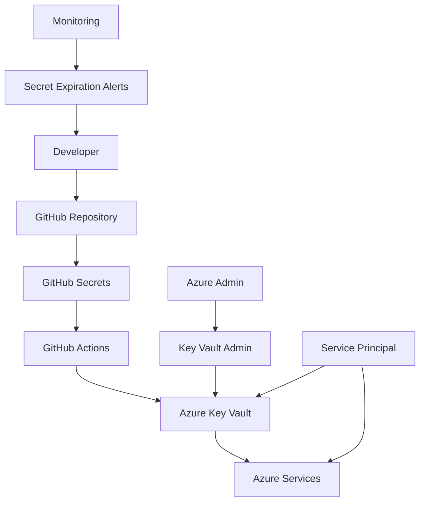

# Secret Management Guide

This guide provides comprehensive instructions for managing secrets, API keys, and sensitive configuration data using Azure Key Vault and GitHub Secrets for the headless WordPress + Next.js application.

## Table of Contents

1. [Secret Management Strategy](#secret-management-strategy)
2. [Azure Key Vault Setup](#azure-key-vault-setup)
3. [GitHub Secrets Configuration](#github-secrets-configuration)
4. [Service Principal Management](#service-principal-management)
5. [Database Secrets](#database-secrets)
6. [API Keys and Tokens](#api-keys-and-tokens)
7. [SSL Certificate Management](#ssl-certificate-management)
8. [Environment-Specific Secrets](#environment-specific-secrets)
9. [Secret Rotation](#secret-rotation)
10. [Security Best Practices](#security-best-practices)

## Secret Management Strategy

### Architecture Overview



### Secret Categories

```yaml
Secret_Types:
  Infrastructure:
    - Azure Service Principal credentials
    - Resource group access tokens
    - Container registry passwords
    
  Application:
    - Database connection strings
    - Redis connection strings
    - WordPress authentication keys
    - API keys and tokens
    
  Security:
    - SSL certificate private keys
    - Encryption keys
    - JWT signing secrets
    
  Third_Party:
    - GitHub tokens
    - Monitoring service keys
    - Email service credentials
```

## Azure Key Vault Setup

### Create Key Vault Infrastructure

```bash
# Create resource group for Key Vault
az group create \
  --name rg-keyvault-prod \
  --location eastus

# Create Key Vault with advanced security features
az keyvault create \
  --name kv-wordpress-prod-$(date +%s | tail -c 4) \
  --resource-group rg-keyvault-prod \
  --location eastus \
  --sku Premium \
  --enable-soft-delete true \
  --soft-delete-retention-days 90 \
  --enable-purge-protection true \
  --enable-rbac-authorization false \
  --network-acls-default-action Deny

# Configure network access
az keyvault network-rule add \
  --name kv-wordpress-prod \
  --resource-group rg-keyvault-prod \
  --ip-address <YOUR_IP_ADDRESS>

# Allow Azure services
az keyvault update \
  --name kv-wordpress-prod \
  --resource-group rg-keyvault-prod \
  --bypass AzureServices
```

### Configure Access Policies

```bash
# Get your user object ID
USER_OBJECT_ID=$(az ad signed-in-user show --query id -o tsv)

# Set access policy for admin user
az keyvault set-policy \
  --name kv-wordpress-prod \
  --resource-group rg-keyvault-prod \
  --object-id $USER_OBJECT_ID \
  --secret-permissions all \
  --certificate-permissions all \
  --key-permissions all

# Create service principal for CI/CD
SP_INFO=$(az ad sp create-for-rbac \
  --name sp-keyvault-cicd-prod \
  --role "Key Vault Secrets Officer" \
  --scopes "/subscriptions/$SUBSCRIPTION_ID/resourceGroups/rg-keyvault-prod/providers/Microsoft.KeyVault/vaults/kv-wordpress-prod")

echo $SP_INFO | jq .

# Set access policy for service principal
SP_OBJECT_ID=$(echo $SP_INFO | jq -r '."appId"' | xargs az ad sp show --id --query id -o tsv)
az keyvault set-policy \
  --name kv-wordpress-prod \
  --resource-group rg-keyvault-prod \
  --object-id $SP_OBJECT_ID \
  --secret-permissions get list \
  --certificate-permissions get list
```

### Store Core Secrets

```bash
# Generate and store WordPress authentication keys
WP_AUTH_KEY=$(openssl rand -base64 64)
WP_SECURE_AUTH_KEY=$(openssl rand -base64 64)
WP_LOGGED_IN_KEY=$(openssl rand -base64 64)
WP_NONCE_KEY=$(openssl rand -base64 64)
WP_AUTH_SALT=$(openssl rand -base64 64)
WP_SECURE_AUTH_SALT=$(openssl rand -base64 64)
WP_LOGGED_IN_SALT=$(openssl rand -base64 64)
WP_NONCE_SALT=$(openssl rand -base64 64)

# Store WordPress secrets
az keyvault secret set \
  --vault-name kv-wordpress-prod \
  --name "wordpress-auth-key" \
  --value "$WP_AUTH_KEY"

az keyvault secret set \
  --vault-name kv-wordpress-prod \
  --name "wordpress-secure-auth-key" \
  --value "$WP_SECURE_AUTH_KEY"

# Store database connection secrets
az keyvault secret set \
  --vault-name kv-wordpress-prod \
  --name "database-connection-string" \
  --value "Server=mysql-wordpress-prod.mysql.database.azure.com;Database=wordpress;Uid=dbadmin@mysql-wordpress-prod;Pwd=<SECURE_PASSWORD>;SslMode=Required;"

az keyvault secret set \
  --vault-name kv-wordpress-prod \
  --name "database-password" \
  --value "<SECURE_DATABASE_PASSWORD>"

# Store Redis connection secrets
az keyvault secret set \
  --vault-name kv-wordpress-prod \
  --name "redis-connection-string" \
  --value "redis-wordpress-prod.redis.cache.windows.net:6380,password=<REDIS_KEY>,ssl=True,abortConnect=False"

az keyvault secret set \
  --vault-name kv-wordpress-prod \
  --name "redis-password" \
  --value "<REDIS_PRIMARY_KEY>"
```

## GitHub Secrets Configuration

### Repository Secrets Setup

```bash
# Set up GitHub CLI and authenticate
gh auth login

# Set repository secrets for Azure authentication
gh secret set AZURE_CREDENTIALS \
  --body '{
    "clientId": "'$CLIENT_ID'",
    "clientSecret": "'$CLIENT_SECRET'",
    "subscriptionId": "'$SUBSCRIPTION_ID'",
    "tenantId": "'$TENANT_ID'"
  }'

# Set Key Vault information
gh secret set AZURE_KEY_VAULT_NAME --body "kv-wordpress-prod"
gh secret set AZURE_KEY_VAULT_URI --body "https://kv-wordpress-prod.vault.azure.net/"

# Set container registry secrets
gh secret set ACR_LOGIN_SERVER --body "acrwordpressprod.azurecr.io"
gh secret set ACR_USERNAME --body "acrwordpressprod"
gh secret set ACR_PASSWORD --body "<ACR_ADMIN_PASSWORD>"

# Set environment-specific secrets
gh secret set DATABASE_URL_PROD --body "@Microsoft.KeyVault(VaultName=kv-wordpress-prod;SecretName=database-connection-string)"
gh secret set REDIS_URL_PROD --body "@Microsoft.KeyVault(VaultName=kv-wordpress-prod;SecretName=redis-connection-string)"
```

### Environment Secrets

```bash
# Create environment-specific secret groups
gh api repos/:owner/:repo/environments/production --method PUT
gh api repos/:owner/:repo/environments/staging --method PUT
gh api repos/:owner/:repo/environments/development --method PUT

# Set production environment secrets
gh secret set DATABASE_HOST --env production --body "mysql-wordpress-prod.mysql.database.azure.com"
gh secret set DATABASE_NAME --env production --body "wordpress"
gh secret set DATABASE_USER --env production --body "dbadmin"

# Set staging environment secrets
gh secret set DATABASE_HOST --env staging --body "mysql-wordpress-staging.mysql.database.azure.com"
gh secret set DATABASE_NAME --env staging --body "wordpress"
gh secret set DATABASE_USER --env staging --body "dbadmin"

# Set development environment secrets
gh secret set DATABASE_HOST --env development --body "mysql-wordpress-dev.mysql.database.azure.com"
gh secret set DATABASE_NAME --env development --body "wordpress"
gh secret set DATABASE_USER --env development --body "dbadmin"
```

## Service Principal Management

### Create Environment-Specific Service Principals

```bash
# Production service principal
PROD_SP=$(az ad sp create-for-rbac \
  --name sp-wordpress-prod \
  --role Contributor \
  --scopes "/subscriptions/$SUBSCRIPTION_ID/resourceGroups/rg-app-prod")

echo "Production Service Principal:"
echo $PROD_SP | jq .

# Staging service principal
STAGING_SP=$(az ad sp create-for-rbac \
  --name sp-wordpress-staging \
  --role Contributor \
  --scopes "/subscriptions/$SUBSCRIPTION_ID/resourceGroups/rg-app-staging")

echo "Staging Service Principal:"
echo $STAGING_SP | jq .

# Development service principal
DEV_SP=$(az ad sp create-for-rbac \
  --name sp-wordpress-dev \
  --role Contributor \
  --scopes "/subscriptions/$SUBSCRIPTION_ID/resourceGroups/rg-app-dev")

echo "Development Service Principal:"
echo $DEV_SP | jq .
```

### Service Principal Permissions

```bash
# Grant additional permissions for each service principal

# Production permissions
PROD_SP_ID=$(echo $PROD_SP | jq -r '.appId')
az role assignment create \
  --assignee $PROD_SP_ID \
  --role "AcrPush" \
  --scope "/subscriptions/$SUBSCRIPTION_ID/resourceGroups/rg-acr-prod"

az role assignment create \
  --assignee $PROD_SP_ID \
  --role "Key Vault Secrets User" \
  --scope "/subscriptions/$SUBSCRIPTION_ID/resourceGroups/rg-keyvault-prod"

# Staging permissions
STAGING_SP_ID=$(echo $STAGING_SP | jq -r '.appId')
az role assignment create \
  --assignee $STAGING_SP_ID \
  --role "AcrPush" \
  --scope "/subscriptions/$SUBSCRIPTION_ID/resourceGroups/rg-acr-staging"

az role assignment create \
  --assignee $STAGING_SP_ID \
  --role "Key Vault Secrets User" \
  --scope "/subscriptions/$SUBSCRIPTION_ID/resourceGroups/rg-keyvault-staging"
```

### Store Service Principal Credentials

```bash
# Store service principal credentials in GitHub secrets
gh secret set AZURE_CREDENTIALS_PROD --body "$PROD_SP"
gh secret set AZURE_CREDENTIALS_STAGING --body "$STAGING_SP"
gh secret set AZURE_CREDENTIALS_DEV --body "$DEV_SP"

# Also store in Key Vault for cross-reference
az keyvault secret set \
  --vault-name kv-wordpress-prod \
  --name "service-principal-prod" \
  --value "$PROD_SP"
```

## Database Secrets

### Generate Secure Database Passwords

```bash
# Generate secure passwords for different environments
PROD_DB_PASSWORD=$(openssl rand -base64 32)
STAGING_DB_PASSWORD=$(openssl rand -base64 32)
DEV_DB_PASSWORD=$(openssl rand -base64 32)

# Store in Key Vault
az keyvault secret set \
  --vault-name kv-wordpress-prod \
  --name "database-password-prod" \
  --value "$PROD_DB_PASSWORD"

az keyvault secret set \
  --vault-name kv-wordpress-staging \
  --name "database-password-staging" \
  --value "$STAGING_DB_PASSWORD"

az keyvault secret set \
  --vault-name kv-wordpress-dev \
  --name "database-password-dev" \
  --value "$DEV_DB_PASSWORD"

# Store in GitHub as environment secrets
gh secret set DB_PASSWORD --env production --body "$PROD_DB_PASSWORD"
gh secret set DB_PASSWORD --env staging --body "$STAGING_DB_PASSWORD"
gh secret set DB_PASSWORD --env development --body "$DEV_DB_PASSWORD"
```

### Database Connection String Templates

```bash
# Create connection string templates
PROD_CONNECTION_STRING="Server=mysql-wordpress-prod.mysql.database.azure.com;Database=wordpress;Uid=dbadmin;Pwd=$PROD_DB_PASSWORD;SslMode=Required;ConnectionTimeout=30;"
STAGING_CONNECTION_STRING="Server=mysql-wordpress-staging.mysql.database.azure.com;Database=wordpress;Uid=dbadmin;Pwd=$STAGING_DB_PASSWORD;SslMode=Required;ConnectionTimeout=30;"
DEV_CONNECTION_STRING="Server=mysql-wordpress-dev.mysql.database.azure.com;Database=wordpress;Uid=dbadmin;Pwd=$DEV_DB_PASSWORD;SslMode=Required;ConnectionTimeout=30;"

# Store connection strings
az keyvault secret set \
  --vault-name kv-wordpress-prod \
  --name "database-connection-string-prod" \
  --value "$PROD_CONNECTION_STRING"

az keyvault secret set \
  --vault-name kv-wordpress-staging \
  --name "database-connection-string-staging" \
  --value "$STAGING_CONNECTION_STRING"

az keyvault secret set \
  --vault-name kv-wordpress-dev \
  --name "database-connection-string-dev" \
  --value "$DEV_CONNECTION_STRING"
```

## API Keys and Tokens

### WordPress API Keys

```bash
# Generate WordPress-specific keys for each environment
for env in prod staging dev; do
  WP_AUTH_KEY=$(wp config shuffle-salts --format=json | jq -r '.AUTH_KEY')
  WP_SECURE_AUTH_KEY=$(wp config shuffle-salts --format=json | jq -r '.SECURE_AUTH_KEY')
  WP_LOGGED_IN_KEY=$(wp config shuffle-salts --format=json | jq -r '.LOGGED_IN_KEY')
  WP_NONCE_KEY=$(wp config shuffle-salts --format=json | jq -r '.NONCE_KEY')
  
  # Store in Key Vault
  az keyvault secret set \
    --vault-name kv-wordpress-$env \
    --name "wordpress-auth-key-$env" \
    --value "$WP_AUTH_KEY"
    
  az keyvault secret set \
    --vault-name kv-wordpress-$env \
    --name "wordpress-secure-auth-key-$env" \
    --value "$WP_SECURE_AUTH_KEY"
    
  az keyvault secret set \
    --vault-name kv-wordpress-$env \
    --name "wordpress-logged-in-key-$env" \
    --value "$WP_LOGGED_IN_KEY"
    
  az keyvault secret set \
    --vault-name kv-wordpress-$env \
    --name "wordpress-nonce-key-$env" \
    --value "$WP_NONCE_KEY"
done
```

### Third-Party API Keys

```bash
# Store third-party service API keys

# Email service (SendGrid, etc.)
az keyvault secret set \
  --vault-name kv-wordpress-prod \
  --name "sendgrid-api-key" \
  --value "<SENDGRID_API_KEY>"

# Monitoring service (New Relic, DataDog, etc.)
az keyvault secret set \
  --vault-name kv-wordpress-prod \
  --name "newrelic-license-key" \
  --value "<NEWRELIC_LICENSE_KEY>"

# CDN service (Cloudflare, etc.)
az keyvault secret set \
  --vault-name kv-wordpress-prod \
  --name "cloudflare-api-token" \
  --value "<CLOUDFLARE_API_TOKEN>"

# GitHub API token for automation
az keyvault secret set \
  --vault-name kv-wordpress-prod \
  --name "github-api-token" \
  --value "<GITHUB_PAT>"
```

## SSL Certificate Management

### Certificate Storage

```bash
# Import SSL certificates into Key Vault

# Production certificate
az keyvault certificate import \
  --vault-name kv-wordpress-prod \
  --name "ssl-cert-prod" \
  --file /path/to/production-cert.pfx \
  --password "<CERT_PASSWORD>"

# Staging certificate
az keyvault certificate import \
  --vault-name kv-wordpress-staging \
  --name "ssl-cert-staging" \
  --file /path/to/staging-cert.pfx \
  --password "<CERT_PASSWORD>"

# Store certificate passwords
az keyvault secret set \
  --vault-name kv-wordpress-prod \
  --name "ssl-cert-password-prod" \
  --value "<CERT_PASSWORD>"

az keyvault secret set \
  --vault-name kv-wordpress-staging \
  --name "ssl-cert-password-staging" \
  --value "<CERT_PASSWORD>"
```

### Let's Encrypt Integration

```bash
# Store Let's Encrypt ACME credentials
az keyvault secret set \
  --vault-name kv-wordpress-prod \
  --name "letsencrypt-account-key" \
  --value "<ACME_ACCOUNT_PRIVATE_KEY>"

az keyvault secret set \
  --vault-name kv-wordpress-prod \
  --name "letsencrypt-email" \
  --value "admin@example.com"

# DNS challenge credentials (if using DNS validation)
az keyvault secret set \
  --vault-name kv-wordpress-prod \
  --name "dns-api-key" \
  --value "<DNS_PROVIDER_API_KEY>"
```

## Environment-Specific Secrets

### Secret Naming Convention

```yaml
Naming_Pattern:
  Format: "service-purpose-environment"
  Examples:
    - "wordpress-auth-key-prod"
    - "database-password-staging"
    - "redis-connection-string-dev"
    - "ssl-cert-password-prod"
    
Environment_Suffixes:
  - "-prod" for production
  - "-staging" for staging
  - "-dev" for development
  - "-test" for testing
```

### GitHub Workflow Secret Access

```yaml
# Example workflow using environment-specific secrets
name: Deploy to Environment

on:
  workflow_dispatch:
    inputs:
      environment:
        type: choice
        options:
        - development
        - staging
        - production

jobs:
  deploy:
    runs-on: ubuntu-latest
    environment: ${{ github.event.inputs.environment }}
    
    steps:
    - name: Azure Login
      uses: azure/login@v1
      with:
        creds: ${{ secrets[format('AZURE_CREDENTIALS_{0}', upper(github.event.inputs.environment))] }}
        
    - name: Get secrets from Key Vault
      uses: Azure/get-keyvault-secrets@v1
      with:
        keyvault: kv-wordpress-${{ github.event.inputs.environment }}
        secrets: |
          database-password-${{ github.event.inputs.environment }}
          redis-password-${{ github.event.inputs.environment }}
          wordpress-auth-key-${{ github.event.inputs.environment }}
      id: keyvault
      
    - name: Deploy application
      env:
        DATABASE_PASSWORD: ${{ steps.keyvault.outputs.database-password }}
        REDIS_PASSWORD: ${{ steps.keyvault.outputs.redis-password }}
        WORDPRESS_AUTH_KEY: ${{ steps.keyvault.outputs.wordpress-auth-key }}
      run: |
        # Deployment commands using environment variables
        az containerapp update \
          --name ca-wordpress-${{ github.event.inputs.environment }} \
          --resource-group rg-app-${{ github.event.inputs.environment }} \
          --set-env-vars \
            DATABASE_PASSWORD="$DATABASE_PASSWORD" \
            REDIS_PASSWORD="$REDIS_PASSWORD" \
            WORDPRESS_AUTH_KEY="$WORDPRESS_AUTH_KEY"
```

## Secret Rotation

### Automated Secret Rotation

```yaml
# .github/workflows/rotate-secrets.yml
name: Rotate Secrets

on:
  schedule:
    - cron: '0 2 1 */3 *'  # Every 3 months at 2 AM on the 1st
  workflow_dispatch:
    inputs:
      secret_type:
        description: 'Type of secret to rotate'
        required: true
        type: choice
        options:
        - wordpress-keys
        - database-passwords
        - api-keys
        - all

jobs:
  rotate-secrets:
    runs-on: ubuntu-latest
    permissions:
      contents: read
      actions: write
    
    steps:
    - uses: actions/checkout@v4
    
    - name: Azure Login
      uses: azure/login@v1
      with:
        creds: ${{ secrets.AZURE_CREDENTIALS }}
        
    - name: Rotate WordPress keys
      if: github.event.inputs.secret_type == 'wordpress-keys' || github.event.inputs.secret_type == 'all'
      run: |
        for env in prod staging dev; do
          # Generate new WordPress authentication keys
          NEW_AUTH_KEY=$(openssl rand -base64 64)
          NEW_SECURE_AUTH_KEY=$(openssl rand -base64 64)
          NEW_LOGGED_IN_KEY=$(openssl rand -base64 64)
          NEW_NONCE_KEY=$(openssl rand -base64 64)
          
          # Update secrets in Key Vault
          az keyvault secret set \
            --vault-name kv-wordpress-$env \
            --name "wordpress-auth-key-$env" \
            --value "$NEW_AUTH_KEY"
            
          az keyvault secret set \
            --vault-name kv-wordpress-$env \
            --name "wordpress-secure-auth-key-$env" \
            --value "$NEW_SECURE_AUTH_KEY"
            
          # Store old versions with expiration date
          az keyvault secret set \
            --vault-name kv-wordpress-$env \
            --name "wordpress-auth-key-$env-backup" \
            --value "$(az keyvault secret show --vault-name kv-wordpress-$env --name wordpress-auth-key-$env --query value -o tsv)" \
            --expires "$(date -d '+30 days' -u +'%Y-%m-%dT%H:%M:%SZ')"
        done
        
    - name: Rotate database passwords
      if: github.event.inputs.secret_type == 'database-passwords' || github.event.inputs.secret_type == 'all'
      run: |
        for env in prod staging dev; do
          # Generate new database password
          NEW_DB_PASSWORD=$(openssl rand -base64 32)
          
          # Update MySQL user password
          az mysql flexible-server execute \
            --name mysql-wordpress-$env \
            --database-name mysql \
            --querytext "ALTER USER 'dbadmin'@'%' IDENTIFIED BY '$NEW_DB_PASSWORD';"
            
          # Update secret in Key Vault
          az keyvault secret set \
            --vault-name kv-wordpress-$env \
            --name "database-password-$env" \
            --value "$NEW_DB_PASSWORD"
            
          # Update connection string
          NEW_CONNECTION_STRING="Server=mysql-wordpress-$env.mysql.database.azure.com;Database=wordpress;Uid=dbadmin;Pwd=$NEW_DB_PASSWORD;SslMode=Required;"
          az keyvault secret set \
            --vault-name kv-wordpress-$env \
            --name "database-connection-string-$env" \
            --value "$NEW_CONNECTION_STRING"
        done
        
    - name: Trigger application restart
      run: |
        # Restart applications to pick up new secrets
        for env in prod staging dev; do
          az containerapp revision restart \
            --name ca-wordpress-$env \
            --resource-group rg-app-$env
        done
        
    - name: Verify secret rotation
      run: |
        # Test applications with new secrets
        for env in prod staging dev; do
          curl -f "https://wordpress-$env.example.com/health" || echo "Health check failed for $env"
        done
        
    - name: Notify team
      uses: 8398a7/action-slack@v3
      with:
        status: success
        text: "Secret rotation completed successfully for ${{ github.event.inputs.secret_type || 'all' }} secrets"
      env:
        SLACK_WEBHOOK_URL: ${{ secrets.SLACK_WEBHOOK_URL }}
```

### Manual Secret Rotation Process

```bash
#!/bin/bash
# manual-secret-rotation.sh

ENVIRONMENT=$1
SECRET_TYPE=$2

if [ -z "$ENVIRONMENT" ] || [ -z "$SECRET_TYPE" ]; then
    echo "Usage: $0 <environment> <secret_type>"
    echo "Environments: prod, staging, dev"
    echo "Secret types: wordpress, database, redis, api"
    exit 1
fi

echo "Rotating $SECRET_TYPE secrets for $ENVIRONMENT environment..."

case $SECRET_TYPE in
    "wordpress")
        echo "Generating new WordPress authentication keys..."
        NEW_AUTH_KEY=$(openssl rand -base64 64)
        NEW_SECURE_AUTH_KEY=$(openssl rand -base64 64)
        
        # Backup current secrets
        CURRENT_AUTH_KEY=$(az keyvault secret show \
            --vault-name kv-wordpress-$ENVIRONMENT \
            --name wordpress-auth-key-$ENVIRONMENT \
            --query value -o tsv)
            
        az keyvault secret set \
            --vault-name kv-wordpress-$ENVIRONMENT \
            --name "wordpress-auth-key-$ENVIRONMENT-backup-$(date +%Y%m%d)" \
            --value "$CURRENT_AUTH_KEY" \
            --expires "$(date -d '+30 days' -u +'%Y-%m-%dT%H:%M:%SZ')"
            
        # Set new secrets
        az keyvault secret set \
            --vault-name kv-wordpress-$ENVIRONMENT \
            --name "wordpress-auth-key-$ENVIRONMENT" \
            --value "$NEW_AUTH_KEY"
        ;;
        
    "database")
        echo "Generating new database password..."
        NEW_DB_PASSWORD=$(openssl rand -base64 32)
        
        # Update database user
        az mysql flexible-server execute \
            --name mysql-wordpress-$ENVIRONMENT \
            --database-name mysql \
            --querytext "ALTER USER 'dbadmin'@'%' IDENTIFIED BY '$NEW_DB_PASSWORD';"
            
        # Update Key Vault
        az keyvault secret set \
            --vault-name kv-wordpress-$ENVIRONMENT \
            --name "database-password-$ENVIRONMENT" \
            --value "$NEW_DB_PASSWORD"
        ;;
        
    "redis")
        echo "Regenerating Redis access key..."
        NEW_REDIS_KEY=$(az redis regenerate-keys \
            --name redis-wordpress-$ENVIRONMENT \
            --resource-group rg-cache-$ENVIRONMENT \
            --key-type Primary \
            --query primaryKey -o tsv)
            
        # Update Key Vault
        az keyvault secret set \
            --vault-name kv-wordpress-$ENVIRONMENT \
            --name "redis-password-$ENVIRONMENT" \
            --value "$NEW_REDIS_KEY"
        ;;
        
    *)
        echo "Unknown secret type: $SECRET_TYPE"
        exit 1
        ;;
esac

echo "Secret rotation completed. Restarting applications..."
az containerapp revision restart \
    --name ca-wordpress-$ENVIRONMENT \
    --resource-group rg-app-$ENVIRONMENT

echo "Verifying application health..."
sleep 30
curl -f "https://wordpress-$ENVIRONMENT.example.com/health" && echo "Health check passed" || echo "Health check failed"
```

## Security Best Practices

### Access Control

1. **Principle of Least Privilege**: Grant minimum necessary permissions
2. **Separate Service Principals**: Use different SPs for different environments
3. **Regular Access Reviews**: Audit permissions quarterly
4. **Time-bound Access**: Use temporary access where possible

### Secret Hygiene

```yaml
Secret_Best_Practices:
  Generation:
    - Use cryptographically secure random generators
    - Minimum 32 characters for passwords
    - Use Base64 encoding for binary data
    
  Storage:
    - Never store secrets in code or configuration files
    - Use Azure Key Vault for all sensitive data
    - Enable soft delete and purge protection
    
  Rotation:
    - Rotate secrets every 90 days maximum
    - Immediate rotation after security incidents
    - Automated rotation where possible
    
  Access:
    - Audit secret access logs regularly
    - Monitor for unusual access patterns
    - Use network restrictions where appropriate
```

### Monitoring and Alerting

```bash
# Create alerts for secret access and expiration
az monitor metrics alert create \
  --name "KeyVault-Secret-Access-Alert" \
  --resource-group rg-keyvault-prod \
  --scopes "/subscriptions/$SUBSCRIPTION_ID/resourceGroups/rg-keyvault-prod/providers/Microsoft.KeyVault/vaults/kv-wordpress-prod" \
  --condition "count 'ServiceApiResult' > 100" \
  --description "High number of Key Vault access requests" \
  --evaluation-frequency 5m \
  --window-size 15m \
  --severity 2

# Alert for secret expiration
az monitor metrics alert create \
  --name "KeyVault-Secret-Expiration-Alert" \
  --resource-group rg-keyvault-prod \
  --scopes "/subscriptions/$SUBSCRIPTION_ID/resourceGroups/rg-keyvault-prod/providers/Microsoft.KeyVault/vaults/kv-wordpress-prod" \
  --condition "avg 'Availability' < 1" \
  --description "Key Vault secret approaching expiration" \
  --evaluation-frequency 1d \
  --window-size 1d \
  --severity 1
```

### Secret Scanning

```yaml
# GitHub workflow to scan for exposed secrets
name: Secret Scanning

on:
  push:
    branches: [main, develop]
  pull_request:
    branches: [main]

jobs:
  secret-scan:
    runs-on: ubuntu-latest
    steps:
    - uses: actions/checkout@v4
      with:
        fetch-depth: 0
        
    - name: Run TruffleHog
      uses: trufflesecurity/trufflehog@main
      with:
        path: ./
        base: main
        head: HEAD
        extra_args: --debug --only-verified
        
    - name: Run GitLeaks
      uses: gitleaks/gitleaks-action@v2
      env:
        GITHUB_TOKEN: ${{ secrets.GITHUB_TOKEN }}
```

## Incident Response

### Secret Compromise Response

```bash
#!/bin/bash
# emergency-secret-rotation.sh - Use in case of secret compromise

SECRET_NAME=$1
ENVIRONMENT=$2

echo "EMERGENCY: Rotating compromised secret $SECRET_NAME in $ENVIRONMENT"

# Disable compromised secret immediately
az keyvault secret set-attributes \
    --vault-name kv-wordpress-$ENVIRONMENT \
    --name $SECRET_NAME \
    --enabled false

# Generate new secret based on type
case $SECRET_NAME in
    *"database-password"*)
        NEW_SECRET=$(openssl rand -base64 32)
        # Update database immediately
        az mysql flexible-server execute \
            --name mysql-wordpress-$ENVIRONMENT \
            --database-name mysql \
            --querytext "ALTER USER 'dbadmin'@'%' IDENTIFIED BY '$NEW_SECRET';"
        ;;
    *"wordpress"*)
        NEW_SECRET=$(openssl rand -base64 64)
        ;;
    *)
        NEW_SECRET=$(openssl rand -base64 32)
        ;;
esac

# Create new secret
az keyvault secret set \
    --vault-name kv-wordpress-$ENVIRONMENT \
    --name $SECRET_NAME \
    --value "$NEW_SECRET"

# Force restart all applications
az containerapp revision restart \
    --name ca-wordpress-$ENVIRONMENT \
    --resource-group rg-app-$ENVIRONMENT

# Notify incident response team
echo "Secret $SECRET_NAME rotated. Applications restarted. Verify functionality immediately."
```

### Audit Logging

```bash
# Query Key Vault audit logs
az monitor activity-log list \
  --resource-group rg-keyvault-prod \
  --start-time 2024-01-01T00:00:00Z \
  --end-time 2024-01-31T23:59:59Z \
  --query "[?contains(resourceId, 'Microsoft.KeyVault')]"

# Query for specific secret access
az keyvault secret list-versions \
  --vault-name kv-wordpress-prod \
  --name database-password-prod
```

## Next Steps

1. Implement [automated testing](automated-testing.md) for secret rotation
2. Set up [monitoring and alerting](../monitoring/azure-monitor-setup.md) for secret access
3. Configure [infrastructure security](../infrastructure/security-hardening.md)
4. Plan [disaster recovery](../backup-dr/disaster-recovery-plan.md) for secret management
