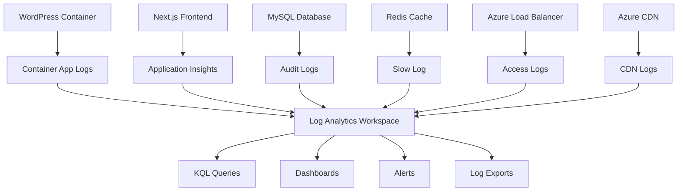

# Logging Configuration Guide

This guide provides comprehensive instructions for setting up centralized logging with Azure Log Analytics for the headless WordPress + Next.js application.

## Table of Contents

1. [Logging Architecture](#logging-architecture)
2. [Log Analytics Workspace Setup](#log-analytics-workspace-setup)
3. [Container App Logging](#container-app-logging)
4. [Database Logging](#database-logging)
5. [Application Logging](#application-logging)
6. [Log Collection and Forwarding](#log-collection-and-forwarding)
7. [Log Analysis and Queries](#log-analysis-and-queries)
8. [Log Retention and Cost Management](#log-retention-and-cost-management)
9. [Security and Compliance](#security-and-compliance)
10. [Troubleshooting](#troubleshooting)

## Logging Architecture

### Centralized Logging Overview



### Log Categories and Sources

```yaml
Logging_Categories:
  Application_Logs:
    WordPress:
      - Error logs
      - Access logs
      - Debug logs
      - Plugin logs
      - Performance logs
    
    Next.js:
      - Build logs
      - Runtime errors
      - API call logs
      - Performance metrics
      - User interaction logs
    
  Infrastructure_Logs:
    Container_Apps:
      - Container startup/shutdown
      - Resource utilization
      - Scaling events
      - Health check results
    
    Database:
      - Query logs
      - Slow query logs
      - Connection logs
      - Error logs
      - Audit logs
    
    Network:
      - Load balancer access logs
      - CDN access logs
      - DNS query logs
      - Security events
  
  Security_Logs:
    Authentication:
      - Login attempts
      - Failed authentications
      - Session events
      - Password changes
    
    Access_Control:
      - Permission changes
      - Admin actions
      - File access
      - API access
```

## Log Analytics Workspace Setup

### Create Log Analytics Workspace

```bash
# Create Log Analytics Workspace for each environment
az monitor log-analytics workspace create \
  --workspace-name "law-wordpress-prod" \
  --resource-group "rg-monitoring-prod" \
  --location "eastus" \
  --sku "PerGB2018" \
  --retention-time 90 \
  --tags Environment="production" Project="wordpress-nextjs"

az monitor log-analytics workspace create \
  --workspace-name "law-wordpress-staging" \
  --resource-group "rg-monitoring-staging" \
  --location "eastus" \
  --sku "PerGB2018" \
  --retention-time 60 \
  --tags Environment="staging" Project="wordpress-nextjs"

az monitor log-analytics workspace create \
  --workspace-name "law-wordpress-dev" \
  --resource-group "rg-monitoring-dev" \
  --location "eastus" \
  --sku "PerGB2018" \
  --retention-time 30 \
  --tags Environment="development" Project="wordpress-nextjs"

# Get workspace details
LAW_WORKSPACE_ID=$(az monitor log-analytics workspace show \
  --workspace-name "law-wordpress-prod" \
  --resource-group "rg-monitoring-prod" \
  --query "customerId" -o tsv)

LAW_WORKSPACE_KEY=$(az monitor log-analytics workspace get-shared-keys \
  --workspace-name "law-wordpress-prod" \
  --resource-group "rg-monitoring-prod" \
  --query "primarySharedKey" -o tsv)

echo "Workspace ID: $LAW_WORKSPACE_ID"
echo "Workspace Key: $LAW_WORKSPACE_KEY"
```

### Configure Data Collection Rules

```bash
# Create Data Collection Rule for container logs
az monitor data-collection rule create \
  --name "dcr-container-logs-prod" \
  --resource-group "rg-monitoring-prod" \
  --location "eastus" \
  --description "Data collection rule for container application logs" \
  --data-flows '[
    {
      "streams": ["Microsoft-ContainerLog"],
      "destinations": ["law-wordpress-prod"]
    }
  ]' \
  --destinations '{
    "logAnalytics": [
      {
        "workspaceResourceId": "/subscriptions/{subscription-id}/resourceGroups/rg-monitoring-prod/providers/Microsoft.OperationalInsights/workspaces/law-wordpress-prod",
        "name": "law-wordpress-prod"
      }
    ]
  }'
```

### Custom Log Tables

```bash
# Create custom log table for WordPress-specific logs
az monitor log-analytics workspace table create \
  --workspace-name "law-wordpress-prod" \
  --resource-group "rg-monitoring-prod" \
  --name "WordPressCL" \
  --columns '[
    {
      "name": "TimeGenerated",
      "type": "datetime"
    },
    {
      "name": "Level",
      "type": "string"
    },
    {
      "name": "Message",
      "type": "string"
    },
    {
      "name": "RequestId",
      "type": "string"
    },
    {
      "name": "UserId",
      "type": "string"
    },
    {
      "name": "IPAddress",
      "type": "string"
    },
    {
      "name": "UserAgent",
      "type": "string"
    },
    {
      "name": "ExecutionTime",
      "type": "real"
    }
  ]'

# Create custom log table for Next.js application logs
az monitor log-analytics workspace table create \
  --workspace-name "law-wordpress-prod" \
  --resource-group "rg-monitoring-prod" \
  --name "NextJSCL" \
  --columns '[
    {
      "name": "TimeGenerated",
      "type": "datetime"
    },
    {
      "name": "Level",
      "type": "string"
    },
    {
      "name": "Component",
      "type": "string"
    },
    {
      "name": "Message",
      "type": "string"
    },
    {
      "name": "RequestPath",
      "type": "string"
    },
    {
      "name": "ResponseTime",
      "type": "real"
    },
    {
      "name": "StatusCode",
      "type": "int"
    }
  ]'
```

## Container App Logging

### Container Apps Log Configuration

```bash
# Configure Container Apps to send logs to Log Analytics
az containerapp env create \
  --name "cae-wordpress-prod" \
  --resource-group "rg-app-prod" \
  --location "eastus" \
  --logs-destination "log-analytics" \
  --logs-workspace-id "$LAW_WORKSPACE_ID" \
  --logs-workspace-key "$LAW_WORKSPACE_KEY"

# Create Container App with enhanced logging
az containerapp create \
  --name "ca-wordpress-prod" \
  --resource-group "rg-app-prod" \
  --environment "cae-wordpress-prod" \
  --image "acrwordpressprod.azurecr.io/wordpress:latest" \
  --env-vars \
    LOG_LEVEL="info" \
    LOG_FORMAT="json" \
    ENABLE_ACCESS_LOG="true" \
    ENABLE_ERROR_LOG="true" \
    LOG_DESTINATION="stdout"
```

### Docker Logging Configuration

```dockerfile
# WordPress Dockerfile with enhanced logging
FROM wordpress:php8.1-apache

# Install logging tools
RUN apt-get update && apt-get install -y \
    rsyslog \
    logrotate \
    jq

# Configure PHP logging
RUN echo "log_errors = On" >> /usr/local/etc/php/conf.d/logging.ini && \
    echo "error_log = /dev/stderr" >> /usr/local/etc/php/conf.d/logging.ini && \
    echo "log_errors_max_len = 0" >> /usr/local/etc/php/conf.d/logging.ini

# Configure Apache logging
RUN echo 'LogFormat "{\"time\":\"%{%Y-%m-%d %H:%M:%S}t\",\"remote_addr\":\"%a\",\"method\":\"%m\",\"uri\":\"%U\",\"query\":\"%q\",\"status\":%>s,\"size\":%b,\"referer\":\"%{Referer}i\",\"user_agent\":\"%{User-Agent}i\",\"response_time\":%D}" json_combined' >> /etc/apache2/apache2.conf

# Copy custom logging configuration
COPY logging/rsyslog.conf /etc/rsyslog.conf
COPY logging/logrotate.conf /etc/logrotate.d/wordpress

# WordPress logging configuration
COPY wp-config-logging.php /var/www/html/

EXPOSE 80

# Start services with logging
CMD service rsyslog start && docker-entrypoint.sh apache2-foreground
```

### WordPress Logging Configuration

```php
<?php
// wp-config-logging.php

// Enable WordPress debug logging
define('WP_DEBUG', filter_var(getenv('WORDPRESS_DEBUG'), FILTER_VALIDATE_BOOLEAN));
define('WP_DEBUG_LOG', true);
define('WP_DEBUG_DISPLAY', false);
define('SCRIPT_DEBUG', filter_var(getenv('SCRIPT_DEBUG'), FILTER_VALIDATE_BOOLEAN));

// Custom error handler for structured logging
function custom_error_handler($severity, $message, $filename, $lineno) {
    $log_entry = [
        'timestamp' => date('c'),
        'level' => 'error',
        'severity' => $severity,
        'message' => $message,
        'file' => $filename,
        'line' => $lineno,
        'request_id' => $_SERVER['HTTP_X_REQUEST_ID'] ?? uniqid(),
        'user_id' => get_current_user_id(),
        'ip_address' => $_SERVER['REMOTE_ADDR'] ?? 'unknown',
        'user_agent' => $_SERVER['HTTP_USER_AGENT'] ?? 'unknown'
    ];
    
    error_log(json_encode($log_entry));
    return false; // Continue with normal error handling
}

set_error_handler('custom_error_handler');

// Custom logging function
function write_custom_log($level, $message, $context = []) {
    $log_entry = [
        'timestamp' => date('c'),
        'level' => $level,
        'message' => $message,
        'context' => $context,
        'request_id' => $_SERVER['HTTP_X_REQUEST_ID'] ?? uniqid(),
        'user_id' => get_current_user_id(),
        'ip_address' => $_SERVER['REMOTE_ADDR'] ?? 'unknown'
    ];
    
    error_log(json_encode($log_entry));
}

// Hook into WordPress actions for logging
add_action('wp_login', function($user_login, $user) {
    write_custom_log('info', 'User logged in', [
        'username' => $user_login,
        'user_id' => $user->ID
    ]);
}, 10, 2);

add_action('wp_login_failed', function($username) {
    write_custom_log('warning', 'Failed login attempt', [
        'username' => $username
    ]);
});

add_action('wp_logout', function($user_id) {
    write_custom_log('info', 'User logged out', [
        'user_id' => $user_id
    ]);
});

// Log slow queries
if (getenv('LOG_SLOW_QUERIES') === 'true') {
    add_filter('query', function($query) {
        $start_time = microtime(true);
        
        add_action('shutdown', function() use ($query, $start_time) {
            $execution_time = (microtime(true) - $start_time) * 1000;
            
            if ($execution_time > 1000) { // Log queries slower than 1 second
                write_custom_log('warning', 'Slow database query', [
                    'query' => $query,
                    'execution_time_ms' => $execution_time
                ]);
            }
        });
        
        return $query;
    });
}

// Log GraphQL requests
add_action('graphql_execute', function($query, $variables, $operation_name) {
    write_custom_log('info', 'GraphQL query executed', [
        'operation_name' => $operation_name,
        'query_hash' => md5($query),
        'variables_count' => count($variables ?? [])
    ]);
}, 10, 3);
?>
```

## Database Logging

### MySQL Audit Logging

```bash
# Configure MySQL Flexible Server audit logging
az mysql flexible-server parameter set \
  --name "mysql-wordpress-prod" \
  --resource-group "rg-db-prod" \
  --parameter-name "audit_log_policy" \
  --value "ALL"

az mysql flexible-server parameter set \
  --name "mysql-wordpress-prod" \
  --resource-group "rg-db-prod" \
  --parameter-name "audit_log_format" \
  --value "JSON"

# Enable slow query logging
az mysql flexible-server parameter set \
  --name "mysql-wordpress-prod" \
  --resource-group "rg-db-prod" \
  --parameter-name "slow_query_log" \
  --value "ON"

az mysql flexible-server parameter set \
  --name "mysql-wordpress-prod" \
  --resource-group "rg-db-prod" \
  --parameter-name "long_query_time" \
  --value "2.0"

az mysql flexible-server parameter set \
  --name "mysql-wordpress-prod" \
  --resource-group "rg-db-prod" \
  --parameter-name "log_queries_not_using_indexes" \
  --value "ON"
```

### Database Log Collection

```bash
# Create diagnostic settings for MySQL
az monitor diagnostic-settings create \
  --name "mysql-logs-to-law" \
  --resource "/subscriptions/{subscription-id}/resourceGroups/rg-db-prod/providers/Microsoft.DBforMySQL/flexibleServers/mysql-wordpress-prod" \
  --workspace "/subscriptions/{subscription-id}/resourceGroups/rg-monitoring-prod/providers/Microsoft.OperationalInsights/workspaces/law-wordpress-prod" \
  --logs '[
    {
      "category": "MySqlSlowLogs",
      "enabled": true,
      "retentionPolicy": {
        "enabled": true,
        "days": 30
      }
    },
    {
      "category": "MySqlAuditLogs",
      "enabled": true,
      "retentionPolicy": {
        "enabled": true,
        "days": 90
      }
    }
  ]' \
  --metrics '[
    {
      "category": "AllMetrics",
      "enabled": true,
      "retentionPolicy": {
        "enabled": true,
        "days": 30
      }
    }
  ]'
```

## Application Logging

### Next.js Logging Configuration

```javascript
// frontend/lib/logger.js
const winston = require('winston');
const { combine, timestamp, json, errors } = winston.format;

// Custom format for Azure Log Analytics
const azureFormat = winston.format.printf(({ level, message, timestamp, ...meta }) => {
  return JSON.stringify({
    timestamp,
    level,
    message,
    environment: process.env.NEXT_PUBLIC_ENVIRONMENT,
    component: 'nextjs-frontend',
    requestId: meta.requestId,
    userId: meta.userId,
    sessionId: meta.sessionId,
    ...meta
  });
});

const logger = winston.createLogger({
  level: process.env.LOG_LEVEL || 'info',
  format: combine(
    errors({ stack: true }),
    timestamp(),
    json(),
    azureFormat
  ),
  defaultMeta: {
    service: 'wordpress-nextjs-frontend',
    version: process.env.npm_package_version
  },
  transports: [
    new winston.transports.Console({
      format: combine(
        timestamp(),
        json()
      )
    })
  ]
});

// Add request correlation middleware
export function withLogging(handler) {
  return async (req, res) => {
    const requestId = req.headers['x-request-id'] || generateRequestId();
    const startTime = Date.now();
    
    // Add request ID to response headers
    res.setHeader('x-request-id', requestId);
    
    // Log request
    logger.info('Request started', {
      requestId,
      method: req.method,
      url: req.url,
      userAgent: req.headers['user-agent'],
      ip: req.headers['x-forwarded-for'] || req.connection.remoteAddress
    });
    
    try {
      const result = await handler(req, res);
      
      // Log successful response
      logger.info('Request completed', {
        requestId,
        statusCode: res.statusCode,
        responseTime: Date.now() - startTime
      });
      
      return result;
    } catch (error) {
      // Log error
      logger.error('Request failed', {
        requestId,
        error: error.message,
        stack: error.stack,
        responseTime: Date.now() - startTime
      });
      
      throw error;
    }
  };
}

function generateRequestId() {
  return Math.random().toString(36).substring(2, 15) + 
         Math.random().toString(36).substring(2, 15);
}

export default logger;
```

```javascript
// frontend/pages/api/_middleware.js
import { NextResponse } from 'next/server';
import logger from '../../lib/logger';

export function middleware(request) {
  const requestId = crypto.randomUUID();
  
  // Log API request
  logger.info('API Request', {
    requestId,
    method: request.method,
    url: request.url,
    userAgent: request.headers.get('user-agent')
  });
  
  // Clone request and add request ID
  const response = NextResponse.next();
  response.headers.set('x-request-id', requestId);
  
  return response;
}

export const config = {
  matcher: '/api/:path*'
};
```

### Application Insights Integration

```javascript
// frontend/lib/applicationInsights.js
import { ApplicationInsights } from '@microsoft/applicationinsights-web';

const appInsights = new ApplicationInsights({
  config: {
    instrumentationKey: process.env.NEXT_PUBLIC_APPINSIGHTS_INSTRUMENTATIONKEY,
    enableAutoRouteTracking: true,
    enableRequestHeaderTracking: true,
    enableResponseHeaderTracking: true,
    enableAjaxErrorStatusText: true,
    enableAjaxPerfTracking: true,
    enableUnhandledPromiseRejectionTracking: true,
    disableFetchTracking: false,
    correlationHeaderExcludedDomains: ['*.amazonaws.com'],
    distributedTracingMode: 1 // W3C Tracing
  }
});

appInsights.loadAppInsights();

// Track page views
appInsights.trackPageView({
  name: 'Page View',
  uri: window.location.href
});

// Custom telemetry functions
export const trackEvent = (name, properties = {}, measurements = {}) => {
  appInsights.trackEvent({
    name,
    properties: {
      environment: process.env.NEXT_PUBLIC_ENVIRONMENT,
      ...properties
    },
    measurements
  });
};

export const trackException = (exception, properties = {}) => {
  appInsights.trackException({
    exception,
    properties: {
      environment: process.env.NEXT_PUBLIC_ENVIRONMENT,
      ...properties
    }
  });
};

export const trackDependency = (dependencyTypeName, name, data, duration, success) => {
  appInsights.trackDependencyData({
    dependencyTypeName,
    name,
    data,
    duration,
    success,
    properties: {
      environment: process.env.NEXT_PUBLIC_ENVIRONMENT
    }
  });
};

export default appInsights;
```

## Log Collection and Forwarding

### Fluent Bit Configuration

```yaml
# fluent-bit-config.yaml
apiVersion: v1
kind: ConfigMap
metadata:
  name: fluent-bit-config
  namespace: wordpress
data:
  fluent-bit.conf: |
    [SERVICE]
        Flush         1
        Log_Level     info
        Daemon        off
        Parsers_File  parsers.conf
        HTTP_Server   On
        HTTP_Listen   0.0.0.0
        HTTP_Port     2020

    [INPUT]
        Name              tail
        Path              /var/log/containers/*.log
        Parser            docker
        Tag               kube.*
        Refresh_Interval  5
        Mem_Buf_Limit     50MB
        Skip_Long_Lines   On

    [INPUT]
        Name              systemd
        Tag               host.*
        Systemd_Filter    _SYSTEMD_UNIT=docker.service
        Read_From_Tail    On

    [FILTER]
        Name                kubernetes
        Match               kube.*
        Kube_URL            https://kubernetes.default.svc:443
        Kube_CA_File        /var/run/secrets/kubernetes.io/serviceaccount/ca.crt
        Kube_Token_File     /var/run/secrets/kubernetes.io/serviceaccount/token
        Kube_Tag_Prefix     kube.var.log.containers.
        Merge_Log           On
        K8S-Logging.Parser  On
        K8S-Logging.Exclude Off

    [OUTPUT]
        Name            azure
        Match           *
        Customer_ID     ${LAW_WORKSPACE_ID}
        Shared_Key      ${LAW_WORKSPACE_KEY}
        Log_Type        FluentBitLogs
        Time_Key        @timestamp
        Time_Format     %Y-%m-%dT%H:%M:%S.%3NZ

  parsers.conf: |
    [PARSER]
        Name        docker
        Format      json
        Time_Key    time
        Time_Format %Y-%m-%dT%H:%M:%S.%L
        Time_Keep   On

    [PARSER]
        Name        json
        Format      json
        Time_Key    timestamp
        Time_Format %Y-%m-%dT%H:%M:%S.%3NZ
        Time_Keep   On

    [PARSER]
        Name        wordpress
        Format      regex
        Regex       ^(?<timestamp>\d{4}-\d{2}-\d{2} \d{2}:\d{2}:\d{2}) (?<level>\w+): (?<message>.*)
        Time_Key    timestamp
        Time_Format %Y-%m-%d %H:%M:%S
```

### Log Shipping Script

```bash
#!/bin/bash
# scripts/ship-logs-to-azure.sh

set -e

LAW_WORKSPACE_ID="${1:?LAW_WORKSPACE_ID is required}"
LAW_WORKSPACE_KEY="${2:?LAW_WORKSPACE_KEY is required}"
LOG_TYPE="${3:-ApplicationLog}"
LOG_FILE="${4:?LOG_FILE is required}"

# Azure Log Analytics Data Collector API endpoint
URI="https://${LAW_WORKSPACE_ID}.ods.opinsights.azure.com/api/logs?api-version=2016-04-01"

# Generate authorization signature
function generate_signature() {
    local method="POST"
    local content_length=$1
    local content_type="application/json"
    local x_ms_date=$2
    local resource="/api/logs"
    
    local string_to_hash="${method}\n${content_length}\n${content_type}\nx-ms-date:${x_ms_date}\n${resource}"
    local utf8_string=$(echo -n "$string_to_hash" | iconv -t utf8)
    local decoded_key=$(echo "$LAW_WORKSPACE_KEY" | base64 --decode | hexdump -v -e '/1 "%02x"' | sed 's/\(.\{2\}\)/\\x\1/g')
    local encoded_hash=$(printf "$utf8_string" | openssl sha256 -hmac "$(printf "$decoded_key")" -binary | base64)
    
    echo "SharedKey ${LAW_WORKSPACE_ID}:${encoded_hash}"
}

# Read and format log data
log_data=$(jq -c '.' < "$LOG_FILE")
content_length=${#log_data}
x_ms_date=$(date -u +"%a, %d %b %Y %H:%M:%S GMT")
authorization=$(generate_signature "$content_length" "$x_ms_date")

# Send logs to Azure Log Analytics
response=$(curl -s -X POST "$URI" \
    -H "Content-Type: application/json" \
    -H "Log-Type: $LOG_TYPE" \
    -H "Authorization: $authorization" \
    -H "x-ms-date: $x_ms_date" \
    -H "time-generated-field: timestamp" \
    -d "$log_data")

if [[ $? -eq 0 ]]; then
    echo "Logs shipped successfully to Azure Log Analytics"
else
    echo "Failed to ship logs: $response"
    exit 1
fi
```

## Log Analysis and Queries

### Common KQL Queries

```kusto
// WordPress error analysis
ContainerAppConsoleLogs_CL
| where ContainerName_s contains "wordpress"
| where Log_s contains "error" or Log_s contains "ERROR"
| extend LogData = parse_json(Log_s)
| extend Level = tostring(LogData.level)
| extend Message = tostring(LogData.message)
| extend RequestId = tostring(LogData.request_id)
| where Level in ("error", "critical")
| summarize Count = count() by Level, Message
| order by Count desc

// Slow database queries
ContainerAppConsoleLogs_CL
| where ContainerName_s contains "wordpress"
| extend LogData = parse_json(Log_s)
| where LogData.level == "warning" and LogData.message contains "Slow database query"
| extend ExecutionTime = toreal(LogData.context.execution_time_ms)
| extend Query = tostring(LogData.context.query)
| where ExecutionTime > 1000
| summarize Count = count(), AvgTime = avg(ExecutionTime), MaxTime = max(ExecutionTime) by Query
| order by AvgTime desc

// Failed login attempts
ContainerAppConsoleLogs_CL
| where ContainerName_s contains "wordpress"
| extend LogData = parse_json(Log_s)
| where LogData.message == "Failed login attempt"
| extend Username = tostring(LogData.context.username)
| extend IPAddress = tostring(LogData.ip_address)
| summarize FailedAttempts = count() by Username, IPAddress, bin(TimeGenerated, 1h)
| where FailedAttempts > 5
| order by TimeGenerated desc, FailedAttempts desc

// Application performance metrics
AppInsights
| where AppRoleName == "wordpress-nextjs-frontend"
| where OperationName startswith "GET" or OperationName startswith "POST"
| summarize 
    RequestCount = count(),
    AvgDuration = avg(DurationMs),
    P95Duration = percentile(DurationMs, 95),
    P99Duration = percentile(DurationMs, 99)
    by OperationName, bin(TimeGenerated, 5m)
| order by TimeGenerated desc, P95Duration desc

// Error rate analysis
AppInsights
| where AppRoleName == "wordpress-nextjs-frontend"
| summarize 
    TotalRequests = count(),
    ErrorRequests = countif(Success == false),
    ErrorRate = (countif(Success == false) * 100.0) / count()
    by bin(TimeGenerated, 5m)
| where ErrorRate > 1.0
| order by TimeGenerated desc

// GraphQL query analysis
ContainerAppConsoleLogs_CL
| where ContainerName_s contains "wordpress"
| extend LogData = parse_json(Log_s)
| where LogData.message == "GraphQL query executed"
| extend OperationName = tostring(LogData.context.operation_name)
| extend QueryHash = tostring(LogData.context.query_hash)
| summarize 
    QueryCount = count(),
    UniqueQueries = dcount(QueryHash)
    by OperationName, bin(TimeGenerated, 1h)
| order by TimeGenerated desc, QueryCount desc

// Security events monitoring
union ContainerAppConsoleLogs_CL, AppInsights
| where 
    (Log_s contains "authentication" and Log_s contains "failed") or
    (Log_s contains "unauthorized") or
    (OperationName contains "login" and Success == false)
| extend 
    EventType = case(
        Log_s contains "failed" and Log_s contains "login", "Failed Login",
        Log_s contains "unauthorized", "Unauthorized Access",
        OperationName contains "login" and Success == false, "Login Error",
        "Other Security Event"
    )
| summarize EventCount = count() by EventType, bin(TimeGenerated, 1h)
| order by TimeGenerated desc, EventCount desc
```

### Automated Log Analysis

```python
#!/usr/bin/env python3
# scripts/analyze-logs.py

import os
import json
from datetime import datetime, timedelta
from azure.loganalytics import LogAnalyticsDataClient
from azure.loganalytics.models import QueryBody
from azure.identity import DefaultAzureCredential

def analyze_application_logs():
    """Analyze application logs for patterns and anomalies"""
    
    workspace_id = os.getenv('LAW_WORKSPACE_ID')
    credential = DefaultAzureCredential()
    client = LogAnalyticsDataClient(credential)
    
    # Query for error patterns
    error_query = """
    ContainerAppConsoleLogs_CL
    | where TimeGenerated > ago(1h)
    | where ContainerName_s contains "wordpress"
    | where Log_s contains "error" or Log_s contains "ERROR"
    | extend LogData = parse_json(Log_s)
    | summarize Count = count() by tostring(LogData.level), tostring(LogData.message)
    | order by Count desc
    """
    
    response = client.query(
        workspace_id=workspace_id,
        body=QueryBody(query=error_query)
    )
    
    error_patterns = []
    for row in response.tables[0].rows:
        error_patterns.append({
            'level': row[0],
            'message': row[1],
            'count': row[2]
        })
    
    # Query for performance issues
    performance_query = """
    AppInsights
    | where TimeGenerated > ago(1h)
    | where AppRoleName == "wordpress-nextjs-frontend"
    | summarize 
        AvgDuration = avg(DurationMs),
        P95Duration = percentile(DurationMs, 95)
        by OperationName
    | where P95Duration > 5000
    | order by P95Duration desc
    """
    
    response = client.query(
        workspace_id=workspace_id,
        body=QueryBody(query=performance_query)
    )
    
    performance_issues = []
    for row in response.tables[0].rows:
        performance_issues.append({
            'operation': row[0],
            'avg_duration': row[1],
            'p95_duration': row[2]
        })
    
    # Generate analysis report
    report = {
        'timestamp': datetime.utcnow().isoformat(),
        'analysis_period': '1 hour',
        'error_patterns': error_patterns,
        'performance_issues': performance_issues,
        'recommendations': generate_recommendations(error_patterns, performance_issues)
    }
    
    return report

def generate_recommendations(errors, performance):
    """Generate actionable recommendations based on log analysis"""
    recommendations = []
    
    # Error-based recommendations
    for error in errors[:5]:  # Top 5 errors
        if error['count'] > 10:
            recommendations.append(f"High frequency error: {error['message']} - investigate and fix")
    
    # Performance-based recommendations
    for issue in performance[:3]:  # Top 3 performance issues
        if issue['p95_duration'] > 10000:  # > 10 seconds
            recommendations.append(f"Critical performance issue: {issue['operation']} - optimize immediately")
        elif issue['p95_duration'] > 5000:  # > 5 seconds
            recommendations.append(f"Performance concern: {issue['operation']} - consider optimization")
    
    return recommendations

if __name__ == '__main__':
    report = analyze_application_logs()
    print(json.dumps(report, indent=2))
```

## Log Retention and Cost Management

### Data Retention Policies

```bash
# Configure different retention periods for different log types
az monitor log-analytics workspace table update \
  --workspace-name "law-wordpress-prod" \
  --resource-group "rg-monitoring-prod" \
  --name "ContainerAppConsoleLogs_CL" \
  --retention-in-days 90

az monitor log-analytics workspace table update \
  --workspace-name "law-wordpress-prod" \
  --resource-group "rg-monitoring-prod" \
  --name "AppInsights" \
  --retention-in-days 120

az monitor log-analytics workspace table update \
  --workspace-name "law-wordpress-prod" \
  --resource-group "rg-monitoring-prod" \
  --name "MySqlAuditLogs" \
  --retention-in-days 365  # Compliance requirement
```

### Cost Optimization

```bash
# Set up daily cap to control costs
az monitor log-analytics workspace update \
  --workspace-name "law-wordpress-prod" \
  --resource-group "rg-monitoring-prod" \
  --daily-quota-gb 5.0

# Query to analyze log volume by table
query="
Usage
| where TimeGenerated > ago(30d)
| where IsBillable == true
| summarize TotalVolumeGB = sum(Quantity) / 1000 by DataType
| order by TotalVolumeGB desc
"

az monitor log-analytics query \
  --workspace "$LAW_WORKSPACE_ID" \
  --analytics-query "$query"
```

### Log Archival Strategy

```python
#!/usr/bin/env python3
# scripts/archive-logs.py

import os
from datetime import datetime, timedelta
from azure.storage.blob import BlobServiceClient
from azure.loganalytics import LogAnalyticsDataClient
from azure.identity import DefaultAzureCredential

def archive_old_logs():
    """Archive logs older than retention period to blob storage"""
    
    # Initialize clients
    credential = DefaultAzureCredential()
    log_client = LogAnalyticsDataClient(credential)
    blob_client = BlobServiceClient(
        account_url=f"https://{os.getenv('STORAGE_ACCOUNT_NAME')}.blob.core.windows.net",
        credential=credential
    )
    
    # Define archival cutoff (e.g., 90 days old)
    cutoff_date = datetime.utcnow() - timedelta(days=90)
    
    # Query old logs
    archive_query = f"""
    ContainerAppConsoleLogs_CL
    | where TimeGenerated < datetime({cutoff_date.isoformat()})
    | order by TimeGenerated asc
    """
    
    response = log_client.query(
        workspace_id=os.getenv('LAW_WORKSPACE_ID'),
        body=QueryBody(query=archive_query)
    )
    
    # Process and upload to blob storage
    container_name = "log-archive"
    blob_name = f"container-logs-{cutoff_date.strftime('%Y-%m-%d')}.json"
    
    log_data = []
    for table in response.tables:
        for row in table.rows:
            log_entry = dict(zip([col.name for col in table.columns], row))
            log_data.append(log_entry)
    
    # Upload to blob storage
    blob_client.get_blob_client(
        container=container_name,
        blob=blob_name
    ).upload_blob(
        json.dumps(log_data, indent=2),
        overwrite=True
    )
    
    print(f"Archived {len(log_data)} log entries to {blob_name}")

if __name__ == '__main__':
    archive_old_logs()
```

## Security and Compliance

### Log Security Configuration

```bash
# Configure workspace security settings
az monitor log-analytics workspace update \
  --workspace-name "law-wordpress-prod" \
  --resource-group "rg-monitoring-prod" \
  --public-network-access-for-ingestion "Disabled" \
  --public-network-access-for-query "Disabled"

# Create private endpoint for Log Analytics
az network private-endpoint create \
  --name "pe-law-wordpress-prod" \
  --resource-group "rg-monitoring-prod" \
  --vnet-name "vnet-wordpress-prod" \
  --subnet "subnet-monitoring" \
  --private-connection-resource-id "/subscriptions/{subscription-id}/resourceGroups/rg-monitoring-prod/providers/Microsoft.OperationalInsights/workspaces/law-wordpress-prod" \
  --group-id "azuremonitor"
```

### Compliance Logging

```bash
# Enable audit logging for compliance
az monitor diagnostic-settings create \
  --name "compliance-audit-logs" \
  --resource "/subscriptions/{subscription-id}/resourceGroups/rg-monitoring-prod/providers/Microsoft.OperationalInsights/workspaces/law-wordpress-prod" \
  --workspace "/subscriptions/{subscription-id}/resourceGroups/rg-monitoring-prod/providers/Microsoft.OperationalInsights/workspaces/law-wordpress-prod" \
  --logs '[
    {
      "category": "Audit",
      "enabled": true,
      "retentionPolicy": {
        "enabled": true,
        "days": 2555  # 7 years for compliance
      }
    }
  ]'
```

## Troubleshooting

### Common Logging Issues

#### Log Ingestion Delays

```bash
# Check Log Analytics ingestion status
az monitor log-analytics workspace get-shared-keys \
  --workspace-name "law-wordpress-prod" \
  --resource-group "rg-monitoring-prod"

# Test log ingestion
curl -X POST \
  "https://{workspace-id}.ods.opinsights.azure.com/api/logs?api-version=2016-04-01" \
  -H "Content-Type: application/json" \
  -H "Log-Type: TestLog" \
  -H "Authorization: SharedKey {workspace-id}:{shared-key}" \
  -d '[{"timestamp":"2024-01-01T00:00:00.000Z","message":"test log entry"}]'
```

#### Container App Log Issues

```bash
# Check container app logging configuration
az containerapp show \
  --name "ca-wordpress-prod" \
  --resource-group "rg-app-prod" \
  --query "properties.configuration.ingress"

# View container logs directly
az containerapp logs show \
  --name "ca-wordpress-prod" \
  --resource-group "rg-app-prod" \
  --follow
```

#### Log Query Performance

```kusto
// Optimize slow queries by adding time filters
ContainerAppConsoleLogs_CL
| where TimeGenerated > ago(1h)  // Always include time filter
| where ContainerName_s == "wordpress"  // Use specific filters
| project TimeGenerated, Log_s  // Project only needed columns
| limit 1000  // Limit result set size
```

## Next Steps

1. Set up [alerting and notifications](alerting-setup.md)
2. Create [performance monitoring dashboards](dashboard-creation.md)
3. Implement [backup and disaster recovery](../backup-dr/backup-strategy.md)
4. Configure [security monitoring](../infrastructure/security-hardening.md)
