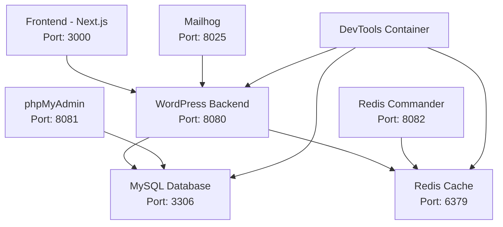

# Development Environment Guide
## Headless WordPress + Next.js

### Document Information
- **Document Version**: 1.0
- **Last Updated**: 2025-08-11
- **Owner**: Development Team
- **Prerequisites**: Docker, Docker Compose, Make

---

## Quick Start

### 1. Clone and Setup
```bash
# Clone the repository
git clone <repository-url>
cd Wordpess-Claude

# Quick setup and start
make quick-start
```

### 2. Access Services
Once started, access these URLs:

| Service | URL | Credentials |
|---------|-----|-------------|
| WordPress Admin | http://localhost:8080/wp-admin | admin / admin_password |
| GraphQL Endpoint | http://localhost:8080/graphql | - |
| Next.js Frontend | http://localhost:3000 | - |
| phpMyAdmin | http://localhost:8081 | root / root_password |
| Redis Commander | http://localhost:8082 | - |
| Mailhog | http://localhost:8025 | - |

---

## Detailed Setup

### Prerequisites

#### Required Software
- **Docker Desktop** 4.15+ ([Download](https://www.docker.com/products/docker-desktop))
- **Docker Compose** 2.12+ (included with Docker Desktop)
- **Make** (pre-installed on macOS/Linux, [Windows installation](https://gnuwin32.sourceforge.net/packages/make.htm))
- **Git** ([Download](https://git-scm.com/downloads))

#### System Requirements
- **RAM**: 8GB minimum, 16GB recommended
- **Storage**: 10GB free space
- **CPU**: 2+ cores
- **Network**: Internet connection for initial setup

### Environment Setup

#### 1. Repository Setup
```bash
# Clone repository
git clone <repository-url>
cd Wordpess-Claude

# Create necessary directories and set permissions
make install
```

#### 2. Configuration
The environment uses sensible defaults, but you can customize by creating a `.env` file:

```bash
# .env (optional)
WORDPRESSDB_PASSWORD=custom_password
WORDPRESSDB_ROOT_PASSWORD=custom_root_password
REDIS_PASSWORD=custom_redis_password
WORDPRESS_ADMIN_USER=admin
WORDPRESS_ADMIN_PASSWORD=secure_password
WORDPRESS_ADMIN_EMAIL=admin@yoursite.com
```

#### 3. Start Services
```bash
# Start all services
make start

# OR start with development tools
make dev
```

---

## Service Architecture

### Container Overview



### Service Details

#### WordPress Backend
- **Image**: Custom WordPress 6.4 + PHP 8.2
- **Purpose**: Headless CMS with GraphQL API
- **Features**:
  - WPGraphQL plugin pre-installed
  - Advanced Custom Fields
  - Redis object cache
  - Sample content
- **Volumes**: Themes, plugins, uploads mounted for development

#### Next.js Frontend
- **Image**: Node.js 18 Alpine
- **Purpose**: Static site generator and development server
- **Features**:
  - Hot reloading
  - TypeScript support
  - GraphQL integration
  - Debugging port (9229)
- **Volumes**: Source code mounted for live editing

#### MySQL Database
- **Image**: MySQL 8.0
- **Purpose**: WordPress database
- **Features**:
  - Optimized configuration
  - UTF8MB4 character set
  - Performance tuning
- **Volumes**: Persistent data storage

#### Redis Cache
- **Image**: Redis 7 Alpine
- **Purpose**: Object caching and session storage
- **Features**:
  - Persistence enabled
  - Password protection
  - Performance optimization
- **Volumes**: Persistent cache data

#### Development Tools
- **Purpose**: Database management, email testing, debugging
- **Services**:
  - **phpMyAdmin**: Web-based MySQL management
  - **Redis Commander**: Redis data browser
  - **Mailhog**: Email testing tool
  - **DevTools**: Shell access with development utilities

---

## Development Workflow

### Daily Development

#### Starting Work
```bash
# Start the environment
make start

# Check service status
make status

# View logs if needed
make logs
```

#### Code Changes
- **WordPress**: Edit files in `wordpress/themes/` and `wordpress/plugins/`
- **Frontend**: Edit files in `frontend/src/`
- **Configuration**: Modify Docker configurations in `infrastructure/docker/`

#### Common Tasks
```bash
# Install WordPress plugin
make wp-install PLUGIN=plugin-name

# Access WordPress shell
make wp-shell

# Install frontend dependencies
make fe-install

# Access database
make db-shell

# View specific service logs
make logs-wp
make logs-fe
```

#### Ending Work
```bash
# Stop services (keeps data)
make stop

# OR remove containers but keep volumes
make clean-soft
```

### Testing and Validation

#### Health Checks
```bash
# Run comprehensive health checks
make test

# Test GraphQL specifically
make test-graphql

# Check service status
make status
```

#### Manual Testing
1. **WordPress Admin**:
   - Login at http://localhost:8080/wp-admin
   - Create/edit content
   - Verify GraphQL endpoint at http://localhost:8080/graphql

2. **Frontend**:
   - Visit http://localhost:3000
   - Verify content from WordPress displays
   - Check browser console for errors

3. **Database**:
   - Access phpMyAdmin at http://localhost:8081
   - Verify data structure and content

### Debugging

#### Frontend Debugging
```bash
# Access frontend container
make fe-shell

# View detailed logs
make logs-fe

# Debug with Node.js inspector (attach to port 9229)
node --inspect-brk=0.0.0.0:9229 server.js
```

#### Backend Debugging
```bash
# Access WordPress container
make wp-shell

# Check WordPress logs
tail -f /var/log/wordpress/debug.log

# Test GraphQL queries
wp graphql --allow-root
```

#### Database Debugging
```bash
# Access MySQL shell
make db-shell

# Check slow queries
SELECT * FROM mysql.slow_log ORDER BY start_time DESC LIMIT 10;

# Monitor connections
SHOW PROCESSLIST;
```

---

## File Structure

### Project Layout
```
Wordpess-Claude/
├── docker-compose.yml          # Main orchestration file
├── Makefile                    # Development commands
├── .env.example               # Environment variables template
├── 
├── frontend/                   # Next.js application
│   ├── src/
│   │   ├── app/               # App Router pages
│   │   ├── components/        # React components
│   │   ├── lib/               # Utilities and GraphQL
│   │   └── types/             # TypeScript definitions
│   ├── Dockerfile.dev         # Development container
│   ├── package.json
│   └── next.config.js
│
├── wordpress/                  # WordPress customizations
│   ├── themes/                # Custom themes
│   ├── plugins/               # Custom plugins
│   └── uploads/               # Media uploads (persistent)
│
├── infrastructure/
│   ├── docker/                # Docker configurations
│   │   ├── wordpress/         # WordPress container setup
│   │   ├── mysql/             # MySQL configuration
│   │   ├── redis/             # Redis configuration
│   │   └── devtools/          # Development tools
│   ├── terraform/             # Infrastructure as Code
│   └── bicep/                 # Azure Bicep templates
│
├── logs/                      # Service logs (created at runtime)
│   ├── wordpress/
│   ├── frontend/
│   ├── mysql/
│   └── redis/
│
└── backups/                   # Database and file backups
```

### Volume Mounts

#### Development Mounts (live editing)
- `./frontend:/app` - Frontend source code
- `./wordpress/themes:/var/www/html/wp-content/themes/custom`
- `./wordpress/plugins:/var/www/html/wp-content/plugins/custom`

#### Persistent Mounts (data preservation)
- `mysql_data:/var/lib/mysql` - Database files
- `redis_data:/data` - Redis persistence
- `wordpress_data:/var/www/html` - WordPress core files
- `./wordpress/uploads:/var/www/html/wp-content/uploads` - Media files

---

## Configuration Details

### Environment Variables

#### WordPress Configuration
```bash
WORDPRESS_DB_HOST=mysql
WORDPRESS_DB_NAME=wordpress
WORDPRESS_DB_USER=wordpress
WORDPRESS_DB_PASSWORD=wordpress_password
WORDPRESS_DEBUG=1
WORDPRESS_DEBUG_LOG=1
```

#### Next.js Configuration
```bash
NODE_ENV=development
NEXT_PUBLIC_WORDPRESS_URL=http://localhost:8080
NEXT_PUBLIC_GRAPHQL_ENDPOINT=http://localhost:8080/graphql
```

#### Database Configuration
```bash
MYSQL_DATABASE=wordpress
MYSQL_USER=wordpress
MYSQL_PASSWORD=wordpress_password
MYSQL_ROOT_PASSWORD=root_password
```

### Performance Tuning

#### MySQL Optimization
- InnoDB buffer pool: 256MB
- Query cache: Disabled (MySQL 8.0+)
- Max connections: 151
- Character set: UTF8MB4

#### Redis Configuration
- Max memory: 256MB
- Eviction policy: allkeys-lru
- Persistence: RDB + AOF
- Password protection: Enabled

#### WordPress Optimization
- Object cache: Redis-backed
- Debug logging: Enabled in development
- File editing: Disabled for security
- Auto-updates: Disabled

#### PHP Configuration
- Memory limit: 512MB
- Max execution time: 300s
- Upload limit: 100MB
- OPcache: Enabled

---

## Troubleshooting

### Common Issues

#### Services Won't Start
```bash
# Check Docker is running
docker version

# Check port conflicts
netstat -tulpn | grep -E ':(3000|8080|3306|6379)\s'

# View detailed error logs
make logs

# Rebuild containers
make rebuild
```

#### Database Connection Issues
```bash
# Check MySQL container
docker-compose logs mysql

# Test database connection
make db-shell

# Reset database (removes all data)
make wp-reset
```

#### Frontend Build Issues
```bash
# Clear Next.js cache
make fe-shell
rm -rf .next
npm run build

# Reinstall dependencies
make fe-shell
rm -rf node_modules package-lock.json
npm install
```

#### WordPress Issues
```bash
# Reset WordPress plugins
make wp-shell
wp plugin deactivate --all --allow-root
wp plugin activate wp-graphql advanced-custom-fields --allow-root

# Check WordPress health
curl -I http://localhost:8080/wp-admin/admin-ajax.php
```

### Performance Issues

#### Slow Database Queries
```bash
# Enable slow query log
make db-shell
SET GLOBAL slow_query_log = 'ON';
SET GLOBAL long_query_time = 1;

# Check slow queries
SELECT * FROM mysql.slow_log;
```

#### High Memory Usage
```bash
# Monitor resource usage
make monitor

# Check container stats
docker stats

# Adjust memory limits in docker-compose.yml
```

### Network Issues

#### CORS Errors
CORS is configured in the WordPress Apache virtual host for development. If issues persist:

```bash
# Check Apache configuration
make wp-shell
cat /etc/apache2/sites-available/000-default.conf

# Restart WordPress container
docker-compose restart wordpress
```

#### Port Conflicts
```bash
# Check what's using ports
lsof -i :3000
lsof -i :8080

# Change ports in docker-compose.yml if needed
```

### Data Recovery

#### Backup and Restore
```bash
# Create backup
make backup

# Restore from backup
make restore BACKUP_FILE=wordpress_20231201_143000.sql

# Manual database export
make db-shell
mysqldump -u root -p wordpress > /tmp/backup.sql
```

---

## Advanced Configuration

### Custom PHP Extensions
To add PHP extensions to WordPress:

```dockerfile
# Add to infrastructure/docker/wordpress/Dockerfile
RUN docker-php-ext-install gd imagick
```

### Custom Node.js Modules
To add global Node.js modules:

```dockerfile
# Add to frontend/Dockerfile.dev
RUN npm install -g your-module
```

### SSL in Development
To enable HTTPS in development:

1. Generate self-signed certificates
2. Update docker-compose.yml with SSL configuration
3. Update WordPress and Next.js URLs

### Multi-site WordPress
To enable WordPress multisite:

```bash
# Access WordPress shell
make wp-shell

# Enable multisite
wp core multisite-convert --allow-root
```

---

## Production Considerations

### Security Hardening
Before production deployment:

- [ ] Change all default passwords
- [ ] Disable debug modes
- [ ] Enable HTTPS
- [ ] Configure proper firewall rules
- [ ] Update to latest software versions

### Performance Optimization
- [ ] Enable production caching
- [ ] Optimize database queries
- [ ] Configure CDN
- [ ] Enable compression
- [ ] Optimize images

### Monitoring Setup
- [ ] Configure application monitoring
- [ ] Set up log aggregation
- [ ] Create health check endpoints
- [ ] Configure alerting

---

## Support and Resources

### Documentation
- [WordPress Developer Documentation](https://developer.wordpress.org/)
- [Next.js Documentation](https://nextjs.org/docs)
- [WPGraphQL Documentation](https://www.wpgraphql.com/docs/introduction/)
- [Docker Compose Documentation](https://docs.docker.com/compose/)

### Community Support
- WordPress Community Forums
- Next.js GitHub Discussions
- WPGraphQL Slack Channel
- Stack Overflow

### Internal Resources
- Architecture Documentation: `docs/architecture/`
- API Documentation: `docs/api/`
- Deployment Guide: `docs/deployment/`
- Troubleshooting Guide: This document

---

## Appendix

### Useful Commands Reference

```bash
# Environment Management
make install          # Setup environment
make start           # Start all services
make stop            # Stop all services
make restart         # Restart all services
make status          # Show service status
make clean           # Remove everything

# Development
make shell           # Access devtools container
make wp-shell        # Access WordPress container
make fe-shell        # Access frontend container
make logs            # Show all logs
make test            # Run health checks

# Data Management
make backup          # Create backup
make restore         # Restore from backup
make wp-reset        # Reset WordPress

# Monitoring
make monitor         # Show resource usage
make info            # Environment information
```

### Port Reference

| Port | Service | Purpose |
|------|---------|----------|
| 3000 | Frontend | Next.js development server |
| 8080 | WordPress | WordPress backend |
| 3306 | MySQL | Database |
| 6379 | Redis | Cache |
| 8081 | phpMyAdmin | Database management |
| 8082 | Redis Commander | Redis management |
| 8025 | Mailhog | Email testing |
| 9229 | Node Debug | Frontend debugging |
| 1025 | SMTP | Email relay |

### Default Credentials

| Service | Username | Password |
|---------|----------|----------|
| WordPress Admin | admin | admin_password |
| MySQL Root | root | root_password |
| MySQL WordPress | wordpress | wordpress_password |
| Redis | - | redis_password |
| phpMyAdmin | root | root_password |
